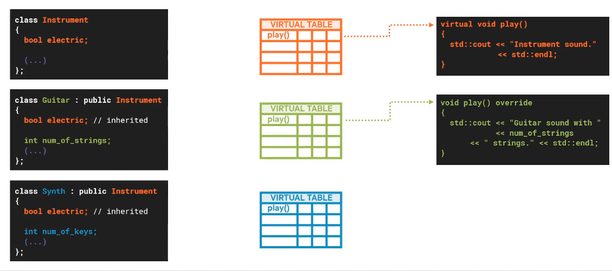

# WORKING WITH POINTERS AND ARRAYS IN C++ 20

<details>
 <summary> Empty </summary>

> [!IMPORTANT]
> the GitHub way

</details>

# Start: Uncategorized
<details>
 <summary> Uncategorized </summary>


# 5. Pointing to Class Members
Module 5:

## 5.1. Accessing Class Members with the Arrow Operator

- The compiler evaluates the **dot operator** `.` before the **dereference operator** `*`
- So if you want to **dereference** first then access the members of the object, make sure you put the dereference in **parenthesis** `(*pointerName)`
- But this(code in above image) syntax is hard to read
- So, we can use the **member-of operater** `->` instead :


- That is why C++ also offers us the **member-of operater** `->`
- It's like saying *dereference the pointer to an object THEN access a member* `pointerToAnObject->member`
- dereference THEN access
- -> ==  dereference `-`,  THEN access `>`
- It's a shortcut from:
- *pointer.member ==  dereference `*pointerName`, THEN access `.`

## 5.2. Using Base Class Pointers as an Interface
### Summary

- If you ever need `virtual functions` in your classes, always define a `virtual destructor` to prevent **memory leaks**.

### Start
**Base Class:**


**Derived Classes:**


**Main Class:**


#### If ~Destructor is not made virtual 
If you don't make the **destructor** virtual, when you call delete on a derived class/object , the delete call will only delete the base class' stuff and leave the derived guys. This leads to memory leaks.
e.g. :
**Modified Main Class:**


Delete will only delete the Base part from each of these objects. 
This is because the compiler will still use **`Early Binding`** to access these objects.
The dangling members from the derived classes will stay in memory and cause a serious memory leak.

**To fix this:**

Do the same thing we did to the *play* function.
We need to implement **`Late Binding`**
And we can do that by making the *Base Destructor* virtual.


Note:
But in this case, the lesson instructor didn't even create *Derived Destructors*.
I guess because the base one was enough.
Since it was going to be inherited by the derived classes.
Look at the picture, in his code, he placed everything in the public section.

### Why we need the Virtual feature
If we have a hierachy of classes (like from his code), we can use the Base class as an interface.
e.g.:

**Inheritance** and **Late Binding** allow us to group Derived classes in a single array of Base class pointers.


(In his Cose) Since it makes no sense to have a general `Instrument` object, he turned the Base class into an **Abstract class** (by removing the play function definition and assigning it to 0) :

This makes the function a **Pure Virtual Function**.
And every class that has a *Pure Virtual Function* is known as an **Abstract class**
- *which is another word for an `Interface` in C++*

Basically, *Abstract classes* cannot be instantiated.
- *which makes sense for him coz he doesn't need an unspecified instrument*


Here is another use case for the Instrument Interface:

If we didn't have this, we would have to overload this function for every type of Instrument.
Or we would be forced to make a **Templated Function**

##### Prevent Memory Leaks:
And finally we cannot forget to create another loop to delete each one of these Instruments from the Heap :

So:
 If you ever need `virtual functions` in your classes, always define a `virtual destructor` to prevent **memory leaks**.

 ## 5.3. Virtual Tables and Virtual Pointers
 A brief discussion/demonstration on how C++ implements **Late Binding** to support the existence of **Virtual Functions**.

 Virtual Functions introduce a small overhead in the size of a class.

 For this demonstration, we are going to bring back the definition of the `play()` function :
 
#### The previous base class and derived classes

When you mark some function as `virtual`, program will create a `virtual table` in memory for the class that contains that **virtual function**:


This virtual table is nothing more than **a simple array of pointers**, specifically: pointers to functions.
Each position in that array is dedicated to a virtual function.


Since derived functions could override this function from the base class, they also get their own virtual tables:

We know that each of these classes have their own version of the play function:

And the instructions for executing these functions are also stored in a special part of memory.

These functions from the virtual table should point to the appropriate function in memory:

Since every class in this example has its own function override, these pointers point to the function defined inside of that class.

So let's say I want to call the `play()` function from the **Instrument pointer**, which actually points to the **Guitar object**:

Before executing the function, C++ will check the virtual table of the object; which in this case, is the object of the Guitar class:

Compiler knows that the position of this function pointer is 0:

So it will use this function pointer to find the correct function in memory:


Once it finds the correct function, it will **Bind** it to the highlighted/current statement:

And call the corret `play()` function from memory.
This is why we call it **Late Binding** 
*Because the function is Bound at the time of execution (at Runtime)*

------
But what if I decide to remove this overriden function from the **Synth** derived class:

The Virtual Table from this class:
 
will see that we don't have the appropriate overide
So by default, this function pointer will point to the function defined in the Base Instrument class:


And now when we try to call this `play()` function on the **Synth object** through the **Instrument pointer**:

The Virtual Table will be checked again:

And this pointer:

will tell the program to execute the function from the Base Instrument class:


So these Virtual Tables will help the program find the correct Virtual Function in memory.
And we don't have to manage these tables (the program manages them itself).
The **overhead** that I was talking about is the existence of the **virtual pointer**.

---
Whenever you define a virtual function, that base class and all of its derived classes need to store another hidden member, which is known as the **Virtual Pointer**:

We don't manage this pointer, but we have to be aware that it increases the size of the overall class. 
The only purpose of this hidden pointer is to point to the virtual table that belongs to that class:

This is how a program gets access to the correct virtual table. 
And this pointer :

is inherited just like any other member of the base class, so all of the derived classes also have it. 

So let's say again that I'm calling the play() function from the Instrument pointer, which points to the Guitar object: 

This above highlighted pointer is only aware of the inherited part of this Guitar object.

As far as this pointer is concerned, this object `new Guitar(true)` is actually an instrument and it only has these two members, the Boolean value and the virtual pointer, because the number of strings is not inherited.

But that's great because the Instrument pointer is still aware of this virtual pointer member:

and since this pointer belongs to the Guitar object, that means that it is pointing to the Guitar's virtual table:

And since the Guitar's virtual table has the correct function pointer, the overridden function will be used:


---
**The part about the Overhead:** Look at the images below


Before virtual functions, the Instrument needed only one byte of data. And now you can see that all of these objects suddenly need 16 bytes of memory.

Since the virtual pointer is just a pointer, each class would need an additional 8 bytes of memory, at least on my 64‚Äëbit computer.


So Before, if the Instrument class only required 1 byte, shouldn't the total size now be 9 bytes(and not 16 bytes)? 
Yes, but the reason for this big increase is the occurrence of something known as **structure padding**.

As I mentioned, all of the object members have to be stored next to each other in one block of memory. But the total size of this block will depend on the alignment of data.

In essence, CPU works by processing data in cycles:

, and a so‚Äëcalled **word length** determines the maximum amount of bytes that it can process in each cycle.
On 32‚Äëbit machines, this word length is 4 bytes, and on 64‚Äëbit machines, like mine, it's 8 bytes:

To achieve better performance, the data from an object is aligned by the computer:


If we just put members next to each other, Instrument class would only need 9 bytes, but this virtual pointer would be split in two parts. CPU prefers to read whole values in one cycle. To make this happen, the program will move this pointer into the next block of 8 bytes and add 7 padding bytes next to the Boolean:

Now we can read the Boolean in one cycle and the whole pointer in the next one. 

And the same goes for the derived classes:

Their virtual pointer is also moved to the next cycle, but the Boolean and the integer member are both available in the first cycle:


If you remove the virtual functions and check the size of the Guitar or Synth class, you might be surprised that it's 8 bytes instead of 5:

This is because the processor also likes to have data aligned in a way that *every data type starts at an increment of its own size.*
In this case, an integer of 4 bytes should either start at the beginning of an 8‚Äëbyte sequence or at least at the middle.
So the computer adds 3 padding bytes to make this happen:


I should note that this is not a language feature. Padding is implemented by the compiler, and just because it works like this on my computer, that doesn't mean that yours will do the same. The point of this little digression was to show you how this virtual pointer: 

can possibly increase the size of your objects, in this case, significantly. So don't use virtual functions just because the cool kids are doing it; approach them wisely.

### 5.3.Q.1. What is Late Binding
C++ implements **late binding** to support the existence of **virtual functions**. 
So does **late binding** occur at runtime THEN **early binding** at compile time?

Response:
To answer your question based on the diagram and your description:

**Late binding** (or dynamic dispatch) occurs **at runtime**, which is the process of resolving the correct function to call through the virtual table (vtable). 

In the case of **virtual functions**, the compiler performs the following actions during **compile time** (early binding phase):
1. **Sets up the vtable structure**: The compiler generates a vtable for each class that has virtual functions. This vtable maps function pointers to the correct implementation based on the class hierarchy.
2. **Associates the vtable with objects**: Each polymorphic object (an object of a class with virtual functions) contains a hidden pointer (`vptr`) that points to the vtable of the actual type of the object.
3. **Emits code for indirect calls**: For calls to virtual functions, the compiler generates code that accesses the `vptr` to locate the correct function pointer in the vtable.

At **runtime**, the **late binding** occurs when:
- The program accesses the vtable via the `vptr` and invokes the appropriate function pointer stored in the table. This allows the correct overridden function to be called based on the actual type of the object, even if the call is made through a base class pointer.

In summary:
- **Early binding** at compile time: The vtable is set up, and the `vptr` logic is incorporated into the program.
- **Late binding** at runtime: The function call is resolved dynamically via the vtable, allowing polymorphism to work.


## 5.4. Revisiting RAII
```c++
#include <iostream>

class DNA {
    public:
        // 60'000'000 bytes = 60 megabytes
        char code[60'000'000];

        DNA(const char *str) {
            for(int i = 0; i < 4; i++) {
                code[i] = str[i];
            } 
        }

        void printGeneticCode() {
            for(int i = 0; i < 4; i++) {
                std::cout << code[i];
            }
            std::cout << std::endl;
        }
};

//instead of having DNA in Subject, like this:
// class Subject {
//     public:
//         int subject_id;
//         DNA sample;
// };

class Subject {
    public:
        int subject_id;
        DNA *sample;

        Subject(): subject_id(0), sample(new DNA("0000")) {}
        // NOT like this:
        //Subject(int si, const char *str): subject_id(si), DNA(str) {}

        // I want to pass this string literal pointer to the DNA object, but the object doesn't exist yet, we only have an empty sample pointer.
        // So inside of this constructor, we actually need to allocate space on the heap for this DNA object and store its location inside of the sample pointer.

        Subject(int si, const char *str): subject_id(si), sample(new DNA(str)) {}

        //  this is where we need to start thinking about all of the side effects from using pointers as data members. Since we allocated this DNA resource inside of the constructor, we need to deallocate it inside of the destructor. 

        ~Subject() { 
            delete sample;
        }

        void printSubjectData() {
            std::cout << "ID  : " << subject_id << std::endl;
            std::cout << "DNA : ";
            sample->printGeneticCode();
            std::cout << std::endl;
        }
};

// version of main() that WON'T work
// int main() {
//     DNA sample;

//     return 0;
//     // program won't be able to instantiate sample on the stack
//     // coz 60MB can't fit in the stack
// }

// version of main() that WILL work
int main() {
    DNA *sample = new DNA("CGTA");
    sample->printGeneticCode();
    return 0;

    Subject sheep(3, "CGTA");
    sheep.printSubjectData();
}

```

#### Version of main() that WON'T work


#### Version of main() that WILL work
We learned in one of the previous lessons that we can pass the string literal to a function by using the constant pointer to a char value. It has to be constant because the string literal is in a read only part of memory.

> [!IMPORTANT]
>  Q. But `str` is a character pointer, so why is he using the square-bracket notation to access the elements?
R. ???

---

## 5.5. Implementing Copy Semantics


---

# Kate Gregory stuff
## C++ notes
### Standardization
- C++ is defined by a standard
- The Standards Committee updates it


## Uniform Initialization
### Why Does **Uniform Initialization** Exist in C++?

**Uniform initialization** was introduced in **C++11** to address several inconsistencies and limitations in how objects were traditionally initialized in C++. Previously, C++ had multiple syntaxes for initialization (`()` for constructors, `{}` for aggregates, `=` for assignments), which often led to confusion, ambiguity, and unexpected behavior. 

---

### üöÄ **Problems with Traditional Initialization Syntaxes**

1. **Multiple Initialization Forms**  
    ```cpp
    int a = 5;       // Copy initialization
    int b(5);        // Direct initialization
    int c{5};        // Uniform initialization (C++11)
    ```

   - Different syntax for initializing the same object type.

2. **Ambiguity in Constructor Overload Resolution**  
    ```cpp
    class Example {
    public:
        Example(int x) {}
        Example(std::initializer_list<int> list) {}
    };

    Example e1(5);  // Calls int constructor
    Example e2{5};  // Calls initializer_list constructor
    ```

   - The `{}` syntax allowed more predictable overload resolution.

3. **Narrowing Conversions**  
    - Traditional initialization allowed **narrowing conversions**, which could lead to silent data loss:
    ```cpp
    double x = 3.14;
    int y(x);  // Allowed, but dangerous
    int z{3.14};  // Error: Narrowing conversion not allowed
    ```

4. **Aggregate and POD Initialization Confusion**  
    ```cpp
    struct Data { int x; int y; };
    Data d1 = {1, 2};  // Works
    Data d2(1, 2);     // Error
    Data d3{1, 2};     // Works in C++11
    ```

---

### ‚úÖ **Benefits of Uniform Initialization**

1. **Consistency Across All Types**
   - `{}` syntax works for **primitives, classes, STL containers, and aggregates**.

2. **Prevention of Narrowing Conversions**
   - `{}` prevents silent data loss from implicit narrowing conversions.

3. **Improved Constructor Overload Resolution**
   - `{}` syntax helps distinguish between constructors with different signatures, like `std::initializer_list`.

4. **Simpler and More Readable Syntax**
   - One initialization style reduces cognitive overhead when switching between different object types.

5. **Works with `auto` and Templates**
   - `{}` can be combined with `auto` effectively:
     ```cpp
     auto x = {1, 2, 3};  // std::initializer_list<int>
     ```

---

### üìö **Examples**

```cpp
int a{5};  // Preferred over int a = 5;

std::vector<int> vec{1, 2, 3};  // Cleaner syntax

struct Point { int x; int y; };
Point p{10, 20};  // Uniform initialization
```

---

### üîë **Conclusion**

Uniform initialization exists to:
- Eliminate ambiguities from traditional initialization methods.
- Make initialization syntax consistent across the language.
- Prevent unsafe implicit conversions.
- Improve code clarity and robustness.

It is now considered **best practice** to use uniform initialization (`{}`) whenever possible in modern C++.

---

### 🤔 **Why Do People Still Use Direct Initialization in Constructor Definitions?**

When defining constructors in C++, you’ll often see **direct initialization** syntax (`()` or `: member(value)`) in initializer lists, even though **uniform initialization** (`{}`) exists. This happens for several practical reasons:

---

## üöÄ **1. Uniform Initialization Doesn't Work in All Contexts**

### **Direct Initialization in Member Initializer Lists**

- In **member initializer lists**, the syntax uses direct initialization `()` or assignment-style `=`.
  
```cpp
class Person {
public:
    int age;
    std::string name;

    // Constructor with Direct Initialization
    Person(int a, std::string n) 
        : age(a), name(n) {}
};
```

- **Why not `{}`?**
   - Uniform initialization (`{}`) has ambiguity when constructors accept `std::initializer_list`.  
   - `std::initializer_list` constructor might get picked unexpectedly.

**Problem Example:**
```cpp
class Example {
public:
    Example(int value) {}
    Example(std::initializer_list<int> list) {}
};

Example e{42};  // Ambiguous! Which constructor is called?
Example e(42);  // Clear! Calls int constructor.
```

- This ambiguity makes developers prefer **direct initialization** for clarity.

---

## ‚úÖ **2. Clarity and Readability**

- Direct initialization in constructors aligns with older and widely adopted C++ conventions.
- When initializing primitive types or members without ambiguity, direct initialization is more concise and readable.

**Example:**
```cpp
Person::Person(int a, std::string n)
    : age(a), name(n) {}  // Clear and concise
```

If `{}` were used:
```cpp
Person::Person(int a, std::string n)
    : age{a}, name{n} {}  // Also valid, but less common in practice
```

Both are valid, but `()` feels more natural in member initializer lists.

---

## ⚠️ **3. Brace-Initialization Pitfalls**

- Uniform initialization can **fail silently** if there’s no matching constructor.
- Sometimes `{}` doesn’t behave as expected in edge cases.

**Example:**
```cpp
std::vector<int> v1(5);   // 5 default-initialized integers
std::vector<int> v2{5};   // A vector with one integer: 5
```

- These subtle differences can cause bugs if misunderstood.

---

## 🛠️ **4. Historical and Community Convention**

- C++ developers are accustomed to using direct initialization in member initializer lists.
- Existing codebases overwhelmingly use direct initialization for constructors.

Switching entirely to uniform initialization would require significant refactoring and could introduce subtle bugs.

---

## üìö **Best Practices**

1. Use **Direct Initialization (`()`)** in member initializer lists unless there’s a specific reason to use `{}`.
2. Use **Uniform Initialization (`{}`)** in local variables or when constructing objects where narrowing conversions must be prevented.
3. Avoid mixing the two styles arbitrarily—stick to a consistent style.

**Example of Modern Constructor:**
```cpp
class Person {
    int age;
    std::string name;

public:
    Person(int a, std::string n)
        : age(a), name(n) {}  // Clear and follows conventions
};
```

If there’s no ambiguity, using `{}` in member initializer lists is fine:
```cpp
Person(int a, std::string n)
    : age{a}, name{n} {}  // Also valid, slightly more strict
```

---

### üîë **Conclusion**

- Direct initialization (`()`) remains the **preferred choice** in constructor definitions and member initializer lists due to clarity, consistency, and historical conventions.
- Uniform initialization (`{}`) is excellent for general-purpose variable initialization and preventing narrowing conversions but can introduce ambiguity in constructors with `std::initializer_list`. 

When in doubt, **follow the conventions of the codebase you’re working in.** 😊

---

# Modern C++
> [!IMPORTANT]
>  What are the performance benefits of having Templates in C++ resolve at compile-time, compared to Generics in Java and C# that resolve at run-time?

The compile-time resolution of templates in C++ offers several performance advantages over the run-time resolution of generics in Java and C#. Here's a breakdown of the key benefits:

---

## ‚ö° **1. Zero Runtime Overhead**  
- **C++ Templates:** Template code is fully instantiated at **compile-time** for each unique type it is used with. This means that the compiler generates specialized code for every type, avoiding type checks, casts, or other overhead at runtime.  
- **Java/C# Generics:** Generics are typically implemented using **type erasure** (Java) or **run-time type constraints** (C#). At runtime, generic type parameters are often replaced with `Object` (Java) or base type constraints (C#), requiring type casting and potentially incurring additional runtime costs.

**Example:**  
```cpp
template <typename T>
T add(T a, T b) { return a + b; }
```
- In C++, `add<int>` and `add<float>` generate two distinct functions at compile-time, fully optimized for `int` and `float` types.

---

## ‚ö° **2. Better Inlining and Optimization**  
- **C++ Templates:** The compiler can **inline** template functions directly because it has full knowledge of the type at compile-time. This allows aggressive compiler optimizations (e.g., loop unrolling, constant propagation).  
- **Java/C# Generics:** The JVM or CLR doesn't have type-specific knowledge at compile-time, and optimizations rely on **Just-In-Time (JIT)** compilation at runtime, which is often less effective than compile-time optimization.

**Example:**  
```cpp
template <typename T>
void printSize() { std::cout << sizeof(T); }
```
- In C++, `printSize<int>` will directly print the size of `int` without any type-checking overhead.

---

## ‚ö° **3. Avoiding Boxing/Unboxing Overhead**  
- **C++ Templates:** There is **no boxing/unboxing** because each type instantiates a fully specialized function or class.  
- **Java Generics:** Primitive types (e.g., `int`, `float`) are **boxed** into wrapper objects (`Integer`, `Float`) when used with generics due to type erasure, adding memory and CPU overhead.

**Example (Java Generic Limitation):**  
```java
List<int> numbers = new ArrayList<>(); // Invalid, must use Integer
```

---

## ‚ö° **4. Static Type Safety**  
- **C++ Templates:** Type errors in template code are caught **at compile-time**, reducing the risk of runtime type exceptions.  
- **Java/C# Generics:** Type safety depends partially on runtime checks (e.g., casting errors or `ClassCastException`).

---

## ‚ö° **5. Code Specialization**  
- **C++ Templates:** The compiler can generate highly **specialized code** for specific types, allowing optimizations that are impossible when the type is resolved dynamically.  
- **Java/C# Generics:** With type erasure, specialized implementations are not possible because the generic type information is not fully preserved at runtime.

**Example:**  
```cpp
template <>
void printSize<int>() { std::cout << "Specialized for int"; }
```

---

## ‚ö° **6. Reduced Memory Fragmentation**  
- **C++ Templates:** Each instantiation generates a separate code path, which may increase binary size but avoids memory indirection.  
- **Java/C# Generics:** Objects often rely on additional indirection or heap allocations due to boxing/unboxing and type erasure.

---

### üöÄ **Summary Table**

| **Aspect** | **C++ Templates** | **Java Generics** | **C# Generics** |
|------------|-------------------|------------------|-----------------|
| **Resolution Time** | Compile-Time | Run-Time (Type Erasure) | Run-Time (with Constraints) |
| **Inlining** | Full Support | Limited | Limited |
| **Boxing/Unboxing** | None | Present (Primitives) | Present (Value Types) |
| **Type Safety** | Compile-Time | Mixed | Mixed |
| **Specialization** | Full | None | Limited |
| **Performance Overhead** | Minimal | Higher | Moderate |

---

### 🧠 **Conclusion:**  
C++ templates excel in performance-critical scenarios because they leverage **compile-time type resolution**, **type safety**, and **highly optimized code generation**. Java and C# generics, while more flexible in some contexts, pay a performance price for their runtime type resolution and boxing behavior.

---
# Standardization
> [!IMPORTANT]
>  Amongst the popular programming languages, is C++ the only one that is standardized? Meaning is it the only one that doesn't belong to a corporation? Meaning is it the only one that has a specification and then that specification is implemented by other vendors?


No, C++ is not the only standardized programming language, nor is it the only one with a formal specification that is implemented by multiple vendors. Several other programming languages follow a similar model. Let’s break it down:

---

### üåç **Standardized Languages with Formal Specifications**

1. **C++**  
   - Standardized by: *ISO (International Organization for Standardization)*  
   - Specification: *ISO/IEC 14882*  
   - Implementations: GCC, Clang, MSVC, Intel C++ Compiler  

2. **C**  
   - Standardized by: *ISO (ISO/IEC 9899)*  
   - Implementations: GCC, Clang, MSVC  

3. **Ada**  
   - Standardized by: *ISO/IEC 8652*  
   - Implementations: GNAT, AdaCore  

4. **Fortran**  
   - Standardized by: *ISO/IEC 1539*  
   - Implementations: GNU Fortran (GFortran), Intel Fortran Compiler  

5. **SQL** (Yes, it’s a programming language for databases!)  
   - Standardized by: *ISO/IEC 9075*  
   - Implementations: MySQL, PostgreSQL, SQLite  

6. **Common Lisp**  
   - Standardized by: *ANSI INCITS 226-1994 (R2004)*  
   - Implementations: SBCL, CLISP  

7. **Scheme** (A Lisp dialect)  
   - Standardized by: *IEEE (IEEE Standard 1178-1990)*  
   - Implementations: MIT Scheme, Guile  

8. **ECMAScript** (The standard behind JavaScript)  
   - Standardized by: *ECMA International (ECMA-262)*  
   - Implementations: V8 (Node.js, Chrome), SpiderMonkey (Firefox)  

---

### 🏢 **Languages Owned by Corporations**

Some popular programming languages are owned and controlled by a corporation, and their specifications are largely dictated by that organization:

1. **Java** — Owned by *Oracle*  
2. **C#** — Owned by *Microsoft*  
3. **Swift** — Owned by *Apple*  
4. **Go** — Owned by *Google*  
5. **Rust** — Managed by the *Rust Foundation* but heavily backed by *Mozilla* originally  

These languages often still have open specifications, but they are more tightly controlled by the corporate entity, and third-party implementations are rare or unofficial.

---

### üìù **Key Differences Between Standardized and Corporate-Owned Languages**
| **Aspect**        | **Standardized Languages** | **Corporate-Owned Languages** |
|--------------------|----------------------------|--------------------------------|
| **Governance**    | International Standards Bodies | Corporate Entities |
| **Specification** | Open Standard (ISO/ECMA/ANSI) | Controlled by company |
| **Implementations** | Multiple Vendors (e.g., GCC, Clang) | Usually a single main implementation |

---

### ‚úÖ **Conclusion**
C++ is a standardized language with an ISO specification and multiple vendor implementations, but it’s not unique in this regard. Languages like C, Ada, Fortran, and ECMAScript also follow this model.

However, C++ is one of the most prominent and widely-used languages in this category, which might make it seem unique compared to more corporate-controlled languages like Java or C#.

---
---
> [!IMPORTANT]
>  Is the ISO (International Organization for Standardization) that standardizes C++ the same one that standardizes C, Ada, Fortran, SQL? (I ask this because in the previous response, I see `Standardized by: ISO/IEC ....`. And what does IEC stand for? And I though Kotlin was owned by Google because the switched from Java to Kotlin for Android development; so do they own Kotlin? And what does it mean when someone says `PLACEHOLDER(e.g.C++) is standardized with an ISO specification` ? What would be the difference if it was standardized with and ECMA or ANSI specification? And what do ECMA and ANSI stand for? )

Great questions! Let’s clarify each point systematically:

---

## 🌍 **ISO and IEC – What Are They?**

- **ISO:** *International Organization for Standardization*  
   - An independent, non-governmental international organization.  
   - Develops and publishes international standards across various industries, including technology and programming languages.

- **IEC:** *International Electrotechnical Commission*  
   - Focuses specifically on electrical, electronic, and related technologies.  
   - Often collaborates with ISO for standards that span software and electronic systems.

### Why ISO/IEC Together?  
When a standard involves both **software (ISO)** and **electrotechnology (IEC)**, it is jointly published under the **ISO/IEC** banner.  

For example:  
- **C++:** ISO/IEC 14882  
- **C:** ISO/IEC 9899  

So yes, the same collaboration (ISO/IEC) standardizes C++, C, Ada, Fortran, and SQL.

---

## 🛠️ **ECMA and ANSI – What Are They?**

- **ECMA:** *European Computer Manufacturers Association* (now simply **Ecma International**)  
   - An international organization that standardizes information and communication systems.  
   - Known for **ECMA-262**, the JavaScript (ECMAScript) standard.  

- **ANSI:** *American National Standards Institute*  
   - A U.S.-based organization that standardizes various industries, including programming languages.  
   - ANSI standards are often adopted internationally by ISO/IEC later.  
   - Example: *ANSI C* (C89 standard) was adopted as ISO C (C90).

### üö¶ **Difference Between ISO, ECMA, and ANSI Standards**

| **Aspect**       | **ISO/IEC**               | **ECMA**                     | **ANSI**                     |
|------------------:|:--------------------------|:-----------------------------|:-----------------------------|
| **Scope**         | Global                   | European/Global Reach        | U.S.-centric (but influential)|
| **Governance**    | International consensus  | Industry-driven consensus    | U.S.-based consensus         |
| **Adoption**      | Widely adopted globally  | Often adopted internationally | Often adopted by ISO later   |
| **Examples**      | C++, SQL, Fortran        | ECMAScript (JavaScript)      | ANSI C                       |

In short:  
- **ISO/IEC:** International, highly formalized standards.  
- **ECMA:** Faster standardization, more industry-led.  
- **ANSI:** U.S.-focused, but influential globally.

---

## 🤖 **Kotlin and Google – Who Owns It?**

- **Kotlin** is **not owned by Google**.  
- It is developed and maintained by **JetBrains**, a Czech software company known for IDEs like **IntelliJ IDEA**.  
- Google officially adopted Kotlin as a **first-class language for Android development** in 2017, which might give the impression that Google owns it.

---

## 📚 **What Does ‘Standardized with an ISO Specification’ Mean?**

When someone says:  

> [!IMPORTANT]
>  *“C++ is standardized with an ISO specification”*  

It means:  
1. There is an **official, internationally accepted specification** for the language.  
2. Any compiler or vendor (e.g., GCC, Clang, MSVC) can **implement** the language according to this specification.  
3. The language evolves through **formal proposals, discussion, and consensus** among experts across the world.

**If it were standardized by ECMA or ANSI:**  
- **ECMA:** The process might be faster and more industry-driven (e.g., JavaScript/ECMAScript).  
- **ANSI:** It would have been driven more by U.S.-based consensus, potentially adopted internationally later.  

Ultimately, ISO/IEC standards are seen as the **gold standard** for global consistency and neutrality.

---

### ‚úÖ **Quick Takeaways**
- **ISO/IEC:** International standards body. C++, C, Ada, and SQL are standardized under it.  
- **IEC:** Deals with electrotechnology; partners with ISO for overlapping domains.  
- **ECMA:** Faster, industry-driven (e.g., JavaScript).  
- **ANSI:** U.S.-centric, often adopted globally later.  
- **Kotlin:** Owned by JetBrains, not Google.  
- **Standardization by ISO/IEC:** Ensures neutrality, global consensus, and multiple implementations adhering to a single formal specification.  

Let me know if you’d like further clarification on any point! 🚀

---
---

> [!IMPORTANT]
>  What about the `IEEE`. What does it stand for ? And is in the same category as ISO, ANSI and ECMA ?

### üåê **What is IEEE?**

- **IEEE:** *Institute of Electrical and Electronics Engineers*  
- Pronounced: *“Eye-Triple-E”*  
- It’s the **world's largest technical professional organization** dedicated to advancing technology, particularly in **electrical, electronics, and computer engineering**.

---

### 🛠️ **Is IEEE in the Same Category as ISO, ANSI, and ECMA?**

Yes, **IEEE is in the same broad category** as ISO, ANSI, and ECMA in that it is a **standards organization**, but it has a more **specific focus area**:

| **Aspect**       | **ISO/IEC**         | **ANSI**              | **ECMA**               | **IEEE**              |
|------------------:|:--------------------|:-----------------------|:-----------------------|:----------------------|
| **Full Name**     | International Organization for Standardization / International Electrotechnical Commission | American National Standards Institute | Ecma International | Institute of Electrical and Electronics Engineers |
| **Focus**         | International standards across industries | U.S.-based standards across industries | ICT & software, faster adoption | Electrical, electronics, and computer technologies |
| **Scope**         | Global            | U.S.-centric, but global influence | International, but more industry-driven | Global, technical engineering focus |
| **Examples**      | C++, SQL, Fortran | ANSI C, ANSI SQL       | ECMAScript (JavaScript) | IEEE 754 (Floating-point arithmetic), IEEE 802.11 (Wi-Fi) |
| **Key Role**      | Broad standards    | National U.S. standards | Software-focused standards | Engineering, hardware, and network protocols |

---

### üìö **Key Differences Between IEEE and Others**
1. **ISO/IEC:** Covers diverse areas including software, hardware, and even non-technical standards.  
2. **ANSI:** Focuses on U.S. standards, often later adopted internationally by ISO.  
3. **ECMA:** Focuses primarily on **software and communication standards**.  
4. **IEEE:** Specializes in **engineering, electronics, networking protocols**, and computer hardware standards.  

### 🖥️ **Famous IEEE Standards in Tech:**
- **IEEE 754:** Standard for Floating-Point Arithmetic (used in almost every programming language).  
- **IEEE 802.3:** Ethernet networking standard.  
- **IEEE 802.11:** Wireless LAN (Wi-Fi) standard.  
- **IEEE 1394:** FireWire standard for high-speed data transfer.  

---

### ‚úÖ **Conclusion: Where Does IEEE Stand?**
- **IEEE** is a standards organization like **ISO, ANSI, and ECMA**, but with a **stronger focus on electronics, electrical engineering, and networking protocols**.  
- While **ISO/IEC** and **ANSI** might standardize programming languages, **IEEE** is more likely to standardize the **underlying technologies (e.g., hardware behavior, network protocols, arithmetic standards)** that these languages depend on.

Let me know if you'd like a deeper dive into any of these organizations! üöÄ

---
---

!!!- Look at this text: <br>"Political nationalism will most probably prevail for as long as we live. Economic nationalism is about to disappear. And technical nationalism has disappeared! " <br><br> What is nationalism? <br> Then what is each nationalism mentioned in the text?<br>Can you guess where I got that text from?

### üåç **What is Nationalism?**

**Nationalism** is a political, cultural, or social ideology centered around promoting the **interests, culture, or identity of a particular nation**, often with the goal of achieving or maintaining the nation's sovereignty, unity, and self-governance. It can manifest in various forms:

1. **Political Nationalism:** Focuses on establishing or preserving the sovereignty and independence of a nation-state.  
2. **Economic Nationalism:** Emphasizes **protecting domestic industries, controlling trade policies**, and prioritizing the national economy over globalization.  
3. **Cultural Nationalism:** Seeks to protect and promote a nation’s cultural identity, language, and traditions.  

---

### 🧠 **Analysis of the Text**

1. **Political Nationalism Will Most Probably Prevail for as Long as We Live:**  
   - Suggests that nations will likely **continue to prioritize their political sovereignty and independence** indefinitely.  
   - Politics will remain heavily tied to national identity and self-rule.  

2. **Economic Nationalism Is About to Disappear:**  
   - Indicates a shift toward **globalization, free trade, and interdependent economies**.  
   - Suggests economic policies will become less driven by national interests and more by global cooperation.  

3. **Technical Nationalism Has Disappeared:**  
   - Implies that **technology has transcended national boundaries**.  
   - Innovations, technical standards, and technical collaboration are now **global efforts** rather than confined to individual nations.  

---

### üìñ **Where is This Text From?**

This quote seems to align with themes discussed by **Peter Drucker**, the influential management consultant and author, particularly from his works on **globalization, economics, and technology**.  

It might be from one of his books, possibly:  
- *"The Age of Discontinuity"*  
- *"Managing in a Time of Great Change"*  
- *"Post-Capitalist Society"*  

Peter Drucker often wrote about the evolving dynamics of politics, economics, and technology in the context of globalization.

Did I hit the mark, or is it from a different source? üòä


---
 <a name="section-ask-later"> <!-- /*LINK - ask later */ --> </a>


</details>


# End: Uncategorized


# Start: Questions to ask later

<details>
<summary>
Questions to ask ChatGPT or ThinkCell
</summary>

> [!IMPORTANT]
> What about JavaScript? <br>Does that mean that ECMAScript is the specification and JavaScript is one implementation of ECMAScript?

> [!IMPORTANT]
> Why did Google adopt Kotlin and leave Java? <br>Why didn't they adopt their own language 'Go'?

> [!IMPORTANT]
> Where can I find the C++ specification?

> [!IMPORTANT]
> Can I become a vendor? How do I implement the specification?

> [!IMPORTANT]
> Can I make my own specification/standard?

> [!IMPORTANT]
> I would like to hear what the ISO-Cpp guys (or the ThinkCell guys who are part of the ISO Cpp committee) say about why standardization matters, coz corporate-owned languages also achieve consistency worldwide;<br>  What advantages Standardization offers (if any);<br> And are there any disadvantages to Standardization? (compared to corporate consistency)
<a name="end-section-ask-later"></a>
---
</details>

# End: Questions to ask later


# Start: Standardization Advantages

<details>
 <summary> Standardization Advantages </summary>
 
> [!IMPORTANT]
>  Does making a language standardized offer any advantages over the languages that are corporate-owned? <br>Coz look at this, Java and C# are not standardized but that doesn't mean when programming stuff in Java or C#, developers in the U.S. code differently ( or use a different specification ) from developers in Europe.

Great question! While it is true that corporate-owned languages like Java and C# achieve consistency worldwide, there are **specific advantages to standardizing a language** through international bodies like ISO/IEC. Let’s explore the differences and why standardization might matter:

---

## üåü **Advantages of Standardizing a Language**

1. **Neutral Governance**  
   - **Standardized Languages:** Governed by an **international committee** of experts from various backgrounds, industries, and countries, ensuring that no single entity controls the language.  
   - **Corporate-Owned Languages:** Entirely dependent on the **corporation’s decisions** and priorities. This can lead to biases or features catering to corporate interests (e.g., Oracle’s licensing changes for Java).

2. **Multiple Implementations**  
   - **Standardized Languages:**  
     - Anyone can implement the standard (e.g., GCC, Clang, MSVC for C++).  
     - Encourages competition and diversity, which can lead to more robust and optimized tools.  
   - **Corporate-Owned Languages:** Usually have a **single primary implementation** (e.g., Oracle JDK for Java, .NET for C#). Alternative implementations exist but often lag behind the official one.

3. **Longevity**  
   - **Standardized Languages:** Tend to **outlive trends** and corporate interests. For example, C and C++ have persisted for decades due to their open standards.  
   - **Corporate-Owned Languages:** Risk becoming obsolete if the owning corporation decides to stop supporting them (e.g., Google’s discontinuation of Dart for web development).

4. **Interoperability Across Systems**  
   - **Standardized Languages:**  
     - Ensure compatibility across different platforms and systems.  
     - Developers worldwide can use **the same specification** for writing code, making collaboration seamless.  
   - **Corporate-Owned Languages:** Also achieve global consistency, but this depends on the corporation's ability to enforce a single specification.

5. **Legal Certainty**  
   - **Standardized Languages:**  
     - Have **no proprietary restrictions**; developers can use them freely without worrying about licensing issues.  
     - This is particularly crucial for government projects, defense, or large enterprises.  
   - **Corporate-Owned Languages:** May have **licensing fees** or restrictions (e.g., Oracle JDK's licensing changes caused many organizations to switch to OpenJDK).

6. **Community Involvement and Transparency**  
   - **Standardized Languages:**  
     - Changes to the language are discussed openly within standards committees (e.g., the ISO C++ committee).  
     - Developers can propose ideas and influence the language’s future.  
   - **Corporate-Owned Languages:** Decisions are usually made internally by the corporation, with limited external input.

---

## üåê **Why Corporate-Owned Languages Still Work Globally**

You’re right that **developers in the U.S. and Europe code the same way in Java or C#** despite these being corporate-owned. This is because:  
1. **Corporate Control Ensures Consistency:**  
   Corporations like Oracle (Java) or Microsoft (.NET) tightly control the specification and tooling, ensuring that everyone uses the same version of the language globally.

2. **Global Adoption of Single Implementations:**  
   Most developers use the official implementation (e.g., Oracle JDK or .NET Core), which guarantees consistent behavior.

3. **Strong Ecosystem:**  
   Corporate-backed languages often have **well-funded tooling, frameworks, and libraries**, making them highly attractive despite the lack of standardization.

---

## ‚úÖ **Conclusion: Is Standardization Better?**

- **Yes, if:** You value **neutrality, openness, competition**, and the ability to use multiple implementations. Standardized languages like C++ and C are also better suited for **long-term stability** and legally complex environments.  
- **No, if:** You’re happy with a **single implementation and tight corporate control**. Languages like Java and C# prove that strong ecosystems and consistency are achievable without standardization.

In essence, both approaches have their strengths, but **standardization offers additional guarantees of independence, flexibility, and longevity** that corporate ownership cannot always provide.

</details>

# End: Standardization Advantages


# Start: Programming Paradigms && Design Philosophies

<details>

<summary>
Programming Paradigms && Design Philosophies
</summary>

> [!IMPORTANT]
>  https://gemini.google.com/app/2e19c3d0c88ff7aa

> [!IMPORTANT]
> What is imperative programming?

Imperative programming is a programming paradigm where the developer explicitly tells the computer **how** to achieve a desired result through a sequence of step-by-step commands. It focuses on describing the **control flow** of the program—the exact order in which operations should occur—and how these operations change the program's **state** (the data stored in its variables).

It's often compared to a **detailed recipe** üßë‚Äçüç≥, where each line is an instruction that must be executed in order to produce the final dish.

---

## Key Characteristics

The imperative paradigm is built on a few core concepts:

* **Explicit Control Flow:** Instructions are executed sequentially, one after the other, in the order they appear. This flow is managed using constructs like:
    * **Conditional Statements:** `if/else` or `switch` statements that allow different code blocks to run based on conditions.
    * **Loops:** `for` and `while` loops that allow a sequence of statements to be repeated.
    * **Function/Procedure Calls:** Commands that transfer execution to a block of reusable code.
* **Mutable State and Variables:** The program's state is primarily defined by the values stored in its **mutable variables** (variables whose values can be changed after they are initially set). Imperative programs frequently use **assignment statements** to modify these variable values as the program runs.
* **Focus on *How*:** The programmer specifies the exact steps the computer must take to solve the problem, rather than just defining the relationship or desired result (which is the focus of declarative programming).

---

## Imperative vs. Declarative Programming

Imperative programming is best understood in contrast to **Declarative Programming**, which focuses on **what** the program should accomplish without specifying the steps.

| Feature | Imperative Programming | Declarative Programming |
| :--- | :--- | :--- |
| **Focus** | **How** to achieve the result (step-by-step instructions). | **What** the desired result is (the logic/relationships). |
| **State** | Explicitly managed and often **mutable** (changes). | State is often hidden or treated as **immutable** (unchanging). |
| **Control** | High degree of control over execution flow and system resources. | Control flow is often implicit, handled by the language/framework. |
| **Analogy** | A **cookbook recipe** (detailed steps). | A **restaurant menu** (you state what you want). |
| **Example Languages** | C, C++, Java, Python, JavaScript, Assembly. | SQL, HTML, Prolog, Haskell, React. |

### Simple Example Comparison

**Goal:** Calculate the sum of numbers 1 to 5.

| Imperative (e.g., Python) | Declarative (e.g., SQL) |
| :--- | :--- |
| ```python<br>total = 0<br>for i in range(1, 6):<br>    total = total + i<br>print(total) # Output: 15<br>``` | ```sql<br>SELECT SUM(number) FROM series_of_five_numbers;<br>``` |
| **How:** We explicitly initialize a variable, then repeatedly *change its state* inside a loop, instructing the computer step-by-step how to calculate the sum. | **What:** We declare that we want the `SUM` of the values in the `series_of_five_numbers` column. The database engine decides the most efficient *how* to calculate it. |

---

## Examples of Imperative Languages

Most widely used programming languages are primarily or partially imperative:

* **C**
* **C++**
* **Java**
* **Python** (supports multiple paradigms, including imperative)
* **Fortran**
* **JavaScript** (supports multiple paradigms)

Would you like to explore **procedural programming**, which is a sub-paradigm of imperative programming?


> [!IMPORTANT]
>  Doesn't `C++` also support multiple paradigms? Isn't it a:  Functional Programming language, an Object Oriented language, a Data Oriented language, an Imperative Programming language,  and doesn't it support a Generic Programming style? Isn't all this variety some of the reasons why `C++` is called a General Programming Language?

That's absolutely correct! **C++** is considered a **multi-paradigm programming language**, and its support for a wide variety of styles is one of the primary reasons it is called a **General-Purpose Programming Language** (GPL).

It doesn't force a programmer into a single way of writing code; rather, it provides features that allow developers to choose the best approach for different parts of a project.

---

## 💻 C++ and Its Supported Paradigms

Here is a breakdown of the paradigms and styles that C++ supports:

### 1. Imperative Programming (Procedural)
This is the foundational style inherited from its predecessor, C.
* **Focus:** Explicitly telling the computer **how** to solve a problem through a sequence of statements that change the program's state.
* **C++ Features:** Standard functions, sequential execution, loops (`for`, `while`), conditional statements (`if/else`), and the use of global and local **mutable variables**.

### 2. Object-Oriented Programming (OOP)
OOP is a major paradigm supported by C++.
* **Focus:** Organizing code around **objects** that bundle data and the methods that operate on that data. It models real-world entities.
* **C++ Features:** Classes, encapsulation (`public`, `private`, `protected`), inheritance, and polymorphism (via virtual functions).

### 3. Generic Programming (Template-Based)
This style allows algorithms and data structures to be written **independent of the data type** they operate on, without sacrificing performance.
* **Focus:** Writing generalized software components that can be reused for a wide variety of types.
* **C++ Features:** **Templates** (function templates and class templates), which are used extensively in the **Standard Template Library (STL)** for containers (like `std::vector`) and algorithms (like `std::sort`).

### 4. Functional Programming (Functional-Style)
While not a purely functional language, modern C++ (C++11 and later) includes powerful features that enable a functional style of programming.
* **Focus:** Treating computation as the evaluation of mathematical functions, favoring **immutability** and avoiding side effects.
* **C++ Features:** **Lambda expressions** (anonymous functions), `std::function`, and algorithms using ranges and iterators from the `<algorithm>` and `<ranges>` libraries.

### 5. Data-Oriented Design (DOD) (A Design Philosophy)
DOD is less a language paradigm and more a **program design philosophy** that is heavily utilized in high-performance C++ applications, especially game development.
* **Focus:** Organizing and laying out data in memory (e.g., using **Structure of Arrays** instead of Array of Structures) to ensure efficient usage of the CPU cache and improve performance.
* **C++ Features:** Although not strictly a language feature, C++'s direct control over memory layout, structs, and arrays makes it the ideal language for implementing DOD principles.

---

## The General-Purpose Connection

The term **General-Purpose Programming Language (GPL)** simply means the language is designed to be used for writing software in a wide variety of application domains (e.g., operating systems, games, web servers, embedded systems, high-frequency trading platforms).

C++'s ability to support multiple paradigms is its key strength as a GPL because it allows developers to:
* Use the **Imperative/Procedural** style for low-level performance and hardware interaction.
* Use **OOP** for better code organization in large, complex systems.
* Use **Generic Programming** for reusable, type-safe algorithms (the STL).
* Use **Data-Oriented** techniques for maximum performance optimization.

This flexibility to select the right tool (paradigm) for the job is exactly why C++ remains one of the most powerful and broadly applicable programming languages in the world.

This video provides an overview of why C++ is a multi-paradigm programming language. [why c++ is multi paradigm programming language](https://www.youtube.com/shorts/mn3E-q9vu5s)


http://googleusercontent.com/youtube_content/0


</details>

# End: Programming Paradigms && Design Philosophies

# Start: Rabgee's appeal

RabG
Sub No. 11275, N** K*****
Phone number
email address

20th November, 2025

To:
The Deputy Commissioner - Customs Business Policy and Support
Zambia Revenue Authority - Head Office
Lusaka, Zambia

RE: APPEAL FOR RECONSIDERATION TO USE APC 430

Dear Sir/Madam,

I respectfully submit this appeal requesting a review of the decision to deny my duty-free exemption under the Returning Residents provisions for my motor vehicle imported from Singapore. The initial decision appears to have relied primarily on the timing of my final payment, but this does not reflect the actual ownership timeline, the contract, nor the law governing transfer of property in goods.

I am providing clear legal, documentary, and factual evidence to demonstrate full compliance with the Returning Resident requirements.

1. Timeline and Proof of Ownership Before Departure
The sequence of events below confirms that the vehicle was acquired, processed for export, and shipped under my ownership before I returned to Zambia.
   - 6 September 2025: Vehicle deregistered in Singapore
   - 16 September 2025: First payment of USD 3,400 made
   - 19 September 2025: Export document issued
   - 6 October 2025: Commercial invoice issued in my name for the full amount of $4,900
   - 10 October 2025: Bill of lading issued - my name listed as consignee
   - 10 October 2025: Second instalment of $1,217 made (payment was made in ZMW, i.e. K28,000. It bounced and was resent on 13 October, 2025)
   - 11 October 2025: Returned to Zambia
   - 21 October 2025: Final payment paid (USD 283)

Both the commercial invoice and bill of lading - the two controlling documents on ownership and shipment - were completed before my return.


# End: Rabgee's appeal