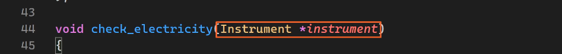
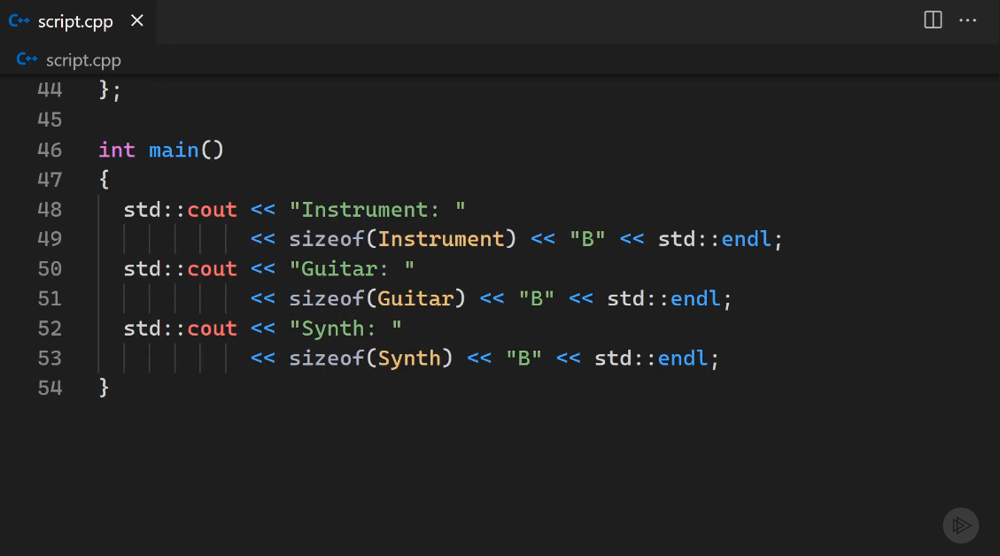

# WORKING WITH POINTERS AND ARRAYS IN C++ 20
Module 5:

## 5.1. Accessing Class Members with the Arrow Operator

- The compiler evaluates the **dot operator** `.` before the **dereference operator** `*`
- So if you want to **dereference** first then access the members of the object, make sure you put the dereference in **parenthesis** `(*pointerName)`
- But this(code in above image) syntax is hard to read
- So, we can use the **member-of operater** `->` instead :

- That is why C++ also offers us the **member-of operater** `->`
- It's like saying *dereference the pointer to an object THEN access a member* `pointerToAnObject->member`
- dereference THEN access
- -> ==  dereference `-`,  THEN access `>`
- It's a shortcut from:
- *pointer.member ==  dereference `*pointerName`, THEN access `.`

## 5.2. Using Base Class Pointers as an Interface
### Summary

- If you ever need `virtual functions` in your classes, always define a `virtual destructor` to prevent **memory leaks**.

### Start
**Base Class:**

**Derived Classes:**

**Main Class:**

#### If ~Destructor is not made virtual 
If you don't make the **destructor** virtual, when you call delete on a derived class/object , the delete call will only delete the base class' stuff and leave the derived guys. This leads to memory leaks.
e.g. :
**Modified Main Class:**

Delete will only delete the Base part from each of these objects. 
This is because the compiler will still use **`Early Binding`** to access these objects.
The dangling members from the derived classes will stay in memory and cause a serious memory leak.

**To fix this:**

Do the same thing we did to the *play* function.
We need to implement **`Late Binding`**
And we can do that by making the *Base Destructor* virtual.

Note:
But in this case, the lesson instructor didn't even create *Derived Destructors*.
I guess because the base one was enough.
Since it was going to be inherited by the derived classes.
Look at the picture, in his code, he placed everything in the public section.

### Why we need the Virtual feature
If we have a hierachy of classes (like from his code), we can use the Base class as an interface.
e.g.:

**Inheritance** and **Late Binding** allow us to group Derived classes in a single array of Base class pointers.

(In his Cose) Since it makes no sense to have a general `Instrument` object, he turned the Base class into an **Abstract class** (by removing the play function definition and assigning it to 0) :

This makes the function a **Pure Virtual Function**.
And every class that has a *Pure Virtual Function* is known as an **Abstract class**
- *which is another word for an `Interface` in C++*

Basically, *Abstract classes* cannot be instantiated.
- *which makes sense for him coz he doesn't need an unspecified instrument*

Here is another use case for the Instrument Interface:

If we didn't have this, we would have to overload this function for every type of Instrument.
Or we would be forced to make a **Templated Function**

##### Prevent Memory Leaks:
And finally we cannot forget to create another loop to delete each one of these Instruments from the Heap :

So:
 If you ever need `virtual functions` in your classes, always define a `virtual destructor` to prevent **memory leaks**.

 ## 5.3. Virtual Tables and Virtual Pointers
 A brief discussion/demonstration on how C++ implements **Late Binding** to support the existence of **Virtual Functions**.

 Virtual Functions introduce a small overhead in the size of a class.

 For this demonstration, we are going to bring back the definition of the `play()` function :
 
#### The previous base class and derived classes

When you mark some function as `virtual`, program will create a `virtual table` in memory for the class that contains that **virtual function**:

This virtual table is nothing more than **a simple array of pointers**, specifically: pointers to functions.
Each position in that array is dedicated to a virtual function.

Since derived functions could override this function from the base class, they also get their own virtual tables:

We know that each of these classes have their own version of the play function:

And the instructions for executing these functions are also stored in a special part of memory.

These functions from the virtual table should point to the appropriate function in memory:

Since every class in this example has its own function override, these pointers point to the function defined inside of that class.

So let's say I want to call the `play()` function from the **Instrument pointer**, which actually points to the **Guitar object**:

Before executing the function, C++ will check the virtual table of the object; which in this case, is the object of the Guitar class:

Compiler knows that the position of this function pointer is 0:

So it will use this function pointer to find the correct function in memory:

Once it finds the correct function, it will **Bind** it to the highlighted/current statement:

And call the corret `play()` function from memory.
This is why we call it **Late Binding** 
*Because the function is Bound at the time of execution (at Runtime)*

------
But what if I decide to remove this overriden function from the **Synth** derived class:

The Virtual Table from this class:
 
will see that we don't have the appropriate overide
So by default, this function pointer will point to the function defined in the Base Instrument class:

And now when we try to call this `play()` function on the **Synth object** through the **Instrument pointer**:

The Virtual Table will be checked again:

And this pointer:

will tell the program to execute the function from the Base Instrument class:

So these Virtual Tables will help the program find the correct Virtual Function in memory.
And we don't have to manage these tables (the program manages them itself).
The **overhead** that I was talking about is the existence of the **virtual pointer**.

---
Whenever you define a virtual function, that base class and all of its derived classes need to store another hidden member, which is known as the **Virtual Pointer**:

We don't manage this pointer, but we have to be aware that it increases the size of the overall class. 
The only purpose of this hidden pointer is to point to the virtual table that belongs to that class:

This is how a program gets access to the correct virtual table. 
And this pointer :

is inherited just like any other member of the base class, so all of the derived classes also have it. 

So let's say again that I'm calling the play() function from the Instrument pointer, which points to the Guitar object: 

This above highlighted pointer is only aware of the inherited part of this Guitar object.

As far as this pointer is concerned, this object `new Guitar(true)` is actually an instrument and it only has these two members, the Boolean value and the virtual pointer, because the number of strings is not inherited.

But that's great because the Instrument pointer is still aware of this virtual pointer member:

and since this pointer belongs to the Guitar object, that means that it is pointing to the Guitar's virtual table:

And since the Guitar's virtual table has the correct function pointer, the overridden function will be used:

---
**The part about the Overhead:** Look at the images below

Before virtual functions, the Instrument needed only one byte of data. And now you can see that all of these objects suddenly need 16 bytes of memory.

Since the virtual pointer is just a pointer, each class would need an additional 8 bytes of memory, at least on my 64‑bit computer.

So Before, if the Instrument class only required 1 byte, shouldn't the total size now be 9 bytes(and not 16 bytes)? 
Yes, but the reason for this big increase is the occurrence of something known as **structure padding**.

As I mentioned, all of the object members have to be stored next to each other in one block of memory. But the total size of this block will depend on the alignment of data.

In essence, CPU works by processing data in cycles:

, and a so‑called **word length** determines the maximum amount of bytes that it can process in each cycle.
On 32‑bit machines, this word length is 4 bytes, and on 64‑bit machines, like mine, it's 8 bytes:

To achieve better performance, the data from an object is aligned by the computer:

If we just put members next to each other, Instrument class would only need 9 bytes, but this virtual pointer would be split in two parts. CPU prefers to read whole values in one cycle. To make this happen, the program will move this pointer into the next block of 8 bytes and add 7 padding bytes next to the Boolean:

Now we can read the Boolean in one cycle and the whole pointer in the next one. 

And the same goes for the derived classes:

Their virtual pointer is also moved to the next cycle, but the Boolean and the integer member are both available in the first cycle:

If you remove the virtual functions and check the size of the Guitar or Synth class, you might be surprised that it's 8 bytes instead of 5:

This is because the processor also likes to have data aligned in a way that *every data type starts at an increment of its own size.*
In this case, an integer of 4 bytes should either start at the beginning of an 8‑byte sequence or at least at the middle.
So the computer adds 3 padding bytes to make this happen:

I should note that this is not a language feature. Padding is implemented by the compiler, and just because it works like this on my computer, that doesn't mean that yours will do the same. The point of this little digression was to show you how this virtual pointer: 

can possibly increase the size of your objects, in this case, significantly. So don't use virtual functions just because the cool kids are doing it; approach them wisely.

### 5.3.Q.1. What is Late Binding
C++ implements **late binding** to support the existence of **virtual functions**. 
So does **late binding** occur at runtime THEN **early binding** at compile time?

Response:
To answer your question based on the diagram and your description:

**Late binding** (or dynamic dispatch) occurs **at runtime**, which is the process of resolving the correct function to call through the virtual table (vtable). 

In the case of **virtual functions**, the compiler performs the following actions during **compile time** (early binding phase):
1. **Sets up the vtable structure**: The compiler generates a vtable for each class that has virtual functions. This vtable maps function pointers to the correct implementation based on the class hierarchy.
2. **Associates the vtable with objects**: Each polymorphic object (an object of a class with virtual functions) contains a hidden pointer (`vptr`) that points to the vtable of the actual type of the object.
3. **Emits code for indirect calls**: For calls to virtual functions, the compiler generates code that accesses the `vptr` to locate the correct function pointer in the vtable.

At **runtime**, the **late binding** occurs when:
- The program accesses the vtable via the `vptr` and invokes the appropriate function pointer stored in the table. This allows the correct overridden function to be called based on the actual type of the object, even if the call is made through a base class pointer.

In summary:
- **Early binding** at compile time: The vtable is set up, and the `vptr` logic is incorporated into the program.
- **Late binding** at runtime: The function call is resolved dynamically via the vtable, allowing polymorphism to work.

