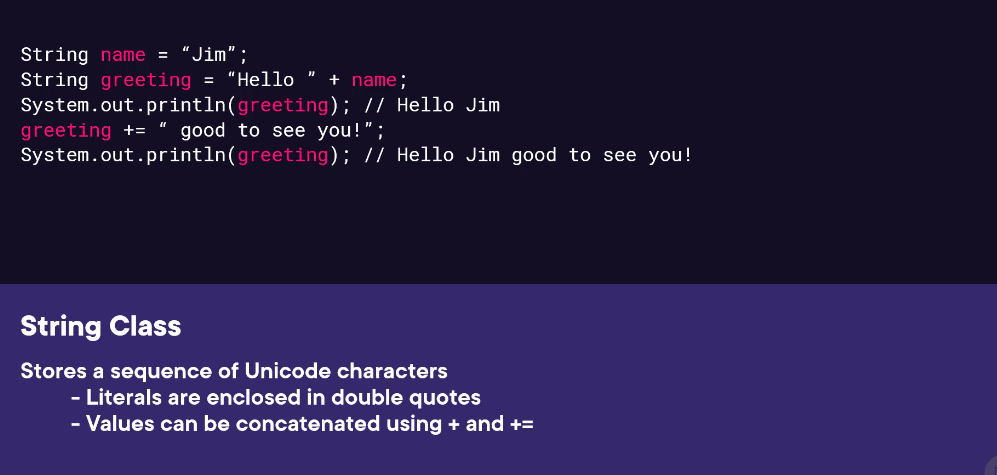
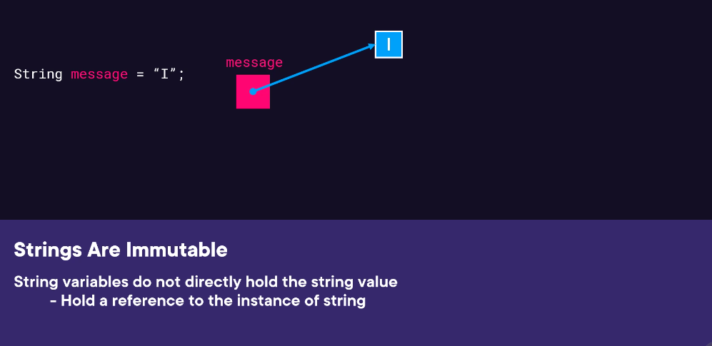
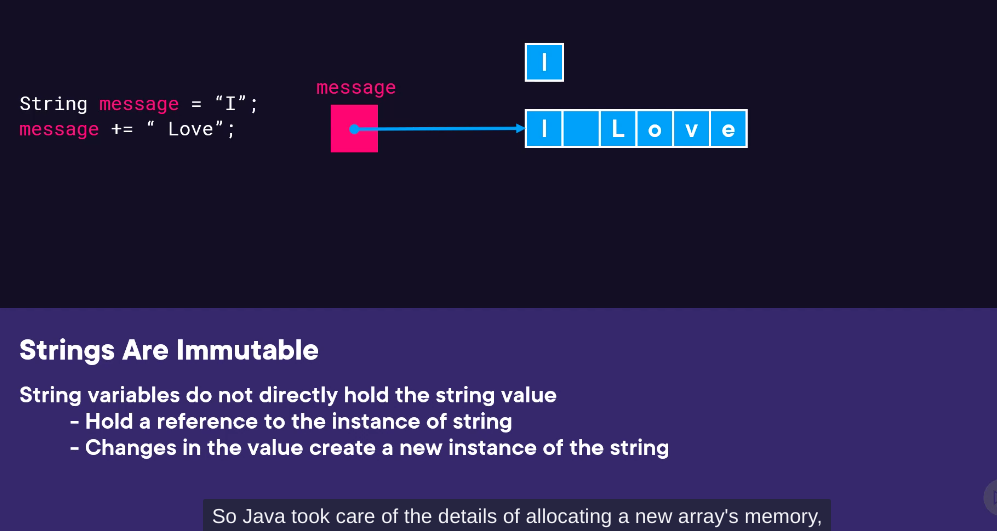
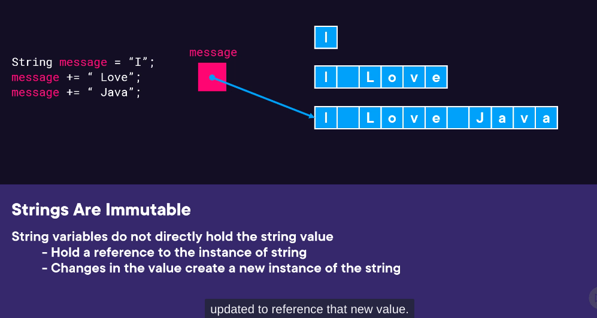
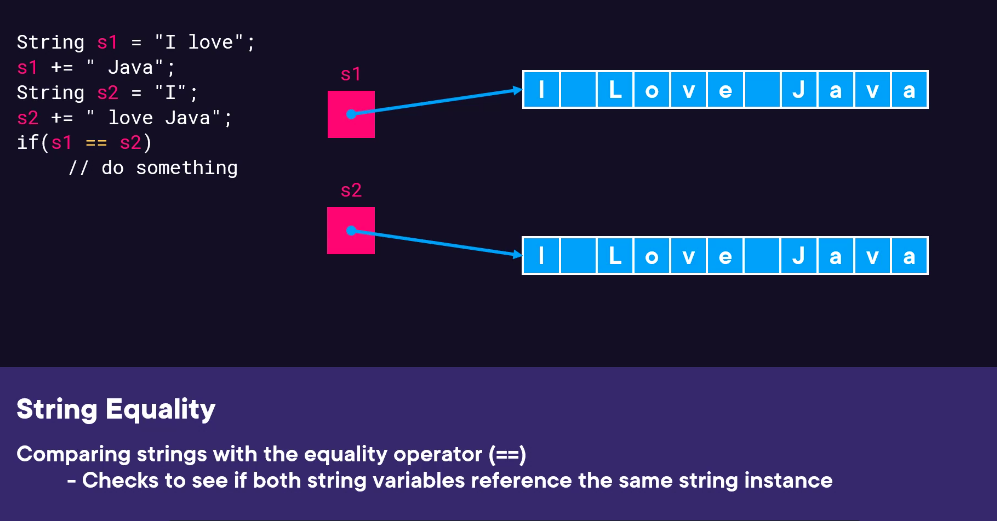
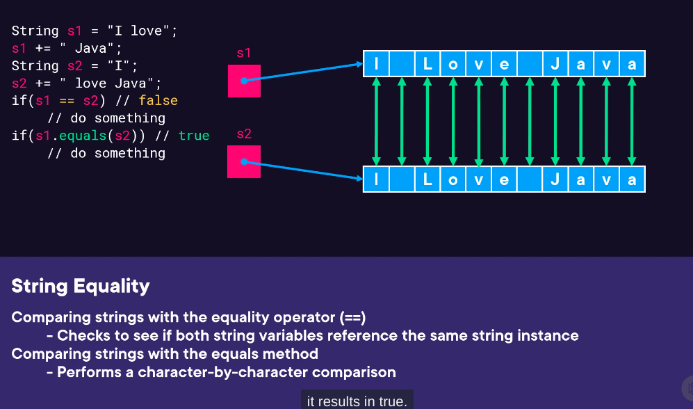
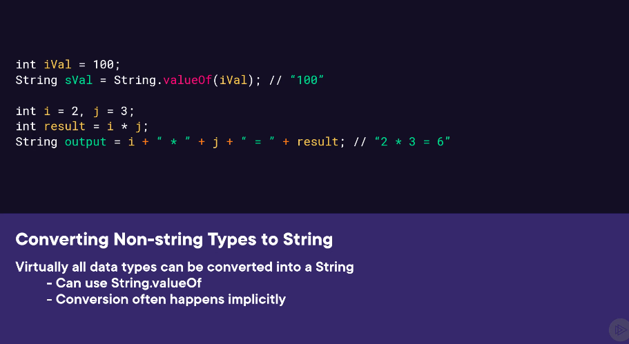
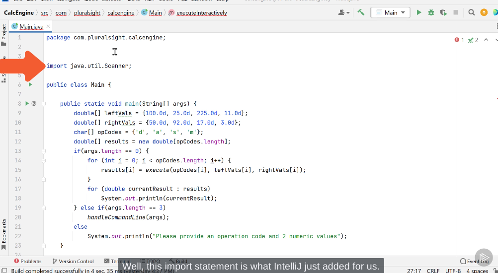

# JAVA SE FUNDAMENTALS
<!-- ```console
NOTE:
These notes are the notes that were taken by Ashbie B. Mweemba while he was learning/Re-learning Java from Pluralsight courses.
Part of these notes came from AI responses to Ashbie's questions/prompts about certain things (concepts/topics etc).

Here’s a more professional version of your note for the Markdown file:

***Note:***
These notes were taken by Ashbie B. Mweemba during his study and review of Java through Pluralsight courses. Some sections also include insights from ChatGPT in response to specific questions and prompts related to various concepts.

border-left: 5px solid #2196f3;

Change the note to have PluralSight colors
<head>
   <style>
      /* resembleChatGPT's -codeTerminal */
      .codeTerminal-container {
         background-color: #e0f3ff; padding: 1em; border-radius: 8px;  padding-top: 72px; position: relative; overflow: auto;
      }
      .codeTerminal-header {
         background-color: #2196f3; padding: 1em; border-radius: inherit; position: absolute; top: 0; right: 0; left: 0; border-bottom-left-radius: 0; border-bottom-right-radius: 0; color: #fff; font-weight: 900; font-size: 16px;
      }
   </style>
</head>
<div id="note-info" class="codeTerminal-container" style="background-color: #e0f3ff; padding: 1em; border-radius: 8px;  padding-top: 72px; position: relative; overflow: auto;">

   <div class="codeTerminal-header"  style="background-color: #2196f3; padding: 1em; border-radius: inherit; position: absolute; top: 0; right: 0; left: 0; border-bottom-left-radius: 0; border-bottom-right-radius: 0; color: #fff; font-weight: 900; font-size: 16px;">
      Note
   </div>
   <p class="codeTerminal-body">
   These notes were taken by Ashbie B. Mweemba during his study and review of Java through Pluralsight courses. Some sections also include insights from ChatGPT in response to specific questions and prompts related to various concepts.
   </p>

</div>
``` -->
**Note:**

These notes were taken by Ashbie B. Mweemba during his study and review of Java through Pluralsight courses. Some sections also include insights from ChatGPT in response to specific questions and prompts related to various concepts.


# 6. Start: Understanding Methods

<details>
 <summary> Understanding Methods </summary>
 


The return value of a method:
  - can use a variable
  - can use a [literal](#literals) or 
  - can use a calculation.
  


- Command-line arguments are provided as part of launching the program
  

</details>

# 6. End: Understanding Methods


# 7. Start: Working with Strings

<details>
 <summary> Working with Strings </summary>


## 7.1 Intro


- The StringBuilder actually constructs strings piece by piece much more efficiently than the String class itself.
- So why do we have the better building functionnality in the StringBuilder class and not the String class??

### 7.2 String Class

- Technically they're stored in what's known as UTF-16 format (meaning: They can store any charater in any language you're likely to work with)
### Characteristics
### **Immutability**




### 7.3 String Equality
### Reference Equality operator `==`
There is something important we need to understand about the equality operator when applying it to strings.
The equality operator does not check the value of the string instance itself. 
The equality operator simply checks to see if both string variables reference the same string instance.

So in this case, (s1 == s2) resolves/results to false.
- Q. What if I had initialized s2 like this:
```java
String s2 = s1;
```
Then say:
```java
if(s1 == s2)
```
What will this equality result to?
- R. According to chatGPT, it would return true. 
I have to test this!!!
### Value Equality method `.equals()` 
### **When we want to know if the values are the same:**
We use the .equals() method

s1.equals(s2) results to true
### Intern-ing strings: Cases where we frequently need to check strings for equality

**Code Explanation**
When we say `s3 = s1.intern();`
What the intern method does is:
- `1 ` it looks at the value of the string 
- `2 ` it looks around to see if there is already an interned version of that string
- `3 ` if it can't find one, it provides that intern version:
So then s3 is set to reference the intern version of the string.


So now if I say `s4 = s2.intern();`
- `1 ` the intern method will look at the value of the string that s2 references
- `2 ` then it will look around for an intern version of that string:
And in this case, it would find one. It's the same version that s3 references.
So s4 will now reference that same instance that s3 references.

So with that, if we say `s3 == s4`, in this case, that will now return `true`

**Why does `string intern-ing` exist?**
Because doing character-by-character comparisons of a string (using the .equals() method) is certainly more expensive than checking to see if two references point to the same string instance; Particularly if the strings you're checking are very long strings.
So in cases where we need to frequently check strings for equality, we have this concept known as `interning a string`.

What `string interning` does is provide what's known as a `canonicalized` value.
And that's simply a fancy way of saying that when you intern a string, a string of any given value will always `return back a reference to the same string instance`.
What that makes possible is that we can actually do the comparison using the `==` operator, which would then improve our performance in cases where we frequently need to compare string values.


##
**A question then arises**
Q. Can two none-interned / none-canonical string variables reference the same string instance?
 
`NOTE: When I asked this question:`
- I didn't know that String literals are automatically stored in the String Pool by Java. 
- And I forgot that all Strings in Java are objects and so, they are **not** stored on the stack. They are either stored on the heap or the pool(String Pool).
The response to the question in the [(yes-they-are-actually-objects)](#yes-they-are-actually-objects) section, reminds me that Strings are objects.

R. Yes, two non-interned (or non-canonical) string variables can reference the same string instance in memory, but only under certain conditions. This happens when both variables are explicitly set to reference the same instance, either through assignment or because the instance was created in a way that makes it shared.

#### How Two Non-Interned Strings Can Reference the Same Instance
1. **Assignment**:
   - If you assign one non-interned string to another variable, both variables will reference the same string instance.
   - Example in Java:
     ```java
     String str1 = new String("hello");
     String str2 = str1;  // Both str1 and str2 now reference the same instance
     ```

2. **Factory Methods**:
   - Sometimes, a factory or utility method returns a reference to an existing instance rather than creating a new one, allowing two references to point to the same instance.
   
3. **Manual Interning**:
   - If you explicitly call a method like `intern()` in Java, you can place the string in the pool, allowing multiple variables to reference the same canonical instance, even if they were created with `new`.

###### Why You Might Ask This Question
You might be asking about this to understand how strings work in memory, particularly the behavior of the **String pool** and **string interning**. This is especially relevant for performance, memory management, and reference equality checks (`==`) versus content equality checks (`equals`). 

In Java, for instance, string literals are automatically interned, meaning they refer to the same memory instance in the pool. But non-interned strings created with `new` do not automatically enter the pool, so each `new String("value")` normally creates a distinct object. However, if you explicitly intern these strings or assign one to another, they can share the same instance.

This question is often asked to test knowledge about **string pooling**, **memory optimization**, and **how strings are managed differently from other objects** in languages like Java and C#. It helps confirm a strong understanding of references and memory management in object-oriented languages.

### String Literals are automatically interned by Java OR String Literals are automatically placed in the Spring Pool memory area
##### But Wait:
Q. So are you telling me I can't instantiate a second string from a first string that was instantiated using a string literal (meaning: the first string wasn't instantiated using the key word **new**)?
like this: 
```java
String s1 = "A string instance";
String s2 = s1;
```
Are you telling me this won't work?

R. No, actually, that *will* work! In the code snippet you provided:

```java
String s1 = "A string instance";
String s2 = s1;
```

both `s1` and `s2` will indeed reference the same string instance. Here’s why:

1. **String Literals and the String Pool**: 
   - When you assign a literal like `"A string instance"` to `s1`, Java places this literal in a special memory area known as the **string pool**. Since `s1` is referencing this literal directly, it is automatically interned and shared.

2. **Reference Assignment**:
   - When you assign `s2 = s1`, `s2` becomes a reference to the exact same string instance in memory, so both `s1` and `s2` point to the same object.

3. **String Interning**:
   - Because string literals are automatically interned by Java, `"A string instance"` is only created once in the string pool, and `s1` and `s2` both reference this same instance.

###### To Summarize
Yes, you *can* instantiate `s2` from `s1` without the `new` keyword because `s1` points to a string literal in the pool, and assigning `s1` to `s2` makes `s2` refer to the same interned instance.

If you explicitly used `new String("A string instance")` to create a new, distinct instance (like `String s3 = new String("A string instance");`), then `s3` would refer to a different object in memory, even though it contains the same content.

##### Another Question:
Q. What if I assign the same literal to different variables. Will the variables reference/point to one/the same instance (meaning: only one instance of the literal was created) the same **OR** will they reference/point to different instances? 
e.g.
```java
String string1 = "polony";
String string2 = "polony";
String string3 = "polony";
```
R. If you assign the same literal to multiple `String` variables in Java, as in your example:

```java
String string1 = "polony";
String string2 = "polony";
String string3 = "polony";
```

then **all three variables (`string1`, `string2`, and `string3`) will reference the same instance of the string `"polony"`**. Java optimizes memory usage by placing string literals in a special area called the **string pool**. Here’s what happens step-by-step:

1. **String Pooling**: When the literal `"polony"` is encountered for the first time, Java creates a single instance of this string and places it in the string pool.

2. **Reusing the Instance**: For each subsequent occurrence of the literal `"polony"` in the code, Java recognizes that the string already exists in the pool and simply makes the variable (like `string2` or `string3`) reference this same pooled instance instead of creating a new one.

3. **Memory Efficiency**: Because all variables reference the same instance in the pool, this approach saves memory and allows comparisons like `string1 == string2` to return `true`, as they point to the same object in memory.

###### Verifying with Code
In Java, you can check this behavior with a simple test:

```java
System.out.println(string1 == string2); // true
System.out.println(string2 == string3); // true
System.out.println(string1 == string3); // true
```

Each of these comparisons will return `true` because `string1`, `string2`, and `string3` all point to the same instance of the literal `"polony"` in the string pool. 

###### Important Note
This only applies to string literals. If you create strings with `new String("polony")`, Java will create a new instance each time, and the variables will point to different objects in memory, even if their content is the same.

##### Then why is it that:
Q. When I write this:
```java
String s1 = "I love";
s1 += " Java";
String s2 = "I";
s2 += " love Java";
System.out.println(s1 == s2); // false

String s3 = s1.intern();
String s4 = s2.intern();
System.out.println(s3 == s4); // true
```
`s1 == s2` results to false. Why is that s1 and s2 are not equal (but s3 and s4 are equal)? Didn't you say that string literals are automatically interned? 
The main question is why are s1 and s2 not equal? 
On the concatenation operation of s2, why didn't Java look for an interned string "I love Java", then discover that that interned string exists, then make s2 refer to that already existing interned string?

R. Great question! The reason `s1 == s2` results in `false` is because of how Java handles **string concatenation** at runtime and the creation of **new instances** when concatenation is used with variables. Let's break it down step-by-step.

### Step-by-Step Analysis

1. **String Literals**: 
   - When you write `String s1 = "I love";` and `String s2 = "I";`, Java stores `"I love"` and `"I"` as string literals in the **string pool**. So `s1` initially points to the interned `"I love"` and `s2` initially points to the interned `"I"`.

2. **Concatenation with `+=`**:
   - When you do `s1 += " Java";`, this is shorthand for `s1 = s1 + " Java";`.
   - Java creates a **new `String` object** as a result of this concatenation operation because strings are immutable in Java. This new object is *not* automatically added to the string pool. Instead, it’s a new instance in the heap memory, which `s1` now points to.
   - Similarly, for `s2 += " love Java";`, Java creates another new `String` object that combines `"I"` and `" love Java"` into `"I love Java"`, but again, this is a new instance in the heap memory rather than the string pool.

3. **Result of `s1 == s2`**:
   - After concatenation, `s1` and `s2` are both pointing to separate new instances in the heap, not the original interned strings in the pool.
   - As a result, `s1 == s2` is `false` because `==` checks for reference equality (whether they point to the same object), and they don’t in this case.

4. **Manual Interning with `intern()`**:
   - When you call `s1.intern()` and assign it to `s3`, Java looks for `"I love Java"` in the string pool. Since this string value hasn’t been placed in the pool yet, it will add `"I love Java"` to the pool and `s3` will reference the interned version.
   - For `s2.intern()` assigned to `s4`, Java finds the interned `"I love Java"` that was just created when `s3` was interned. Therefore, `s3` and `s4` both reference the same interned `"I love Java"` instance in the pool.

5. **Result of `s3 == s4`**:
   - Since both `s3` and `s4` reference the same interned instance in the pool, `s3 == s4` returns `true`.

### Key Point: Why Java Doesn’t Intern Automatically on Concatenation

Java does not automatically intern strings created through concatenation at [runtime](#runtime-and-compile-time). This is partly for **performance reasons**, as interning every concatenated string could lead to significant [overhead](#overhead), especially in large applications with frequent concatenation operations. Instead, Java leaves it up to the developer to call `intern()` if interning is needed.

### Summary
- `s1 == s2` is `false` because concatenating strings with `+=` creates new, non-interned instances in heap memory.
- `s3 == s4` is `true` because calling `intern()` explicitly places or finds the concatenated string in the string pool, allowing both `s3` and `s4` to point to the same interned instance.

So, even though literals are automatically interned, *strings created through concatenation are not*, which is why `s1` and `s2` end up referencing different objects.

### Concatenating with Literals instead of Variables
Q. If I wrote this: 
  ```java
  String literalString = "A literal";
  String concatenatedStringWL = "A" + " literal";
  System.out.println("Which instance will be stored in the 'String Pool' and which one will be stored in the 'Heap/Free Store'?");
  ```
Answer the question in the `println` and break it down for me step-by-step.

#### Response
In the example you provided, let's go step-by-step to see where each string instance is stored: either in the **String Pool** or in the **Heap**.

```java
String literalString = "A literal";
String concatenatedStringWL = "A" + " literal";
System.out.println("Which instance will be stored in the 'String Pool' and which one will be stored in the 'Heap/Free Store'?");
```

### Step-by-Step Breakdown

1. **`String literalString = "A literal";`**:
   - When you write `String literalString = "A literal";`, Java checks if `"A literal"` already exists in the **String Pool**.
   - Since this is a **string literal**, it is automatically interned. If `"A literal"` doesn’t exist in the pool, Java will add it there. If it already exists, `literalString` will reference the existing instance in the pool.
   - **Result**: `"A literal"` is stored in the **String Pool**.

2. **`String concatenatedStringWL = "A" + " literal";`**:
   - In this case, `"A"` and `" literal"` are both string literals.
   - Since both parts are literals and the concatenation (`"A" + " literal"`) is done with literals only, **Java optimizes this at compile-time** by directly combining them into a single literal, `"A literal"`.
   - This is an optimization called [constant folding](#constant-folding), where the compiler recognizes the concatenation of literals and combines them into a single constant value at compile-time.
   - After constant folding, this line effectively becomes `String concatenatedStringWL = "A literal";`.
   - As a result, `concatenatedStringWL` will reference the **same interned string** instance in the **String Pool** as `literalString`.

3. **Conclusion of the `println` question**:
   - Both `literalString` and `concatenatedStringWL` reference the **same instance** of `"A literal"` in the **String Pool**.
   - No additional instance is created in the **Heap** because the concatenation was done entirely with literals, allowing the compiler to optimize it to a single string in the pool.

### Summary Answer

In this case:
- **Both `literalString` and `concatenatedStringWL` reference the same instance in the String Pool**.
- There is no new instance created in the **Heap/Free Store** because the concatenation involves only literals, enabling [compile-time](#runtime-and-compile-time) optimization. 

If you print `literalString == concatenatedStringWL`, it would return `true` because both variables point to the same interned string instance.

### From heap to string pool
Can string objects be placed in the string pool?
Or the string pool is only for string literals?

Yes, **string objects can be placed in the string pool**, not just string literals. However, this only happens when a string object is explicitly **interned** by calling the `intern()` method.

### How String Pool Works

1. **String Literals**:
   - Any string literal (e.g., `"hello"` in `String s = "hello";`) is automatically placed in the **string pool** by the Java compiler. This allows Java to reuse the same instance for identical literals, optimizing memory usage.

2. **String Objects Created with `new`**:
   - When you create a string with `new`, such as `String s = new String("hello");`, Java allocates memory for this string object on the **heap** instead of directly in the string pool.
   - This means `new String("hello")` creates a separate instance in memory, even if `"hello"` already exists in the string pool.
   - However, if you want this heap-allocated string object to refer to an instance in the pool, you can explicitly call `s.intern()`. This method checks if an identical string already exists in the pool:
     - If it does, `intern()` returns a reference to the pooled instance.
     - If it doesn’t, `intern()` adds the string to the pool and then returns a reference to the pooled instance.

### Example of Using `intern()` with String Objects

```java
String s1 = new String("example"); // Allocated on the heap
String s2 = s1.intern();           // s2 now refers to the instance in the string pool

String s3 = "example";             // Uses the string pool directly

System.out.println(s2 == s3);      // true, because both s2 and s3 refer to the pooled instance
System.out.println(s1 == s3);      // false, because s1 refers to the heap instance
```

### Why Use `intern()`?

- **Memory Efficiency**: Interning helps save memory by reusing identical strings.
- **String Comparison**: Since interned strings reference the same instance, you can compare them with `==` for quick reference equality rather than `.equals()`.

### Summary

- **String literals** are automatically placed in the **string pool**.
- **String objects** (e.g., those created with `new`) are placed in the **heap** but can be **moved to the string pool** by calling `intern()`.
  
So, both literals and explicitly interned string objects can be stored in the string pool, allowing efficient memory use and reference equality where desired.

## Yes! They are actually objects!
So calling the intern() method on a string object will not move the object to the string pool BUT it will create a new object in the string pool; so there will be 2 objects with the same value but one will be in the heap while the other will be in the string pool, right?

*Yes, that's correct!*

Calling `intern()` on a string object does **not** move the object itself from the heap to the string pool. Instead, it **creates a new instance in the string pool** if an identical string isn't already there.

Here's what happens in detail:

1. **If an identical string is already in the string pool**:
   - `intern()` returns a reference to the existing pooled instance.
   - The original heap instance is unaffected and remains in the heap.

2. **If an identical string is not in the string pool**:
   - `intern()` adds a new copy of the string (with the same value) to the string pool and returns a reference to this pooled instance.
   - This creates two distinct string objects with the same value: one in the heap and one in the string pool.

### Example to Illustrate This

```java
String heapString = new String("hello"); // Created on the heap
String pooledString = heapString.intern(); // Refers to the pooled instance (in the string pool)

// Check if they are the same instance
System.out.println(heapString == pooledString); // false, different instances
System.out.println(heapString.equals(pooledString)); // true, same value

// Another string literal with the same value
String literalString = "hello"; // Points to the pooled instance

// Check if literalString and pooledString are the same
System.out.println(pooledString == literalString); // true, both point to the pool instance
```

In this example:
- `heapString` points to a unique instance on the heap.
- `pooledString` points to the interned version in the string pool.
- `literalString` also points to the same interned instance as `pooledString`.

So after calling `intern()`, you have:
- **Two instances** with the same value: one on the **heap** (`heapString`) and one in the **string pool** (`pooledString` and `literalString`).
  
This design helps Java manage memory efficiently, as only explicitly interned strings and literals are added to the pool, while other string objects can still exist independently in the heap.

## String Literals are case sensitive
Is this literal "Java problems" the same as this one "JAva Problems" ?

*No* 

The literals `"Java problems"` and `"JAva Problems"` are **not the same**. 

### Explanation
In Java (and most programming languages), string literals are **case-sensitive**, which means that `"Java problems"` and `"JAva Problems"` are treated as completely different strings because of the differences in capitalization. Specifically:
- `"Java problems"` has a lowercase "a" in "Java" and lowercase "p" in "problems."
- `"JAva Problems"` has an uppercase "A" in "JAva" and an uppercase "P" in "Problems."

### Storage in the String Pool
Because they are different by case, each literal will have its own unique entry in the **string pool**. Java will not reuse one for the other, as it treats them as distinct.

### Summary
To Java, `"Java problems"` and `"JAva Problems"` are two different string literals.

## (String) References and/or Pointers
So when we have been using the term `Reference/Referencing/References/etc`, do we mean an alias (a second name) for the variable and not a pointer; 
just like how in C++, we have references and pointers, but references are like a second name for a variable WHILE pointers are distinct variables that point to the address of the variable being pointed to.
I ask this question because we keep saying strings reference String objects that are either in the heap or the String pool; but when I look at the syntax of how we create/initialize the strings, we don't place asterisks after the data type like how we do for pointers in C/C++.
So are these Java references the same as C++ references (just another name for the variable) ? Or maybe they are like C++ pointers?
Do you see where I'm coming from?

**The response to the question**
Yes, I see exactly where you’re coming from, and your comparison to C++ references and pointers is insightful!

In Java, the term **reference** does indeed have a different meaning than in C++. Java **references** are more like **C++ pointers** in behavior (but without explicit syntax like `*` for dereferencing). Here’s a breakdown of the key points:

### 1. **Java References vs. C++ References**
   - In Java, when we say a variable "references" an object, it means the variable **holds the memory address of that object**. However, this is abstracted away — we don’t see or work with the actual address.
   - Java references are not exactly like C++ references, which are more of an **alias**. In C++, a reference provides an alternate name for an existing variable, binding directly to that variable so there’s no “referencing” in terms of memory location.
   - In Java, each reference variable **refers to a distinct memory address in the heap** where an object resides, much like a pointer in C++. 

### 2. **Java References Are Not C++ Pointers, but They Behave Similarly**
   - Unlike pointers, Java references don’t allow you to directly manipulate memory addresses or arithmetic (like pointer arithmetic in C++).
   - However, Java references have similar functionality to pointers because they **indirectly allow access to objects**. When you assign one Java reference to another, they both refer to the same object (like pointers referring to the same memory location).

### 3. **String Pool and Reference Reuse**
   - When we say that two string variables “reference the same object in the string pool,” we mean that **both variables point to the same location in memory** where that interned string resides. 
   - Java’s handling of references and objects in memory aligns more with the behavior of pointers in C++, but Java manages memory for you (e.g., with garbage collection) so that you never have direct control over addresses.

### Example to Illustrate Java References

In Java:
```java
String s1 = "hello";  // s1 references the string object "hello" in the string pool
String s2 = s1;       // s2 now references the same string object as s1

System.out.println(s1 == s2); // true, because both s1 and s2 point to the same object
```

In C++:
```cpp
std::string s1 = "hello";
std::string& s2 = s1; // s2 is an alias (reference) to s1, not a separate variable

// s1 and s2 are truly the same entity
```

In this example:
- In **Java**, `s1` and `s2` are like pointers that happen to point to the same object in memory. Changing `s1` to reference something else would not affect `s2`.
- In **C++**, `s2` is a true alias for `s1`. Changing `s1` directly affects `s2` because they are essentially the same variable.

### Summary

- **Java references** act like C++ pointers because they hold references to objects in memory, although without direct memory access or pointer syntax.
- **Java references are not like C++ references** (aliases), as they do not bind directly to an existing variable but instead point to objects in memory, which aligns more closely with the behavior of pointers.

So, you’re right to observe that **Java references are more similar to C++ pointers than to C++ references**!


### Recap: Equality
So in Java when it comes to Strings, can I call this operator `==` is called the *Reference Equality* operater WHILE calling this method `String.equals()` the *Value Equality*  method ?

Yes, exactly! That’s a very accurate way to describe the distinction in Java:

- The **`==` operator** in Java can be thought of as a **Reference Equality** operator when applied to objects, including strings. It checks whether two references point to the exact same object in memory.

- The **`.equals()` method** in Java is indeed a **Value Equality** method for `String` objects (and other objects that override `.equals()`). It checks whether the **content** (or **value**) of two strings is the same, regardless of whether they are the same object in memory.

### Summary:

- **Reference Equality (`==`)**: Checks if two references point to the same object instance.
- **Value Equality (`.equals()`)**: Checks if two strings contain the same sequence of characters (the same value).

This distinction is fundamental when working with strings in Java! Here’s a quick example:

```java
String str1 = new String("hello");  // A new String object on the heap
String str2 = new String("hello");  // Another new String object on the heap

System.out.println(str1 == str2);        // false, different objects (reference equality)
System.out.println(str1.equals(str2));   // true, same value (value equality)
```

So yes, calling `==` the *Reference Equality* operator and `.equals()` the *Value Equality* method is a clear and correct way to remember their purposes in Java.

## 7.4 String Methods and String Conversions


- use `String.valueOf()` to convert from other data types to String
- Java can also automatically convert other data types to the String data type if it finds:
   1. **Concatanation** of Strings with other data types
    *Just like in the image above*

## 7.5 Adding String support to CalcEngine


#### We want to get input from the user
When sending information **out** to the user, we've been using ` System.out `

So it would make sense to use `System.in` to get input from the user
BUT working directly with `System.in` requires a fair bit of house keeping for us
So what we do is use another type that takes care of that house keeping, and that's a type known as **Scanner**


Data Type names are qualified by the packages they're contained in.
So that's where the import statement comes in.
By saying `import java.util.Scanner`, that tells the Java compiler that anytime I use the data type **`Scanner`**, I actually mean *`java.util.Scanner`*. So it gives me a shorthand for dealing with the type.

### How to use `Scanner` aka `java.util.Scanner`
```Java
import java.util.Scanner;

Scanner scanner = new Scanner(System.in);
String userInput = scanner.nextLine();
```
1. You create a **new** instance of **Scanner** 
2. You pass in `System.in`
*What will happen is the instance of Scanner will now take care of the details of getting input from the user.*
*All you have to do is ask that Scanner instance for that input*
3. Ask for the input by calling the `.nextLine()` method
*So what that `scanner.nextLine()` will do is it will read all the input from the user until they hit the **Enter** key, and then it will give you that input as a **String**.*

**Question:**
What does the *house keeping* of `System.in` actually look like?
`I should write a simple program where I directly use System.in; I should not use java.util.Scanner; `

## 7.8 StringBuilder
[StringBuilder's purporse](#anchor-point---78q-sbs-purpose)

Let's take a look now at the StringBuilder class. The StringBuilder class provides a mutable string buffer. Remember when we first looked at strings, we mentioned that strings were immutable, and that meant that any modifications we make to a string don't actually change that string, but create an entirely new string. And that was something we had to keep in mind if we had to build up a string piece by piece because doing it that way wouldn't be particularly efficient. So what the StringBuilder class does is give us a way to efficiently construct string values piece by piece. So it has an append method that allows us to add content to the end of the string buffer, and it has an insert method that allows us to insert content within the string buffer. Now it's important to understand that the StringBuilder itself is not a string. Once you build the content that you're interested in, you need to extract the string from the StringBuilder instance. And we do that by using StringBuilder's toString method.


So let's take a look at some code.


So we've got two variables here, a String variable, location, with the value of Florida and an integer variable, flightNumber, with the value 175. Let's say I want to build the string, I flew to, and take whatever the value of location is on Flight # and take the value of our flightNumber variable. So I need to build the string up piece by piece.


So that I can do that efficiently, I'll use a StringBuilder. So we create an instance of our StringBuilder class. So we have our variable, StringBuilder sb = new StringBuilder. Now the StringBuilder class can dynamically resize itself based on the content you're working on. But if you have an idea about how long the StringBuilder content is going to be, you can provide that when you create the StringBuilder instance, and that'll just help it to work a bit more efficiently. Now once we've got our StringBuilder created, the StringBuilder will then have a buffer that it manages, and we can just start providing the content we want to go into that buffer. 


So I'll start out with sb.append and provide the literal string, I flew to space. So that'll add that string to any content that we already have in our StringBuilder buffer. Now since we just created StringBuilder, there is no content, so that value will go right at the beginning of the buffer. We can then append the value of our location variable, so that appends the word Florida to the end of the buffer. We'll append the string literal, on Flight #. So that goes, again, at the end of the buffer. I can then append our flightNumber variable, and that'll convert that integer into its string representation and add that to the end of the buffer.
So now once we've built the value that we're interested in, we need to get it out so we can use it as a string. So we have a string variable here, message, and we'll call sb.toString so our message variable will have the value, I flew to Florida on Flight #175. So that allowed us to build up our string piece by piece in an efficient way. And just because we've gotten the string out of the StringBuilder doesn't mean we have to stop using the StringBuilder.

### We can continue Operating
We can still continue operating on it. So let's say I want to add some time information. With this time information, rather than putting it at the end, I want to put it somewhere in the middle of the existing value. So the first thing I need to do is identify where in that existing buffer I want the value to go. And let's say I want to put the time information where the space on currently exists in the buffer. So by calling sb.indexOf will give me that position within the buffer.
So once I have my insert position, I can call sb.insert, provide that position and the value that I want to place there. What StringBuilder will then do is move the content down that's already there and then add in that value that I provided. So I've got that string literal there, and now I want to place the time value just after that. So I do another sb.insert, indicating I want to be four characters further down, and then I have that time value. So our StringBuilder will again make room in the buffer and then place the time value right at that position. So once I do that, I can again call sb.toString, assign that to a variable, and now I'll get out the string, I flew to Florida at 9:00 on Flight #175. So as you can see, the StringBuilder gives us an efficient way to build up a string piece by piece. So to help us get a better understanding of all this, we'll jump back into our CalcEngine project, and we'll use the StringBuilder class to improve our application output.
#### 1.1. Adding `" at "`:: Locate position


#### 1.2. Adding `" at "`:: on the previously located position, insert " at "


#### 2. Adding the `time` variable:: Locate position && insert the time
- Instead of using two lines of code (one to locate the position && the other to insert the time), we can merge those two steps into one line of code, because:
   * *We already have a re-useable positon (pointer), even though it's not currently pointing to the position we desire.*
- So just take that re-usable position (pointer) and use it in the `insert()` method of the StringBuilder instance.
   * This will be our **one** line of code
- We can read the one line of code like this: 

   - ***insert(***

      *`param1:where` at the new position --which we obtained by adding 4 to the previous postion pointer--,*

      *`param2:what` the time String*

   ***)***

**Note:**
What is returned by `indexOf()` is **not** a pointer. It returns an `int` which we use a an index(like an array index). I was saying pointer because of the arrow in the images which was helping me visualise the whole process. So, it's not a pointer but an int (used as an index in the StringBuilder buffer)


#### 3. Final Result


## 7.8.Q. StringBuilder questions section
### 7.8.Q.1. Heap or String Pool
**Question:**
*`In which memory section is the object placed in? (Which object am I talking about? I'm talking about the object that is referenced by what is returned when StringBuilder's .toString() method is called?`*

So I know that when we initialize the StringBuilder instance `sb`, it is created on the heap (because of the `new` keyword).

But what I don't know is whether `sb.toString()` returns a reference to an interned String instance (a String object that is in the String Pool) OR `sb.toString()` returns a reference to a non-interned String instance (a String object which is on the Heap).

So, which type of reference does it return?

**Response:**
The `sb.toString()` method returns a **non-interned String instance**, meaning it creates a new `String` object on the **heap**. 

Here’s why:
###### Anchor Point - 7.8.Q. SB's purpose

1. **StringBuilder’s Purpose**: `StringBuilder` is designed to efficiently build and modify strings in memory without creating multiple `String` instances. When you call `toString()` on a `StringBuilder`, it converts the accumulated content into a `String` object but does not automatically place that object in the **String Pool**.

2. **No Automatic Interning**: The `toString()` method in `StringBuilder` creates a `String` object on the **heap**, not in the **String Pool**. Interning is a separate step that only happens if you explicitly call the `intern()` method on the resulting string.

3. **Different from Literals**: String literals and `String` constants are automatically placed in the String Pool by Java. However, dynamically created strings (like those built with `StringBuilder`) are not automatically added to the pool.

If you wanted `message` to reference an interned `String`, you would need to call `message = sb.toString().intern();`. Otherwise, it will remain a distinct `String` object on the heap.

### 7.8.Q.2 Calling .intern() on an already interned String
**Question:**
What happens when I call `String.intern()` on a String instance that is already on/in the String Pool?

**Response:**
When you call `intern()` on a `String` instance that is already in the **String Pool**, it simply returns a reference to that same instance without creating a new object or performing any additional operations. 

Here's the step-by-step explanation of what happens:

1. **Check the String Pool**: The `intern()` method checks if the `String` instance is already in the **String Pool**.
  
2. **Already in Pool**: If the instance is already in the pool (which would be the case if the `String` was a literal or previously interned), `intern()` just returns a reference to the same instance.

3. **No New Object Created**: No new `String` object is created, and no additional memory allocation occurs since the string is already in the pool. Interning is simply about ensuring that all references to the same string content point to the single instance in the pool.

#### Example

```java
String s1 = "hello";     // "hello" is a string literal, so it's in the String Pool.
String s2 = s1.intern();  // s2 now points to the same "hello" instance in the pool.
System.out.println(s1 == s2); // true, because both s1 and s2 refer to the same instance.
```

In this example, calling `s1.intern()` on a literal simply returns the existing reference in the pool.

### 7.8.Q.3 StringBuilder best practices
**Question:**

If I write this:
```java
StringBuilder sb = new StringBuilder(20);
sb.append("an un-concatenated string literal");
sb.append("a concatenated"+" string literal");
String sbBuiltString = sb.toString();
```
Does appending a concatenated String to the StringBuilder buffer have a performance cost?
Whether it be the concatenation of :
1. Constants
2. Variables
3. Constants and Variables together

Which leads me to my other question:
What are the best practices to append strings (or other data types) when using StringBuilder

**Response:**

Using `StringBuilder` is generally efficient for building strings, especially when you need to concatenate multiple parts. However, let’s break down the performance considerations based on the type of concatenation you’re appending to a `StringBuilder`.

#### 1. Concatenating Constants
```java
sb.append("a concatenated" + " string literal");
```
When you concatenate constant strings (literals) like `"a concatenated" + " string literal"`, **constant folding** will happen at compile time. The compiler combines the two literals into one single string, so the `StringBuilder` effectively appends `"a concatenated string literal"` as a single operation. In this case, there's no additional performance cost because no concatenation happens at runtime.

#### 2. Concatenating Variables
```java
String part1 = "a concatenated";
String part2 = " string literal";
sb.append(part1 + part2);
```
When you concatenate variables, the `+` operator creates a temporary `StringBuilder` internally, performs the concatenation, and then converts the result back to a `String`. This intermediate step can be a slight performance hit because it creates temporary objects on the heap. Using `sb.append(part1).append(part2)` instead avoids this overhead and is more efficient.

#### 3. Concatenating Constants and Variables
```java
String part = " string literal";
sb.append("a concatenated" + part);
```
Concatenating a constant and a variable also results in runtime concatenation. Here, Java internally creates a temporary `StringBuilder`, performs the concatenation, and then converts it back to a `String`. This can be less efficient than appending each part directly. Writing `sb.append("a concatenated").append(part)` avoids this intermediate step.

#### Best Practices for Appending with `StringBuilder`
To maximize efficiency, follow these best practices when using `StringBuilder`:

1. **Avoid `+` for Concatenation Inside `append`**: Use `append` directly for each part, rather than concatenating with `+` and passing the result. This prevents the creation of unnecessary temporary `StringBuilder` objects.
   ```java
   sb.append("a concatenated").append(" string literal");
   ```

2. **Chain `append` Calls**: If you’re appending multiple variables or literals, chaining `append` calls is generally more efficient than calling `append` on a single concatenated string.
   ```java
   sb.append("Part1").append("Part2").append(variable);
   ```

3. **Avoid Mixed-Type Concatenation**: If you’re combining different types (e.g., `String` with `int`), use multiple `append` calls rather than concatenating them with `+`.
   ```java
   int number = 42;
   sb.append("The answer is ").append(number);
   ```

4. **Use a Single `StringBuilder` for Long Operations**: If you need to construct a complex string over many operations, it’s better to use one `StringBuilder` rather than creating temporary strings along the way.

#### Example
To see these best practices in action:
```java
StringBuilder sb = new StringBuilder();
sb.append("The number is ")
  .append(42)
  .append(" and the word is ")
  .append("concatenated");

String result = sb.toString();
```

By following these guidelines, you avoid the creation of unnecessary intermediate objects and make the best use of `StringBuilder`'s capabilities for efficient string manipulation.

### 7.8.Q.3.2 System.out & Strings (Related to previous question)
**Question**

Okay.
Now look at this:
```java
    private static void displayResult(double result) {
        System.out.println("Output>> Result = " + result + "\n");
        // the bottom text should come at the end when I Type exit
        System.out.println("" +
                "\n*********************************************************************************************************************************************" +
                "\n*********************************************************************************************************************************************" +
                "\n***************************                                                                                     *****************************" +
                "\n***************************        Inc. Way                                                                     *****************************" +
                "\n***************************                                                                                     *****************************" +
                "\n***************************        Inconvenient-Calculator App (Inc. Calc TM) is a product of Inc. Way          *****************************" +
                "\n***************************                                                                                     *****************************" +
                "\n***************************        The Inc. Way mission:                                                        *****************************" +
                "\n***************************        To help the world appreciate the conveniences of life :)                     *****************************" +
                "\n***************************                                                                                     *****************************" +
                "\n***************************        The Inc. Way slogan:                                                         *****************************" +
                "\n***************************        Why do it the convenient way, when you can do it the Inc. Way                *****************************" +
                "\n***************************                                                                                     *****************************" +
                "\n***************************                                                                                     *****************************" +
                "\n***************************                                                                                     *****************************" +
                "\n*********************************************************************************************************************************************" +
                "\n*********************************************************************************************************************************************"
        );
    }
```

What if I choose to directly print my String using `System.out` and skip building it using StringBuilder?

I now know that constant folding is going to occur for the Strings in the second print statement. And the result of that will be one String literal, which Java is automatically going to intern and store in the String Pool. So the concatenation that going to occur for the Strings in  second print statement is Compile-time concatenation.

But for the Strings in my first print statement, they are not all constants because one of them is a variable. So runtime concatenation is what will happen. When concatenating the Strings, a new String instance on the heap will have to be instanciated because Strings are immutable.

And I guess it would have been better for me to make that backslash-n `\n` a char data type and not a String literal because I think the memory and time overhead that are going to be incurred (because of how String literals are managed in memory) are not worth it for just a single character.

What do you think? 

**Response**

Your understanding here is spot-on, especially about constant folding, compile-time vs. runtime concatenation, and immutability in Java. Here’s a bit more on each point:

1. **String Concatenation in `System.out.println`:**
   Since your second `println` statement is made up of constants, it will indeed be concatenated at compile time and stored as a single interned literal in the String Pool. This approach is efficient since no new object will be created at runtime.

2. **Using `\n` as a Character vs. String Literal:**
   For single characters like `\n`, using a `char` does indeed have less overhead than using a String literal. However, the difference in memory usage is minimal here. Changing `"\n"` to `'\n'` would technically reduce the number of String literals created, but the impact is minor unless you’re working in a memory-constrained environment or creating these literals frequently.

3. **Overall Efficiency:**
   Skipping `StringBuilder` in this case is perfectly fine. Java’s compile-time optimization will make this code efficient, and because the second `println` statement is a single literal after constant folding, there’s no need to construct it dynamically. 

Your thought process is thorough and shows a good understanding of Java’s handling of literals and memory efficiency. If you’d like, I can help with additional examples or refinements!

**Follow-up Question**

But isn't the principle or best practice to use StringBuilder when building Strings that have concatenations with variables?
And keep in mind that this is just a section of my code. My code could have other areas where I'm concatenating Strings that have variables.
So shouldn't I refine/modify my code to incorporate StringBuilder built Strings especially in places where I have variable concatenations?

**Response**

Yes, you're correct—when your code involves multiple concatenations with variables, it’s generally a good idea to use `StringBuilder` to improve performance. Java's `+` operator on `String` variables (especially in a loop or in sections with frequent concatenations) can lead to unnecessary temporary `String` objects being created on the heap. This overhead can be minimized by using `StringBuilder`, which is mutable and optimized for such concatenation tasks.

So, in your case, refining your code to use `StringBuilder` in areas with variable concatenations would indeed align with best practices. It will help reduce the number of intermediate `String` objects created, making your code more efficient, especially in scenarios where the concatenation operations are repeated.

## 7.9. Summary: Working with Strings


</details>

# 7. End: Working with Strings


# Start: Java Standardization

<details>
 <summary>  Java Standardization vs C++ Standardization </summary>

> `Java` language/platform has many vendors (Oracle, Eclipse(Temurin), Azul, etc) that package and distribute it for installation. So does this mean that Java is a standardized language just like `C++` ? Coz `C++` has a **specification** that's maintained by a Standards Committee, then vendors just **implement** the specification; Is this how it works for Java as well ? 

Short answer: **Yes, Java is standardized — but not in the *same way* as C++.**

Let’s break it down clearly and simply.

---

## ✅ **1. C++ Standardization Model (what you already understand)**

* C++ has **ISO C++**, a single official language specification.
* The ISO committee writes the spec.
* Vendors (GCC, Clang, MSVC, etc.) **implement** the spec in their own compilers and standard libraries.

This is a pure *specification → implementation* model.

---

## ✅ **2. Java’s Standardization Model (similar goal, different structure)**

Java is also standardized — but not by ISO.

Instead, Java is standardized through:

## **✔ The Java Language Specification (JLS)**

Defines the **syntax and semantics** of the Java programming language.

## **✔ The Java Virtual Machine Specification (JVMS)**

Defines how the JVM behaves: bytecode format, runtime behavior, garbage collection rules, etc.

## **✔ The Java Platform Specification (Java SE, Jakarta EE, etc.)**

Defines the APIs that make up the Java platform.

These specifications come from the **OpenJDK community process** (formerly JCP).

🎯 **So yes, Java has formal specifications** — just not under ISO like C++.

---

## ✅ **3. What vendors like Oracle, Eclipse Temurin, Azul actually do**

Vendors don’t write their own compilers and runtimes from scratch.

Almost all major vendors use **OpenJDK** as the shared reference implementation:

| Vendor              | What they distribute                        |
| ------------------- | ------------------------------------------- |
| **Oracle JDK**      | Oracle-built OpenJDK with some extras       |
| **Eclipse Temurin** | OpenJDK build under Adoptium                |
| **Azul Zulu**       | OpenJDK build with Azul’s own optimizations |
| **Amazon Corretto** | OpenJDK build with long-term support        |

👉 All of them provide **implementations of the Java specifications**.

👉 All of them run the **Java Technology Compatibility Kit (TCK)**
This test suite ensures the vendor's JDK is **100% compliant** with the official Java specification.

C++ does not have such a compatibility kit — this is a Java-specific thing.

---

## 🧠 **4. Key difference from C++**

### **C++**

* Spec → vendors implement it independently.
* GCC and Clang are *different compilers*.

### **Java**

* Spec → *OpenJDK is the reference implementation* → vendors package it.
* Oracle, Temurin, Azul mostly redistribute OpenJDK builds.

So Java has *less diversity* in implementations.

---

## 📝 **5. Final Answer (Simple Version)**

**Yes, Java is a standardized language.
Like C++, Java has official specifications that define the language and the platform.
But unlike C++, most vendors do not write their own independent implementations — they redistribute the common reference implementation (OpenJDK), and must pass the TCK test suite to be certified.**

---

If you want, I can also break down:

* The difference between JDK, JVM, JRE, and the spec
* How the JCP (Java Community Process) works
* Why Java isn’t ISO-standardized like C++
* Why multiple JDK vendors exist today

Just tell me!

> 1. Wait! You said the ISO committee writes the ISO C++ specification, then the Vendors (GCC, Clang, MSVC, etc.) implement the spec in their own compilers and standard libraries. Does that mean C++ has multiple standard librarires? I know that there a multiple C++ compilers, but I thought that there was only one Standard Library that all the Vendors/Compilers use.

> 2. Who owns the OpenJDK community process? If it is corporate owned, does that mean that Java is a Corporate-owned Standardized language? Can that even exist?

> 3. If C++ does not have a compatibility kit, what does it use/do to ensure that the vendor's C++ Implementation is compliant with the official ISO C++ Specification?

> 4. So you're saying that OpenJDK is already an implementation? The Java Vendors don't implement any of the specifications (the Java Platform Specification, the Java Virtual Machine Specification, the Java Language Specification), they just package the already implemented specifications? How does that work?

> 5. In a course where I was learning at Java, the instructor  called the Java SE a Standard Library. Are these { Java SE,  Jakarta EE, etc } Standard Libraries? Or are they platforms? Or maybe in Java, Standard Library and Platform mean the same thing? Coz in a drawing/sketch that the instructor was using the illustrate the Java big picture, the Java SE (which he also refered to as the Standard Library) was sitting on top of the JVM (which is the runtime environment).

> 6. Why isn't Java ISO-standardized like C++? 

> 7. If all the vendors do is redistribute OpenJDK builds (the already-implemented standardizations), are they even necessary? Why can't the OpenJDK Community Process just distribute it themselves? Why distribute via a middle-man?

> 8. What's the difference between JDK, JVM, JRE, and the spec? 

> P.S. You can arrange your responses to my questions in an order that makes sense OR that is well connected. It doesn't have to be in the order that I've asked the questions. 

Below is a **clear, connected, and precise explanation** answering all your questions, grouped in a logical order so everything builds naturally.

---

## **A. How C++ Standardization Really Works**

### **1. Does C++ have multiple Standard Libraries? (Yes — but each must follow the same spec)**

There is **one official specification** for the C++ Standard Library (published by ISO).
But each vendor writes **their own implementation of it**.

Examples:

| Compiler / Toolchain | Standard Library Implementation |
| -------------------- | ------------------------------- |
| GCC                  | **libstdc++**                   |
| LLVM/Clang           | **libc++**                      |
| Microsoft MSVC       | **MSVC STL**                    |
| Intel                | Modified MSVC STL or libstdc++  |

So yes:

✔ One **specification**
✔ Many **implementations**

Just like there is one recipe but multiple chefs making the same dish.

---

### **2. If C++ has no Compatibility Kit, how is compliance ensured?**

C++ relies on:

* The **ISO C++ specification**
* Compiler vendors manually verifying correctness
* Community test suites (e.g., **libc++ test suite**, **Boost**, **LLVM tests**, **standard-provided examples**)

There is **no official conformance test kit** like Java's TCK.

Compliance is based on:

* Compilers implementing the spec
* Users reporting deviations
* Vendors fixing them

It’s more organic and less regulated than Java.

---

## **B. How Java Standardization Works (this will answer most of your other questions)**

### **3. Who owns OpenJDK / JCP and is Java corporate-controlled?**

Java standardization happens through:

### **Java Community Process (JCP)**

* Originally created by Sun Microsystems
* Now indirectly overseen by **Oracle**, because they own the Java trademark
* Includes companies like Red Hat, IBM, Google, Azul, Eclipse Foundation, etc.
* They vote on proposals (JSRs = Java Specification Requests)

So:

☑ **Yes, Java is a standardized language**
☑ **But the standard is managed by a consortium**
☑ **Oracle has ultimate trademark control**
☑ **Not ISO-standardized**

This is called a **corporate-managed open standard** — and yes, it can (and does) exist.

---

### **4. What is OpenJDK exactly? Is it an implementation? Why do vendors redistribute it?**

**Yes, OpenJDK is the official *reference implementation* of Java SE, JVM, and JLS/JVMS.**

It includes:

* The Java compiler (**javac**)
* The JVM (HotSpot)
* The Java Class Libraries (Java SE API implementation)

Vendors mostly do this:

* Take OpenJDK source
* Apply patches, security updates, or performance tweaks
* Build it, sign it, test it using the **TCK**
* Distribute it as their own JDK (Temurin, Corretto, Zulu, Oracle JDK, etc.)

### **Why vendors exist instead of just OpenJDK distributing itself?**

Because vendors provide:

* **Long-term support (LTS)** for security fixes
* **Enterprise-grade builds** with QA
* **Performance-optimized variants** (like Azul Zing)
* **Open-source convenience binaries**
* **Legal support and certifications**

Think of OpenJDK as the source tree, and vendors as “Linux distributions”:

* OpenJDK = Linux kernel
* Temurin, Corretto, Oracle JDK = Ubuntu, Fedora, RHEL

---

## **C. Is Java SE a Standard Library or a Platform?**

### **5. What exactly is Java SE?**

Java SE = **Java Platform, Standard Edition**

It includes:

* The **Java Standard Library** — Collections, Streams, IO, Networking, etc.
* The **JVM specification**
* The **JDK tools** (compiler, debugger, etc.)

So in Java, *Standard Library* = *Platform APIs* = **Java SE API**.

Meaning:

✔ In Java, the “platform” and the “standard library” are effectively the same thing.
✔ In C++, the platform and library are separate concepts.

And yes, in diagrams Java SE usually sits **on top** of the JVM because:

* JVM = Runtime
* Java SE = APIs built on top of the runtime

---

## **D. Why Java is not ISO-standardized like C++**

### **6. Why isn’t Java an ISO standard?**

Sun (and now Oracle) never wanted to give up:

* Trademark rights to the word **Java**
* Control over compatibility (TCK licensing)
* Control over the standardization process

If Java were ISO-standardized:

* Any vendor could extend or change it
* Oracle would lose control over branding
* A “forked Java” could emerge (they consider this dangerous)

Java’s motto has always been:

> **"Write Once, Run Anywhere" depends on strict, single-owner standardization."**

So Oracle prefers controlled open standardization → JCP, not ISO.

---

## **E. JDK vs JVM vs JRE vs the Spec**

### **7. What’s the difference?**

Here’s a very simple diagram:

```
+-------------------------+
| Java Specifications     |
| JLS, JVMS, Java SE spec|
+-------------------------+
            |
            V
+-------------------------+  
| JDK (implementation)    |  <— javac, JRE, tools
| includes:               |
|   - JVM                 |
|   - Java SE libraries   |
|   - javac compiler      |
+-------------------------+
            |
            V
+-------------------------+
| JVM (runtime engine)    | <— executes bytecode
+-------------------------+
            |
            V
+-------------------------+
| Bytecode                |
+-------------------------+
```

### **Short definitions**

**Spec**

* The blueprint (JLS, JVMS, Java SE spec)

**JVM**

* The virtual machine that runs `.class` bytecode
* Implements the **JVMS**

**JRE**

* JVM + Java Standard Library
* (Deprecated now, replaced by JDK distributions)

**JDK**

* JRE + compiler + tools
* The full developer kit
* Implemented by OpenJDK and redistributed by vendors

---

## **F. Final Summary (Everything in 8 clean points)**

1. **C++ has one spec but multiple standard library implementations** (libstdc++, libc++, MSVC STL).
2. **Java standardization is controlled through the JCP**, with Oracle holding trademark power.
3. **C++ has no official compatibility test suite**; Java has the strict TCK.
4. **OpenJDK is the official implementation** of Java; vendors build and redistribute it.
5. **Java SE is both a Standard Library and a Platform** — in Java these are one thing.
6. **Java is not ISO-standardized** because Oracle wants tighter control over compatibility.
7. **Vendors exist** to provide builds, security updates, enterprise support, and optimizations.
8. **Spec → JDK → JVM hierarchy** explains how Java works internally.

---

If you want, I can also draw:

* A **C++ vs Java architecture comparison diagram**,
* Or a **Java vendor ecosystem map**,
* Or a timeline showing how Sun → Oracle → OpenJDK evolved.

Just tell me which direction you want to go next.

> - Is a Consortium a group of Companies?
> - If the Java SE and Jakarta EE  (= the Java Standard Libraries = Java Platforms) are APIs that built on top of the runtime (the JVM), why did you say the Java Platform (e.g Java SE) includes, among other things, the JVM specification?
> - Can you show me a C++ vs Java architecture comparison diagram?

Here are **clear, direct answers** to your three questions — then your **C++ vs Java architecture diagram**.

---

## ✅ **1. Is a consortium a group of companies?**

**Yes.**
A **consortium** is:

> A group of organizations (companies, foundations, institutions) that collaborate on a shared goal.

In Java’s case:

* Oracle
* Red Hat
* IBM
* Azul
* Google
* Eclipse Foundation
* SAP
* BellSoft
* Alibaba
* etc.

All participate (at different levels) in the **Java Community Process (JCP)**, which is Java’s *standardization consortium*.

So yes — consortium = group of companies (and sometimes non-profit organizations).

---

## ✅ **2. If Java SE sits *on top* of the JVM, why does the Java SE platform include the JVM *specification*?**

This is a great question and one that confuses almost everybody until they see the distinction:

---

## **Java SE = the whole platform specification**

It defines everything needed for a Java implementation to call itself **Java SE-compatible**.

This includes:

### ✔ **JLS** – the Java Language Specification

→ Defines the Java syntax and semantics.

### ✔ **JVMS** – the Java Virtual Machine Specification

→ Defines how bytecode executes.

### ✔ **Java SE API Specification**

→ Collections, Streams, I/O, Networking, Concurrency, etc.

---

### The key idea:

**The Java Platform Specification describes the *entire system*,
but the Java Platform Implementation is layered.**

* The **specification** includes all parts (language + JVM + APIs).
* The **implementation** arranges these parts in layers (JVM → APIs → Tools).

So:

### **Spec = complete blueprint**

### **Implementation = layered construction**

This is why in diagrams the JVM sits below the Java SE APIs, but the *specification* for both sits together in “Java SE”.

---

## ✅ **3. C++ vs Java Architecture Diagram**

Here is a clean, conceptual comparison.

---

## **C++ Architecture (ISO-standardized)**

```
                   +------------------------------+
                   | ISO C++ Language Specification|
                   | - Syntax & semantics         |
                   | - Standard Library spec      |
                   +---------------+--------------+
                                   |
                                   V
        +------------------------------------------------+
        | Vendor Implementations                         |
        |                                                |
        |  +-------------------+   +-------------------+ |
        |  | Compiler (e.g.    |   | Standard Library  | |
        |  | GCC/Clang/MSVC)   |   | Implementation    | |
        |  | - Parses C++      |   | (libstdc++/libc++ | |
        |  | - Generates native|   |  MSVC STL, etc.)  | |
        |  |   machine code    |   +-------------------+ |
        |  +-------------------+                         |
        +------------------------------------------------+
                                   |
                                   V
                     +--------------------------+
                     | Native binary executable |
                     | Runs directly on CPU     |
                     +--------------------------+
```

### Key points:

* **Spec** (ISO C++) is separate from **implementation**.
* Vendors build everything: compiler + library.
* Output → machine code for a specific CPU architecture.

---

## **Java Architecture (JCP / Oracle-governed)**

```
         +--------------------------------------------------+
         | Java Platform Specification (Java SE)            |
         |  - Java Language Specification (JLS)              |
         |  - JVM Specification (JVMS)                      |
         |  - Java SE API Specification (Standard Library)  |
         +---------------------------+----------------------+
                                     |
                                     V
                   +----------------------------------+
                   | OpenJDK Implementation           |
                   |  (Reference Implementation)      |
                   |                                  |
                   |  +-----------+   +-------------+ |
                   |  | javac     |   | Java SE API | |
                   |  | (compiler)|   | implementation|
                   |  +-----+-----+   +------+------+ |
                   |        |                 |        |
                   |        V                 |        |
                   |  +-------------------+   |        |
                   |  | JVM (HotSpot)     |   |        |
                   |  +-------------------+   |        |
                   +--------------+-----------+--------+
                                  |
                                  V
     +-------------------------------------------------------+
     | Vendor Distributions (Temurin / Oracle / Corretto ...)|
     | - Package OpenJDK                                     |
     | - Security updates / QA                               |
     | - May optimize but must pass TCK                      |
     +-----------------------------+-------------------------+
                                   |
                                   V
                     +----------------------------+
                     | Bytecode executed on JVM   |
                     | Runs on any platform       |
                     +----------------------------+
```

### Key points:

* **Spec** includes the language, JVM, and libraries all together (Java SE spec).
* **OpenJDK** = official implementation.
* Vendors mostly redistribute OpenJDK.
* Output → **bytecode**, not native binary → JVM executes it.

---

## If you want, I can also show you:

* A layered “C++ vs Java vs Python” architecture diagram
* A “Java SE vs Java EE vs Jakarta EE” diagram
* A simplified "C++ compilation pipeline vs Java compilation pipeline" diagram

Just tell me!

> Show me A “Java SE vs Java EE vs Jakarta EE” diagram

Here is a **clean, layered ASCII diagram** showing the relationship between **Java SE**, **Java EE**, and **Jakarta EE**, including the historical transition.

I’ll show you **two diagrams**:

1. **Modern view** — Jakarta EE (current)
2. **Historical view** — Java EE → Jakarta EE transition

---

## ✅ **1. Modern Architecture (Java SE vs Jakarta EE)**

*(This is the world after Oracle donated Java EE to the Eclipse Foundation.)*

```
                      +---------------------------------------+
                      |           Jakarta EE Platform          |
                      |  (formerly Java EE; now community-run) |
                      |---------------------------------------|
                      | - CDI (Contexts & Dependency Injection)|
                      | - Servlets, JSP, JSF                   |
                      | - JPA (Jakarta Persistence)            |
                      | - JAX-RS (REST)                        |
                      | - JMS (Messaging)                      |
                      | - EJB (Enterprise Beans)               |
                      | - Jakarta Security / Transactions      |
                      | - Jakarta JSON, WebSockets, etc.       |
                      +--------------------+-------------------+
                                           |
                                           V
                     +-----------------------------------------+
                     |         Java SE Platform (Core)          |
                     |------------------------------------------|
                     | - Java Language (JLS)                    |
                     | - JVM + JVMS                            |
                     | - Standard Library (Collections, IO,     |
                     |   Networking, Streams, Concurrency ...)  |
                     | - JDK Tools (javac, jlink, jar, etc.)   |
                     +--------------------+----------------------+
                                           |
                                           V
                         +--------------------------------+
                         |        Operating System        |
                         +--------------------------------+
```

### How to interpret:

* **Java SE** = Core language + JVM + Standard Library
* **Jakarta EE** = Enterprise APIs *built on top of Java SE*
* Jakarta EE **depends on** Java SE but **extends it** with enterprise technologies

---

## ✅ **2. Historical View — Java EE → Jakarta EE Transition**

```
                                 BEFORE 2019
                                 (Oracle Era)
   +---------------------------------------------------------------+
   |                          Java EE Platform                      |
   |              (Oracle-owned, tightly controlled)                |
   |---------------------------------------------------------------|
   | - JPA, EJB, JAX-RS, JMS, JAX-WS, JSF, JSP, Servlet, etc.      |
   | - GlassFish was reference implementation                      |
   +-------------------------------+-------------------------------+
                                   |
                                   V
                             Java SE Platform  
                         (Oracle-owned, JCP-governed)
```

**In 2019: Java EE was donated to Eclipse Foundation**
Oracle kept the **Java EE trademark** → so the name could not be reused.

→ The platform was renamed **Jakarta EE**
→ Packages changed from `javax.*` → `jakarta.*` (biggest migration step)

---

## ✅ **3. Full Combined Diagram (Timeline + Layers)**

*(Shows you everything in one view.)*

```
                               +----------------------------+
                               |        Jakarta EE          |
                               |   (Eclipse Foundation)     |
                               |----------------------------|
                               | - Servlet API (jakarta.*)  |
                               | - JAX-RS REST               |
                               | - JPA ORM                   |
                               | - JMS Messaging             |
                               | - CDI Dependency Injection  |
                               | - Bean Validation          |
                               | - WebSockets, JSON, etc.   |
                               +------------+---------------+
                                            |
                     Evolution (post-2019)  |
                                            V
+----------------------------+    +----------------------------+
|        Java EE             |    |       Java SE              |
|     (Oracle era, pre-2019) |    | (Core Java Platform)       |
|----------------------------|    |----------------------------|
| - Same enterprise APIs     |    | - Java Language            |
|   but under javax.*        |    | - JVM                      |
| - GlassFish RI             |    | - Standard Library         |
| - Owned & controlled by    |    |   (Collections, Streams,   |
|   Oracle                   |    |    IO, Networking, etc.)   |
+----------------------------+    | - JDK Tools (javac, jar...)|
                                 +------------+---------------+
                                              |
                                              V
                                  +--------------------------+
                                  |     Operating System     |
                                  +--------------------------+
```

---

## 🔍 **Summary (Very Short & Clear)**

* **Java SE**
  → Core language + JVM + standard library

* **Java EE** (historical)
  → Oracle’s enterprise platform built on Java SE
  → Now discontinued

* **Jakarta EE** (current)
  → Modern, community-driven successor to Java EE
  → Same purpose, but APIs moved to **jakarta.*** namespace
  → Built *on top of Java SE*

---

If you want, I can also show:

* A diagram showing **how a Jakarta EE application is deployed on a server** (WildFly, GlassFish, Tomcat, Jetty)
* A diagram comparing **Spring vs Jakarta EE**
* The **package migration table** from `javax.*` → `jakarta.*`

Just tell me!


</details>

# End: Java Standardization


# Start: GLOSSARY

<details>
 <summary> GLOSSARY: Some Terms and Definitions </summary>

## Literals

- In programming, literals are fixed values that are directly written into code and represent specific values for fundamental data types. Unlike variables, which store data that can change, literals are constant values written exactly as they should be used in the program.
- Examples:

```java
int age = 30;              // 30 is an integer literal
double pi = 3.14159;       // 3.14159 is a floating-point literal
char initial = 'A';        // 'A' is a character literal
String greeting = "Hello"; // "Hello" is a string literal
boolean isReady = true;    // true is a boolean literal
Object obj = null;         // null is a null literal
```

## Immutability
In programming, **immutable** refers to an object or data structure whose state cannot be modified after it is created. Once an immutable object is initialized with a specific value, it remains constant throughout its lifetime. This concept is particularly important in languages and environments where data integrity, thread safety, or functional programming paradigms are emphasized.

### Characteristics of Immutability
1. **Fixed State**: The object's state (its data or values) is locked in when the object is created. Any "modification" results in creating a new object rather than changing the existing one.
2. **Thread Safety**: Because immutable objects can't be changed, they are inherently thread-safe. Multiple threads can access them without risk of one thread altering the object in a way that affects others.
3. **Predictability and Reliability**: Immutable objects lead to fewer unintended side effects, making code more predictable and easier to understand, test, and maintain.

### Examples of Immutability in Common Languages

1. **Strings**:
   - In languages like Java, Python, and JavaScript, strings are immutable.
   - For example, in Java:
     ```java
     String greeting = "Hello";
     greeting = greeting + " World";
     ```
     Here, `greeting + " World"` creates a new string rather than modifying the original `"Hello"` string.

2. **Immutable Data Structures**:
   - Some languages have specific libraries or data types for immutable structures. For example, **tuples** in Python are immutable, as opposed to lists.
   - In JavaScript, libraries like **Immutable.js** offer data structures (like `Map`, `Set`, `List`) that prevent modification.

3. **Primitive Data Types**:
   - Many languages treat primitive data types (like integers and booleans) as immutable, meaning that assigning a new value to a variable with a primitive type results in creating a new instance rather than modifying the existing one.

### Why Use Immutability?
1. **Functional Programming**: Immutability is a cornerstone of functional programming because it eliminates side effects.
2. **Avoiding Bugs**: When an object can’t be modified, it reduces the chances of accidental changes, which can help prevent certain types of bugs.
3. **Concurrency and Thread Safety**: Immutability enables safe sharing of data between threads without needing locks, which can simplify concurrent programming.

In summary, **immutability** ensures that once an object is created with a value, that value cannot be altered, making the object predictable, reliable, and often safer to use in concurrent or complex code.

## Concurrent programming
**Concurrent programming** is a programming approach that allows multiple tasks (or units of work) to be executed simultaneously or interleaved within the same time period. In concurrent programming, different parts of a program can execute independently, often making use of **multithreading**, **parallelism**, and **asynchronous execution** to achieve this.

### Key Concepts in Concurrent Programming

1. **Concurrency vs. Parallelism**:
   - **Concurrency** means that multiple tasks make progress over time but may not necessarily execute at the exact same instant.
   - **Parallelism** refers to tasks running simultaneously on multiple processors or cores. Concurrency does not always imply parallelism, though they often go hand-in-hand.

2. **Threads and Processes**:
   - A **process** is a self-contained execution environment, while a **thread** is the smallest unit of execution within a process.
   - Concurrent programming often involves multiple threads (multithreading) within the same process to allow different parts of a program to run independently.

3. **Asynchronous Programming**:
   - In asynchronous programming, tasks are executed independently of the main program flow, often in response to events or with callbacks. This is common in I/O-bound tasks where a program can continue executing other code while waiting for a task to complete.

4. **Task Scheduling and Interleaving**:
   - In concurrent systems, tasks are scheduled so that each task runs for a short time, then yields to allow others to progress. This interleaving makes it appear as if tasks are running simultaneously, even if they’re not truly parallel.

### Advantages of Concurrent Programming
- **Efficiency**: Concurrency can improve efficiency, especially in I/O-bound or waiting tasks, by allowing the system to perform other work while waiting.
- **Better Resource Utilization**: Systems with multiple cores or processors can execute multiple tasks in parallel, improving performance.
- **Responsiveness**: Concurrent programming can make applications more responsive by running background tasks without blocking the main thread (e.g., UI interactions).

### Common Challenges in Concurrent Programming

1. **Race Conditions**:
   - Occur when two or more threads try to access shared resources simultaneously, leading to unpredictable results.

2. **Deadlocks**:
   - Arise when two or more tasks are waiting on each other to release resources, causing all of them to stall indefinitely.

3. **Synchronization and Locks**:
   - To avoid race conditions, tasks must sometimes be synchronized. Synchronization mechanisms like **locks**, **mutexes**, and **semaphores** help manage access to shared resources.

4. **Debugging Complexity**:
   - Concurrent code can be challenging to test and debug because issues like race conditions or deadlocks may not happen every time the code runs.

### Examples of Concurrent Programming
- **Web Servers**: Handling multiple client requests at once by creating a new thread or process for each request.
- **UI Applications**: Performing background work (e.g., loading data, animations) without freezing the interface.
- **Data Processing**: Breaking down large datasets into chunks processed in parallel, such as in machine learning or data analysis tasks.

### Concurrent Programming Languages and Frameworks
- **Java**: Provides multithreading with the `java.lang.Thread` class and `java.util.concurrent` package.
- **Python**: Supports concurrency with threads (using `threading`), asynchronous programming with `asyncio`, and parallelism with the `multiprocessing` module.
- **JavaScript**: Single-threaded but supports asynchronous programming with `async/await` and `Promise` constructs.

In summary, **concurrent programming** allows multiple tasks to progress within the same period, improving efficiency and responsiveness, especially in systems that need to handle many tasks or requests at once.

## Runtime and Compile time
Q. What is runtime? What is compile-time? 
And in the previous example's case, why didn't the concatenation and everything else happen at compile time? Why at runtime?
 ### What is Runtime?

**Runtime** refers to the period during which a program is **running** or **executing** on a machine, after it has been successfully compiled. It is when the program actually performs its operations and executes the code.

At runtime, variables are initialized, methods are invoked, and computations are performed based on the data available. For example, string concatenation using `+=` happens at runtime because it's determined dynamically based on the values at that moment in the program's execution.

### What is Compile-Time?

**Compile-time** is the phase in the program development cycle when the source code is **compiled** into machine-readable bytecode (or a machine-level executable for languages like C/C++). This process is performed by a compiler before the program actually starts running.

At compile-time, the compiler checks the syntax, type-checks variables, and performs optimizations that are deterministic based on the code structure. However, not all things can be determined at compile-time, especially when data values depend on user input, external data, or runtime conditions.

### Why Did the Concatenation Happen at Runtime in Your Example?

In your previous example:

```java
String s1 = "I love";
s1 += " Java";  // String concatenation happens here at runtime

String s2 = "I";
s2 += " love Java";  // String concatenation happens here at runtime

System.out.println(s1 == s2); // false
```

The reason the concatenation happens at **runtime** and not **compile-time** is because of the following factors:

1. **String Immutability**: 
   - Strings in Java are immutable, meaning once a string is created, it cannot be changed. So when you do `s1 += " Java";`, it creates a **new string instance** rather than modifying the existing one.
   - Since the concatenation creates a new object, it cannot happen at compile-time because the concatenated string is a new instance, which is created at runtime based on the values of `s1` and `"Java"`.

2. **String Variables Involved**:
   - The concatenation involves string variables (`s1`, `s2`) that might not be known to the compiler at compile-time, depending on the flow of the program. In your case, `s1` and `s2` are variables that hold string values, and the final result depends on their values when the program is executed, not when it is compiled.
   - Compile-time constants (like string literals that are not concatenated with variables) can be resolved at compile-time, but concatenating variables or expressions requires evaluation during program execution.

3. **The `+=` Operator**:
   - The `+=` operator is syntactic sugar for concatenation, but the result of the operation is still computed **at runtime**, meaning the concatenation process (creating a new string and updating the reference) occurs while the program is running, not during compilation.

4. **The Compiler's Knowledge**:
   - During compile-time, the compiler can only evaluate static expressions or constants. Since `s1` and `" Java"` are not constants at compile-time, the compiler cannot predict the exact value of the concatenated string, so it defers the concatenation to runtime.

### Could It Have Happened at Compile-Time?

- If the concatenation involved only **compile-time constants**, such as:

  ```java
  String s1 = "I love";
  String s2 = "I love" + " Java";  // Both parts are literals
  ```

  Then the concatenation could happen at compile-time because both strings are literals and the result (`"I love Java"`) is determinable ahead of time by the compiler. The compiler would compute the concatenated value at compile-time and optimize it, making it a constant.

However, in the example you provided, the second part of the concatenation (`s1 += " Java"`) involves a **variable** (`s1`), which makes it impossible for the compiler to determine the result at compile-time.

>>>>>
### Summary

- **Runtime**: When the program is executing and when dynamic operations (like string concatenation with variables) are carried out.
- **Compile-time**: When the program is being compiled, and static operations (like concatenating string literals) are handled by the compiler.
- **Why Concatenation Happens at Runtime**: Since the `+=` operator involves variables (not constants), and strings are immutable in Java, the concatenation operation creates new instances dynamically during runtime. The final string values are determined based on the runtime state of the variables, so the concatenation can't be done at compile-time.

## Overhead
You mentionned overhead in one of your responses. e.g.:
"This is partly for performance reasons, as interning every concatenated string could lead to significant overhead,...".

### What is overhead?

**Overhead** in the context of programming and computer science refers to the additional resources (time, memory, or computation) required by a system or operation beyond the basic functionality of the task being performed. Essentially, it is the extra "cost" that comes with certain actions, which can reduce efficiency or performance.

### Types of Overhead

1. **Memory Overhead**:
   - This refers to the extra memory required to perform a task. For example, when you store additional data structures, use complex algorithms, or keep references to objects that aren't strictly needed, you consume more memory than necessary. In the case of **string interning**, if every concatenated string were to be interned (stored in a string pool), it would require more memory because many strings that are only needed temporarily would be kept alive in the pool, increasing memory usage unnecessarily.

2. **Time Overhead**:
   - This refers to the additional time it takes to complete an operation. For example, if an algorithm or function performs extra work (like checking if a string should be interned every time it's concatenated), it can take more time to complete than a simpler, direct approach. The overhead in this case comes from additional checks or operations that don't contribute directly to the result but still consume time.

3. **Computational Overhead**:
   - This refers to the additional computations required beyond what is necessary for the main task. For example, if every time a string is concatenated, Java were to check whether it should be added to the string pool, that would introduce computational overhead because the system would need to perform these checks and operations even when not needed.

### Why Overhead Matters

In performance-critical applications (such as games, real-time systems, or large-scale applications), **minimizing overhead** is crucial because it can lead to slower execution or excessive memory consumption. This can affect the user experience and lead to scalability issues.

### Example: String Interning and Overhead

In the case of string interning:
- **Interning Every String**: If Java automatically interned every string, every time a new string was created (even if it was a temporary value), it would check if the string already exists in the string pool and, if not, add it to the pool. This check and the additional memory storage would introduce both **memory overhead** and **time overhead**.
  
- **Avoiding Overhead with Lazy Interning**: Java opts to intern only string literals and allows developers to use the `intern()` method when they specifically want to place a string in the pool. This avoids unnecessary overhead from intern operations that could have been avoided.

### Summary
**Overhead** is the extra cost, whether in time or memory, that a system incurs while performing a task. In the context of your question about string interning, it refers to the additional processing and memory usage that would arise if Java interned all strings automatically, which could slow down the program and waste memory.

## Constant Folding
**Constant folding** is a compiler optimization technique where the compiler evaluates constant expressions at **compile-time** rather than **runtime**. This allows the compiler to replace constant expressions in the code with their computed values, leading to more efficient code because fewer computations are required at runtime.

### How Constant Folding Works

When the compiler encounters expressions made up of **constants** (literal values that are known at compile-time), it can evaluate these expressions immediately and store the result, rather than waiting to compute it during the program's execution. This applies to both **numeric literals** and **string literals**.

For example:

```java
int result = 10 * 5 + 2;
```

Instead of compiling this expression as-is and having it evaluated each time the program runs, the compiler performs **constant folding** by calculating the result of `10 * 5 + 2` at compile-time. This results in:

```java
int result = 52;
```

Similarly, with strings:

```java
String message = "Hello, " + "world!";
```

Since both parts of the concatenation are string literals, the compiler evaluates this expression at compile-time, resulting in:

```java
String message = "Hello, world!";
```

### Benefits of Constant Folding

1. **Improves Performance**: By evaluating expressions at compile-time, constant folding reduces the need for computations at runtime, making the code run faster.
2. **Reduces Code Size**: Fewer operations are needed in the compiled code, which can reduce the overall size of the compiled program.
3. **Simplifies Code Execution**: It eliminates unnecessary operations, making the execution more efficient.

### Limitations of Constant Folding

- **Only Works with Constants**: Constant folding only applies when all parts of an expression are constants known at compile-time. If any part of the expression depends on runtime data (such as a variable input), the compiler cannot perform constant folding.
  
- **Doesn't Apply to All Data Types or Complex Expressions**: For some types of complex expressions, even if the values are constant, constant folding may not be applied due to limitations in the compiler's optimization algorithms.

### Examples of Constant Folding

1. **Numeric Constants**:

   ```java
   int value = 100 + 200 * 3; // Compiler replaces this with 700 at compile-time.
   ```

2. **String Literals**:

   ```java
   String greeting = "Good " + "Morning"; // Compiler replaces this with "Good Morning" at compile-time.
   ```

In short, **constant folding** is a powerful optimization that reduces the work done at runtime by performing constant calculations and concatenations at compile-time, wherever possible.

## Streaming API Requests and Responses
When someone says **"This API allows streaming of Requests and Responses"**, they mean the API supports the continuous transmission of data between the client and server, enabling partial or incremental data to be sent or received without waiting for the entire dataset to be ready. Here's a breakdown of what this implies:

### Streaming Requests
- **Client Sends Data Gradually**: Instead of sending a complete request payload in one go, the client can send chunks of data over time. This is particularly useful for large files, real-time data inputs, or scenarios where data is generated progressively.
- **Example Use Case**: Uploading a large video file, where the client sends the video in smaller parts (chunks) instead of uploading the entire file in one request.

### Streaming Responses
- **Server Sends Data Gradually**: Instead of waiting to process and send the entire response at once, the server can send parts of the response to the client as soon as they are ready. This is helpful for large datasets or real-time applications.
- **Example Use Case**: A server delivering a live video feed or a long computation result in chunks as they are computed.

### How It's Implemented
- **Protocols**: Streaming often leverages protocols like HTTP/1.1 with chunked transfer encoding, HTTP/2, WebSockets, or gRPC for efficient streaming.
- **Data Flow**: APIs that allow streaming often use techniques like:
  - **Readable Streams** (server-side or client-side) for consuming incoming chunks of data.
  - **Writable Streams** for sending data incrementally.

### Benefits
1. **Efficiency**: Reduces memory usage since data is processed and transmitted in smaller chunks instead of being buffered entirely in memory.
2. **Latency Reduction**: Allows the client or server to start processing data earlier without waiting for the entire transmission to complete.
3. **Scalability**: Handles large datasets or real-time communication more effectively.

### Example
#### Request Streaming (Client to Server):
```http
POST /upload HTTP/1.1
Transfer-Encoding: chunked

7
data123
4
more
0
```

#### Response Streaming (Server to Client):
```http
HTTP/1.1 200 OK
Transfer-Encoding: chunked

5
hello
5
world
0
```

In the above examples, data is sent in chunks, enabling streaming behavior. This concept is widely used in APIs designed for real-time applications or dealing with large data sets.

</details>

# End: GLOSSARY