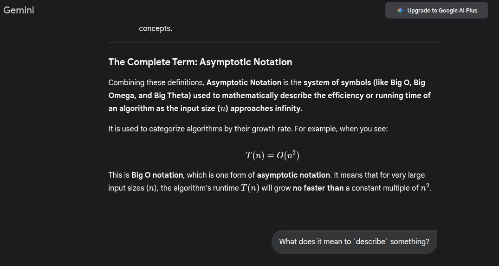

# ALGORITHMS
Notes from the book **Introduction to Algorithms**

<details>
 <summary> Title </summary>

> example text

</details>


#### AnchorPoint -> Some Exercise Solutions
Some Solutions to exercises:

[selected-solutions.pdf](selected-solutions.pdf) OR <a href="selected-solutions.pdf" target="blank"> click-here (if previous link is not working)</a>

#### Prerequisites
- mathematical proofs (esp. proofs by Mathematical Induction)
- elementary calculus


The Books website: https://mitpress.mit.edu/9780262046305/introduction-to-algorithms/


Maybe check later:


## Part IV: Advanced Design and Analysis Techniques
### Dynamic Programming  (aka Dynamic Tabular Method) :Page 362 

This method/algorithm works just like the 'Divide & Conquer' method by combining subproblem solutions in order to solve a problem. 

 

How to know when to use Dynamic Programming instead of Divide-and-Conquer: 

If the problem has overlapping subproblems 
( that is the subproblems share subproblems ) 

When you have an optimization problem 
( a problem that has many possible solutions && each solution has a value && we are looking for the optimal ( maximum or minimum ) value ) 
 

We use this algorithm when a problem has multiple possible solutions. Each solution has a value. From those possible values, we are looking for the maximum value OR the minimum value --- "which is called the Optimal value". So solutions to these type of problems are called 'Optimal Solution' to the problem. 

 

This algorithm involves 3 to 4 steps: 

Characterize the structure of an optimal solution 

Recursively define the value of an optimal solution 

Compute the value of an optimal solution, typically in a bottom-up fashion 

Construct an optimal solution from computed information. 
(That's why I said 3 to 4 steps) 

 

Look at 'Divide-and-Conquer' algorithm steps: 

Partition the problem into disjoint subproblems ( Divide ) 

Solve the subproblems recursively ( Conquer ) 

Combine their solutions to solve the original problem 

 

What I've noticed: 

Dynamic Programming algorithm sort of divides the 'Recursive' step of Divide-and-Conquer into two: 

Recursively define the value of the optimal solution 

Compute the value of an optimal solution, typically in a bottom-up fashion 

 

More information: 

As we saw in Chapters 2 and 4, divide-and-conquer algorithms partition the problem into disjoint subprob- lems, solve the subproblems recursively, and then combine their solutions to solve the original problem. In contrast, dynamic programming applies when the subprob- lems overlap, that is, when subproblems share subsubproblems.  

 

In this context, a divide-and-conquer algorithm does more work than necessary, repeatedly solv- ing the common subsubproblems. A dynamic-programming algorithm solves each subsubproblem just once and then saves its answer in a table, thereby avoiding the work of recomputing the answer every time it solves each subsubproblem.  

 

-----------------------------------
Aproximation Algorithms 
35.5 - The subset-sum problem       : page 1124 

------------------------------


```cpp
#include <iostream>

EXTENDED_BOTTOM_UP_CUT_ROD(p, n) {
    let r[0: n] and s[1: n] be new arrays;
    r[0] = 0;

    for(int J = 1 to n) {
        q = NEGATIVE_INFINITY;

        for(int i = 1 to J) {
            if(q < p[i] + r[J - i]) {
                q = p[i] + r[J - i];
                s[J] = i;
            }
        }

        r[J] = q;
    }

    return r and s;
}


PRINT_CUT_ROD(p, n) {
    (r, s) = EXTENDED_BOTTOM_UP_CUT_ROD(p, n);

    std::cout << "Rod Length: " << n << ", Maximum price possible : " << r[n] << '\n';

    while (n > 0) {
        std::cout << "Rod Length: " << n << ", Cut at : " << s[n] << '\n';
        n -= s[n];
    }
}

```

```cpp
MEMOIZED_CUT_ROD(p, n) {
    let r[0: n] be a new array;

    for(i = 0 to n) {
        r[i] = NEGATIVE_INFINITY;
    }

    return MEMOIZED_CUT_ROD_AUX(p, n, r);
}

MEMOIZED_CUT_ROD_AUX(p, n, r) {
    // initialise q somewhere here
    if(r[n] >= 0) { return r[n] }
    if(n == 0) { q = 0; } // { r[n] = 0; return r[n] } || { r[n] = 0; return 0 }
    else {
        q = NEGATIVE_INFINITY;

        for(i = 1 to n) {
            q = max{ q, p[i] + MEMOIZED_CUT_ROD_AUX(p, n-i, r) };
        }
    }

    r[n] = q;
    return q; // return r[n]
    
}
```

```cpp
BOTTOM_UP_CUT_ROD(p, n) {
    // initialise q here   : I'm starting to think that it doesn't matter
    // where I initialise q from
    let r[0: n] be a new array;
    r[0] = 0;

    for(int J = 1 to n) {
        q = NEGATIVE_INFINITY;

        for(int i = 1 to J) {           
            q = max(q, p[i] + r[J - i] );            
        }

        r[J] = q;
    }

    return r[n];
}

```

```cpp
CUT_ROD(p, n) {
    if(n == 0) {
        return 0;
    }

    q = NEGATIVE_INFINITY;

    for(i = 1 to n) {
        q = max{ q, p[i] + CUT_ROD(p, n-i) };
    }

    return q;
}

```

## Sections 

<details>
 <summary> Asymptotic Notation </summary>



> Asymptotic Notation is the system of symbols (like Big O, Big Omega, and Big Theta) used to mathematically describe the efficiency or running time of an algorithm as the input size ($n$) approaches infinity. It is used to categorize algorithms by their growth rate.

The word **asymptotic** (pronounced *a-sim-TOT-ik*) is a mathematical term that means **approaching a value or curve arbitrarily closely, but never actually meeting it.** This approach happens "in the limit," typically as a variable approaches infinity.

In the context of algorithm analysis (what you're studying), "asymptotic" means **"for large input sizes"**.

***

## 1. Meaning of "Asymptotic"

The term comes from the word **asymptote**, which is a line or curve that a function approaches.

* **Core Meaning:** Of or relating to an asymptote; approaching a limit without ever reaching it.
* **Mathematical Context (Calculus/Analysis):** A function $f(x)$ is asymptotic to a line $L$ if the distance between $f(x)$ and $L$ gets closer and closer to zero as $x$ tends to infinity.
    * **Analogy:** Imagine a perpetual chase where one runner always gets closer to the other, but the distance between them is always being cut in half, so the gap is never fully closed. 
* **Computer Science Context (Algorithms):** When describing an algorithm's performance (like its runtime), **asymptotic analysis** focuses on the **long-term behavior**—that is, how the algorithm scales when the size of the input, $n$, becomes extremely large. It allows you to ignore minor details like constant factors or lower-order terms that don't matter when $n$ is big.

***

## 2. Does the word "Symptotic" Exist?

The word **symptotic** does exist, but it is **rare** and generally **not used** in modern scientific or mathematical contexts.

* **Primary Usage:** It is mostly an old or archaic term that can mean:
    * **Intersecting/Crossing:** Sometimes used in classical geometry to describe lines that cross, contrasting with "asymptotic" lines which never meet.
    * **Relating to a symptom:** Occasionally used as an alternate or shortened form of *symptomatic* (relating to a symptom of a disease).

The word you encountered in algorithm analysis is definitively **asymptotic** (with the leading 'a-').

***

## 3. Meaning of "Notation"

A **notation** is a **system of signs, symbols, or characters** used to represent specialized facts, quantities, or information.

* **Core Meaning:** A system of graphic symbols for a specialized use.
* **Examples:**
    * **Musical Notation:** Using symbols (staves, notes, clefs) to represent musical sound.
    * **Mathematical Notation:** Using symbols (e.g., $+$, $\int$, $\Sigma$) to represent operations and concepts.

***

## The Complete Term: Asymptotic Notation

Combining these definitions, **Asymptotic Notation** is the **system of symbols (like Big O, Big Omega, and Big Theta) used to mathematically describe the efficiency or running time of an algorithm as the input size ($n$) approaches infinity.**

It is used to categorize algorithms by their growth rate. For example, when you see:

$$T(n) = O(n^2)$$

This is **Big O notation**, which is one form of **asymptotic notation**. It means that for very large input sizes ($n$), the algorithm's runtime $T(n)$ will grow **no faster than** a constant multiple of $n^2$.

</details>