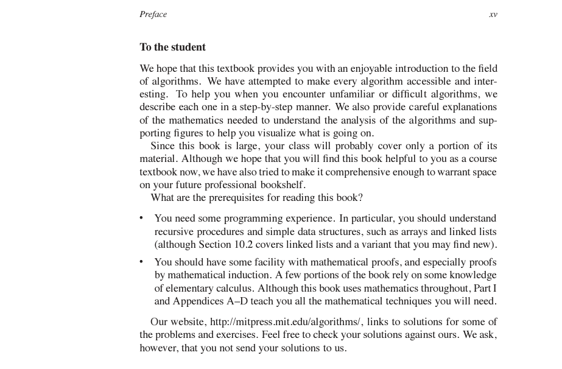
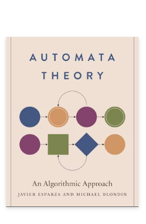
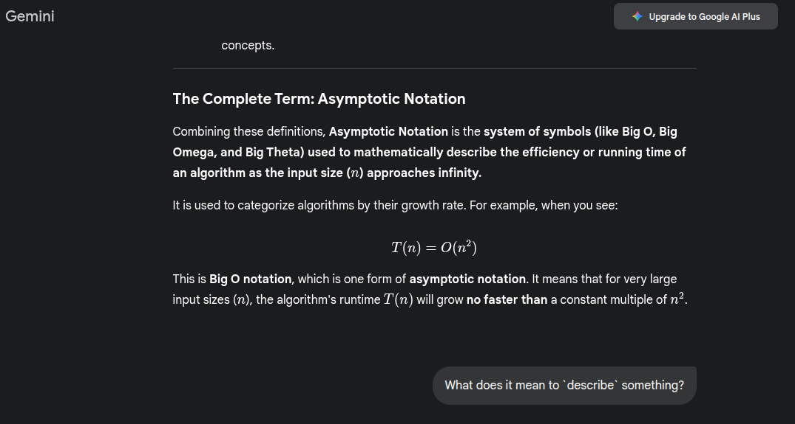

# ALGORITHMS
Notes from the book **Introduction to Algorithms**

<details>
 <summary> Title </summary>

> example text

</details>


#### AnchorPoint -> Some Exercise Solutions
Some Solutions to exercises:

[selected-solutions.pdf](selected-solutions.pdf) OR <a href="selected-solutions.pdf" target="blank"> click-here (if previous link is not working)</a>

#### Prerequisites
- mathematical proofs (esp. proofs by Mathematical Induction)
- elementary calculus


The Books website: https://mitpress.mit.edu/9780262046305/introduction-to-algorithms/


Maybe check later:


## Part IV: Advanced Design and Analysis Techniques
### Dynamic Programming  (aka Dynamic Tabular Method) :Page 362 

This method/algorithm works just like the 'Divide & Conquer' method by combining subproblem solutions in order to solve a problem. 

 

How to know when to use Dynamic Programming instead of Divide-and-Conquer: 

If the problem has overlapping subproblems 
( that is the subproblems share subproblems ) 

When you have an optimization problem 
( a problem that has many possible solutions && each solution has a value && we are looking for the optimal ( maximum or minimum ) value ) 
 

We use this algorithm when a problem has multiple possible solutions. Each solution has a value. From those possible values, we are looking for the maximum value OR the minimum value --- "which is called the Optimal value". So solutions to these type of problems are called 'Optimal Solution' to the problem. 

 

This algorithm involves 3 to 4 steps: 

Characterize the structure of an optimal solution 

Recursively define the value of an optimal solution 

Compute the value of an optimal solution, typically in a bottom-up fashion 

Construct an optimal solution from computed information. 
(That's why I said 3 to 4 steps) 

 

Look at 'Divide-and-Conquer' algorithm steps: 

Partition the problem into disjoint subproblems ( Divide ) 

Solve the subproblems recursively ( Conquer ) 

Combine their solutions to solve the original problem 

 

What I've noticed: 

Dynamic Programming algorithm sort of divides the 'Recursive' step of Divide-and-Conquer into two: 

Recursively define the value of the optimal solution 

Compute the value of an optimal solution, typically in a bottom-up fashion 

 

More information: 

As we saw in Chapters 2 and 4, divide-and-conquer algorithms partition the problem into disjoint subprob- lems, solve the subproblems recursively, and then combine their solutions to solve the original problem. In contrast, dynamic programming applies when the subprob- lems overlap, that is, when subproblems share subsubproblems.  

 

In this context, a divide-and-conquer algorithm does more work than necessary, repeatedly solv- ing the common subsubproblems. A dynamic-programming algorithm solves each subsubproblem just once and then saves its answer in a table, thereby avoiding the work of recomputing the answer every time it solves each subsubproblem.  

 

-----------------------------------
Aproximation Algorithms 
35.5 - The subset-sum problem       : page 1124 

------------------------------


```cpp
#include <iostream>

EXTENDED_BOTTOM_UP_CUT_ROD(p, n) {
    let r[0: n] and s[1: n] be new arrays;
    r[0] = 0;

    for(int J = 1 to n) {
        q = NEGATIVE_INFINITY;

        for(int i = 1 to J) {
            if(q < p[i] + r[J - i]) {
                q = p[i] + r[J - i];
                s[J] = i;
            }
        }

        r[J] = q;
    }

    return r and s;
}


PRINT_CUT_ROD(p, n) {
    (r, s) = EXTENDED_BOTTOM_UP_CUT_ROD(p, n);

    std::cout << "Rod Length: " << n << ", Maximum price possible : " << r[n] << '\n';

    while (n > 0) {
        std::cout << "Rod Length: " << n << ", Cut at : " << s[n] << '\n';
        n -= s[n];
    }
}

```

```cpp
MEMOIZED_CUT_ROD(p, n) {
    let r[0: n] be a new array;

    for(i = 0 to n) {
        r[i] = NEGATIVE_INFINITY;
    }

    return MEMOIZED_CUT_ROD_AUX(p, n, r);
}

MEMOIZED_CUT_ROD_AUX(p, n, r) {
    // initialise q somewhere here
    if(r[n] >= 0) { return r[n] }
    if(n == 0) { q = 0; } // { r[n] = 0; return r[n] } || { r[n] = 0; return 0 }
    else {
        q = NEGATIVE_INFINITY;

        for(i = 1 to n) {
            q = max{ q, p[i] + MEMOIZED_CUT_ROD_AUX(p, n-i, r) };
        }
    }

    r[n] = q;
    return q; // return r[n]
    
}
```

```cpp
BOTTOM_UP_CUT_ROD(p, n) {
    // initialise q here   : I'm starting to think that it doesn't matter
    // where I initialise q from
    let r[0: n] be a new array;
    r[0] = 0;

    for(int J = 1 to n) {
        q = NEGATIVE_INFINITY;

        for(int i = 1 to J) {           
            q = max(q, p[i] + r[J - i] );            
        }

        r[J] = q;
    }

    return r[n];
}

```

```cpp
CUT_ROD(p, n) {
    if(n == 0) {
        return 0;
    }

    q = NEGATIVE_INFINITY;

    for(i = 1 to n) {
        q = max{ q, p[i] + CUT_ROD(p, n-i) };
    }

    return q;
}

```

## Sections 

<details>
 <summary> Asymptotic Notation </summary>



> Asymptotic Notation is the system of symbols (like Big O, Big Omega, and Big Theta) used to mathematically describe the efficiency or running time of an algorithm as the input size ($n$) approaches infinity. It is used to categorize algorithms by their growth rate.

The word **asymptotic** (pronounced *a-sim-TOT-ik*) is a mathematical term that means **approaching a value or curve arbitrarily closely, but never actually meeting it.** This approach happens "in the limit," typically as a variable approaches infinity.

In the context of algorithm analysis (what you're studying), "asymptotic" means **"for large input sizes"**.

***

## 1. Meaning of "Asymptotic"

The term comes from the word **asymptote**, which is a line or curve that a function approaches.

* **Core Meaning:** Of or relating to an asymptote; approaching a limit without ever reaching it.
* **Mathematical Context (Calculus/Analysis):** A function $f(x)$ is asymptotic to a line $L$ if the distance between $f(x)$ and $L$ gets closer and closer to zero as $x$ tends to infinity.
    * **Analogy:** Imagine a perpetual chase where one runner always gets closer to the other, but the distance between them is always being cut in half, so the gap is never fully closed. 
* **Computer Science Context (Algorithms):** When describing an algorithm's performance (like its runtime), **asymptotic analysis** focuses on the **long-term behavior**—that is, how the algorithm scales when the size of the input, $n$, becomes extremely large. It allows you to ignore minor details like constant factors or lower-order terms that don't matter when $n$ is big.

***

## 2. Does the word "Symptotic" Exist?

The word **symptotic** does exist, but it is **rare** and generally **not used** in modern scientific or mathematical contexts.

* **Primary Usage:** It is mostly an old or archaic term that can mean:
    * **Intersecting/Crossing:** Sometimes used in classical geometry to describe lines that cross, contrasting with "asymptotic" lines which never meet.
    * **Relating to a symptom:** Occasionally used as an alternate or shortened form of *symptomatic* (relating to a symptom of a disease).

The word you encountered in algorithm analysis is definitively **asymptotic** (with the leading 'a-').

***

## 3. Meaning of "Notation"

A **notation** is a **system of signs, symbols, or characters** used to represent specialized facts, quantities, or information.

* **Core Meaning:** A system of graphic symbols for a specialized use.
* **Examples:**
    * **Musical Notation:** Using symbols (staves, notes, clefs) to represent musical sound.
    * **Mathematical Notation:** Using symbols (e.g., $+$, $\int$, $\Sigma$) to represent operations and concepts.

***

## The Complete Term: Asymptotic Notation

Combining these definitions, **Asymptotic Notation** is the **system of symbols (like Big O, Big Omega, and Big Theta) used to mathematically describe the efficiency or running time of an algorithm as the input size ($n$) approaches infinity.**

It is used to categorize algorithms by their growth rate. For example, when you see:

$$T(n) = O(n^2)$$

This is **Big O notation**, which is one form of **asymptotic notation**. It means that for very large input sizes ($n$), the algorithm's runtime $T(n)$ will grow **no faster than** a constant multiple of $n^2$.

</details>

<details>
<summary> 2026_May_18: Cursor Quiz && Convo</summary>

# Start: 2026_May_18: Cursor Quiz && Convo

```
Can you analyse the whole @notes/algorithms/IntroductionToAlgorithms.md file and quiz me or test me based on the info in that file
```

I've read your full **Introduction to Algorithms** notes file (262 lines). Here's what it covers, then a quiz you can answer in this chat.

## Topics in your notes

| Area | Content |
|------|---------|
| **Prerequisites** | Proofs (especially induction), elementary calculus |
| **Dynamic programming** | When to use it vs divide-and-conquer, 3–4 steps, overlapping subproblems, optimization problems |
| **Rod cutting** | `CUT_ROD`, bottom-up, memoized, extended (with `s[]`), `PRINT_CUT_ROD` |
| **Approximation** | Subset-sum (Ch. 35.5, p. 1124) — mentioned only |
| **Asymptotic notation** | Meaning of asymptotic/notation, Big O / Ω / Θ, focus on large \(n\) |

---

## Quiz — Round 1 (10 questions)

Answer in order (short answers are fine). I'll grade and explain after you reply.

---

### Part A — Concepts (Dynamic Programming)

**1.** In your notes, what are the two main signals that a problem is a good fit for dynamic programming instead of divide-and-conquer?

**2.** List the **four** steps of the dynamic-programming approach from your notes (the last one is optional in some problems — name it anyway).

**3.** How do **overlapping subproblems** differ from the subproblems in a typical divide-and-conquer setup?

**4.** Why does divide-and-conquer do **extra work** on problems with overlapping subproblems, while DP does not?

**5.** Your notes say DP "sort of divides" which step of divide-and-conquer into two steps? Name those two DP steps.

---

### Part B — Rod cutting (code & logic)

**6.** In `CUT_ROD(p, n)`, what is the recurrence idea in plain English? (What are you trying at each length `n`?)

**7.** What is stored in array `r[]` vs array `s[]` in `EXTENDED_BOTTOM_UP_CUT_ROD`?

**8.** In the bottom-up loop `for J = 1 to n`, inner loop `for i = 1 to J`, what does `p[i] + r[J - i]` represent economically (rod-cutting intuition)?

**9.** In `MEMOIZED_CUT_ROD_AUX`, what does the check `if (r[n] >= 0) return r[n]` accomplish?

**10.** `PRINT_CUT_ROD` uses a `while (n > 0)` loop with `n -= s[n]`. What is it reconstructing?

---

### Part C — Asymptotic notation (bonus)

**11.** In one sentence: what does **asymptotic** mean in algorithm analysis?

**12.** If \(T(n) = O(n^2)\), what does that tell you about growth for **large** \(n\) (not small inputs)?

---

## How to use this

Reply with your answers, e.g. `1. ... 2. ...` or numbered list. I'll score them against your notes, give corrections, and follow with **Round 2** (harder: trace rod-cutting on small `n`, compare naive vs memoized complexity, Big O vs Θ if you want).

If you prefer a different format, say which:

- **Oral-style** — one question at a time  
- **Multiple choice** — I'll convert Round 1  
- **Code trace** — fill in `r[]` / `s[]` for a sample `p` and `n`

---

```
My responses to Part A (note: I tried to answer this part without looking at my notes): 
1. The two main signals that a problem is a good fit for dynamic programming instead of divide-and-conquer is when we have overlapping sub-problems AND the problem that we are solving is an optimization problem (a problem that has many possible solutions but we only want the max or min solution (aka the optimal solution))
2. {"i.": "Divide the problem into sub-problems", "ii.": "solve the sub-problems", "iii.": "reconstruct the answer to the main problem", "iv.": ""}
3. Overlapping sub-problems are smaller instances of the same main-problem whereas sub-problems in a divide-and-conquer setup are not smaller instances of the same main-problem; And two or more overlapping sub-problems of a main-problem might have the same sub-sub problems whereas this is not the case in  sub-problems in a divide-and-conquer setup;
4. divide-and-conquer does extra work on problems with overlapping sub-problems because it doesn't store (memoize) the answers to sub-problems;
5. I don't remember this;

My responses to Part B (note: I had to look at the code part of the notes to answer this part):
6. The recurrence idea in `CUT_ROD(p, n)` is that I'm trying to compare the price of the whole rode (the n) to the sum of the price of two pieces of the rod; 
7.  In `EXTENDED_BOTTOM_UP_CUT_ROD`, array `r[]` stores the maximum value that we can get if we cut the rod while array `s[]` stores the cutting points (where to cut the rod if we want to get that maximum price)
8. `p[i] + r[J - i]` represents a possible better value if  the rod is cut into parts `p[i]` and `r[J - i]`;
9. `if (r[n] >= 0) { return r[n] }` is used to check if we already have the answer (or have already solved that 'n' sub-problem before, and if we did, then that means that we have it's answer stored) for the current 'n' that we are checking;
10. That while loop is showing us where to cut rod `n`; So, when rod `n` is of size `n`, cut it at point `s[n]`; That's what it's reconstructing - rod n with it's cutting points;

My responses to Part C (note: I again tried to not look at my notes when answering this part)
11. In mathematics, 'asymptotic' means as we get closer to something but never reach it; So in algorithm analysis, 'asymptotic' means how does our algorithm perform (in memory and time) the more we get closer to bigger inputs or the more our inputs grow (as our inputs grow to infinity even though they never reach infinity);
12. I think it tells me that the algorithms resource use exponentially grows as the size of 'n' grows;
```

Here’s a detailed grade against your **IntroductionToAlgorithms.md** notes and standard CLRS-style DP (which your notes follow).

---

## Part A — Score: **3.5 / 5**

### 1. When to use DP vs divide-and-conquer — **Correct**

You nailed both signals from your notes:

- **Overlapping subproblems** (subproblems share sub-subproblems)
- **Optimization problem** (many solutions, each with a value; you want max or min)

No changes needed.

---

### 2. The four DP steps — **Partially correct (~1/4)**

Your list sounds like a generic “solve and rebuild” recipe. Your notes use the **CLRS DP recipe**, which is more specific:

| Your answer | What your notes say |
|-------------|---------------------|
| Divide into subproblems | **1.** Characterize the **structure** of an optimal solution |
| Solve subproblems | **2.** **Recursively define** the value of an optimal solution |
| Reconstruct the answer | **3.** **Compute** that value (usually bottom-up) |
| *(empty)* | **4.** **Construct** an optimal solution from what you computed |

Your step (iii) is closest to step **4**; step **3** (fill the table / compute optimal **value**) is missing as its own step.

**Memory hook:** *Structure → Recurrence → Table → Backtrack.*

---

### 3. Overlapping vs divide-and-conquer subproblems — **Needs correction**

**What you got right:** Overlapping subproblems can **share** the same sub-subproblems; divide-and-conquer subproblems typically **do not** overlap that way.

**What to fix:** In divide-and-conquer, subproblems **are** usually smaller instances of the **same** problem (e.g. sort left half and right half, both “sort an array”). The important difference is **not** “same vs different problem type,” but:

| | Divide-and-conquer | Dynamic programming |
|--|-------------------|---------------------|
| Subproblems | **Disjoint** (don’t overlap) | **Overlapping** (shared sub-subproblems) |
| Example feel | Merge sort halves | Rod cutting: “length 5” needed from many parents |

So: **same kind of problem, different overlap structure.**

---

### 4. Why D&C does extra work — **Correct**

Yes: without memoization/tabulation, D&C **re-solves** the same sub-subproblems repeatedly. DP stores each answer **once** in a table.

---

### 5. Which D&C step DP splits — **For your notes**

Your notes say DP effectively splits divide-and-conquer’s **“solve recursively”** step into:

1. **Recursively define** the value of an optimal solution (recurrence)
2. **Compute** the value bottom-up (table filling)

That’s the piece you blanked on — worth memorizing since it’s explicitly in your notes.

---

## Part B — Score: **4.5 / 5**

### 6. `CUT_ROD` recurrence — **Partially correct**

Closer version:

> For rod length `n`, try every **first piece** of length `i` (1 … n), pay `p[i]`, then add the best revenue for the **remaining** length `n - i`. Take the **maximum** over all `i`.

It’s not “whole rod vs two pieces” — it’s “**best first cut** + **optimal rest**,” for every possible first cut.

Base case: `n == 0` → revenue `0`.

---

### 7. `r[]` vs `s[]` — **Correct**

- `r[j]` — max revenue for rod length `j`
- `s[j]` — first cut length that achieves `r[j]` (for reconstruction)

---

### 8. `p[i] + r[J - i]` — **Correct**

First piece length `i` at price `p[i]`, plus best revenue for the leftover `J - i`.

---

### 9. Memoization check — **Correct**

`r[n] >= 0` means “already computed; return cached answer.” (Your code initializes with `NEGATIVE_INFINITY`, so unsolved entries stay negative.)

---

### 10. `PRINT_CUT_ROD` loop — **Correct**

It walks backward using `s[n]`: “first cut here,” then `n -= s[n]` until nothing left. That **reconstructs** the optimal cut sequence, not just one number.

---

## Part C — Score: **1.5 / 2**

### 11. Meaning of asymptotic — **Correct**

Your math intuition (approaching a limit) and CS use (behavior as `n` grows large) match your notes well.

---

### 12. `T(n) = O(n²)` — **Incorrect (common mix-up)**

**O(n²)** means growth is **at most quadratic** (no faster than a constant × n² for large n).

- **Polynomial:** n, n², n³ …
- **Exponential:** 2ⁿ, n! …

So O(n²) is **polynomial**, not exponential. Exponential would look like O(2ⁿ) or similar.

From your notes: Big O means runtime grows **no faster than** that bound for large n.

---

## Overall

| Section | Score |
|---------|--------|
| Part A | 3.5 / 5 |
| Part B | 4.5 / 5 |
| Part C | 1.5 / 2 |
| **Total** | **9.5 / 12** (~79%) |

**Strengths:** DP “when to use,” memoization, rod-cutting arrays, asymptotic intuition.  
**Focus next:** (1) the **four named DP steps**, (2) **disjoint vs overlapping** (not “different problem types”), (3) **O(n²) vs exponential**.

---

## Round 2 — pick your format

Reply with **A**, **B**, or **C** (or “all”):

**A — Fix the gaps (3 questions)**  
1. State the four DP steps from memory.  
2. One sentence: disjoint (D&C) vs overlapping (DP).  
3. In your own words: what does O(n²) guarantee?

**B — Trace (hands-on)**  
Given `p = [0, 1, 5, 8, 9]` (index = length), `n = 4`: fill `r[0..4]` and `s[1..4]` using bottom-up, then list cuts from `PRINT_CUT_ROD`.

**C — Multiple choice (5 quick questions)**  
I’ll send five MCQs on DP steps, overlap, and Big O.

Answer Part A’s three questions inline if you want to start without choosing — I’ll grade those next.

---

```
Before we continue, what is "standard CLRS-style DP"? You mentionned it
```
**CLRS** is the usual nickname for *Introduction to Algorithms* (Cormen, Leiserson, Rivest, and Stein). Your notes file is literally titled from that book, and the dynamic programming section follows the same framework the textbook uses.

**“CLRS-style DP”** means: don’t only say “use a table” or “break it into subproblems.” You follow a fixed **design recipe** the book gives for optimization problems:

1. **Characterize** the structure of an optimal solution  
2. **Define** the optimal value recursively (the recurrence)  
3. **Compute** the optimal value (top-down with memoization or bottom-up in a table)  
4. **Construct** an actual optimal solution (often by backtracking with extra info, like your `s[]` array)

That’s what I meant when I compared your Part A answer to “standard CLRS-style DP.” Your answer (“divide → solve → reconstruct”) is a reasonable high-level idea, but it’s **not** the same as naming those four steps the way your notes (and the book) do.

---

### Why the name matters

Lots of sources say “DP = recursion + memoization.” CLRS is more prescriptive: you first argue **why** an optimal solution has a certain structure, then write the **recurrence**, then implement it, then **rebuild** the answer. Your rod-cutting code maps cleanly onto that:

| CLRS step | Rod cutting in your notes |
|-----------|---------------------------|
| Structure | An optimal cut is “first piece of length `i`” + optimal cut of the rest |
| Recurrence | `r[n] = max over i of (p[i] + r[n-i])` |
| Compute | `BOTTOM_UP_CUT_ROD` / `MEMOIZED_CUT_ROD` |
| Construct | `s[]` + `PRINT_CUT_ROD` |

---

### CLRS-style vs “casual” DP

| Casual description | CLRS-style |
|--------------------|------------|
| “Split into subproblems and solve” | Explicit **optimal substructure** (step 1) |
| “Use a table” | Recurrence first, **then** table (steps 2–3) |
| “Return the max value” | Optional step 4: **which** choices achieve that max |

So when I said your Part A #2 was “partially correct,” I meant: you had the right *spirit* (solve subproblems, rebuild the answer), but the book’s checklist is more specific—and that’s what your notes record on page 362.

If you want to continue the quiz later, we can use “CLRS steps” as shorthand for those four bullets.

---

```
So after you have analyzed my notes, what do you have to say about them? Are they accurate? Are they true? (of course these are not the complete notes of the whole book; I'm still reading the book; I started with the 'Dynamic Programming' part of the book, that's why my notes are like that)
```

You’re building notes in a sensible order: you jumped to **Dynamic Programming** because you’re reading that part now, and what you’ve captured is mostly **accurate and aligned with CLRS**—not fringe or wrong ideas. Below is an honest review: what holds up, what’s thin or easy to misread, and what would make the notes stronger as you keep reading.

---

## Overall verdict

| Aspect | Assessment |
|--------|------------|
| **Factual accuracy** | **Good** for what’s there—DP vs D&C, when to use DP, the four steps, overlap vs redundant work, rod-cutting logic |
| **Completeness** | **Expectedly partial**—one chapter’s worth, not a full book summary |
| **Usefulness for future-you** | **Solid foundation**—especially your “What I’ve noticed” bit and the multiple rod-cutting versions |
| **Risk of misunderstanding** | **Low–medium**—a few gaps (below) are where your quiz answers slipped, not because the notes are wrong |

So: **yes, they’re largely true and accurate** for CLRS-style DP and rod cutting. They’re **not** a substitute for the full chapter yet—and you already know that.

---

## What you got right (and should keep)

**1. When to use dynamic programming**  
Overlapping subproblems + optimization (many solutions, want max/min) is exactly what CLRS emphasizes. That’s textbook-correct.

**2. The four-step DP recipe**  
Your numbered steps match the book’s methodology. Keeping them labeled as “CLRS steps” (structure → recurrence → compute → construct) will help you not blur them with generic “divide and solve.”

**3. DP vs divide-and-conquer**  
The contrast—**disjoint** subproblems (D&C) vs **overlapping** (DP), and D&C redoing work DP stores once—is correct and well put. Your observation that DP “splits” the recursive **solve** into **define recurrence** + **bottom-up compute** is a good personal note; I’d keep it.

**4. Rod-cutting code**  
The progression is pedagogically right:

- `CUT_ROD` — naive recursion (shows the problem)
- `BOTTOM_UP_CUT_ROD` — table, value only
- `MEMOIZED_*` — same recurrence, top-down cache
- `EXTENDED_*` + `PRINT_CUT_ROD` — reconstruction via `s[]`

The recurrence idea (try first piece `i`, add `r[n-i]`, maximize) is implicit in the code and matches the book.

**5. Asymptotic notation (in the collapsible section)**  
“Large \(n\)”, ignoring constants/low-order terms, Big O as an upper bound—**accurate** and clearly written. The “symptotic” aside is fine trivia, not core, but not wrong.

---

## Where the notes are thin (not wrong, but easy to mislearn)

These are the gaps that showed up in your quiz—not because your notes lie, but because they **don’t yet spell out** things CLRS states explicitly.

**1. Named properties: optimal substructure + overlapping subproblems**  
You describe overlap well; you don’t yet use CLRS’s label **optimal substructure** (“an optimal solution contains optimal solutions to subproblems”). Adding one line for each property would anchor your four steps.

**2. Divide-and-conquer subproblems are still “the same problem”**  
Your notes stress **disjoint vs overlapping**, which is right. They don’t yet say that D&C subproblems are usually **smaller instances of the same problem** (e.g. sort two halves). That omission is why it was easy to think D&C subproblems are a “different kind” of problem. One sentence would fix that.

**3. No written recurrence**  
The code implies  
\(r(n) = \max_{1 \le i \le n}(p_i + r(n-i))\),  
with \(r(0)=0\).  
A single displayed equation in the notes would tie the CLRS steps to the loops.

**4. No complexities**  
You have four rod-cutting variants but no explicit bounds, e.g.:

- naive `CUT_ROD`: exponential (e.g. \(\Theta(2^n)\)-style growth in recursive calls)
- bottom-up / memoized: \(\Theta(n^2)\) time, \(\Theta(n)\) space

That’s why **O(n²)** vs “exponential” was fuzzy in Part C—the asymptotic section isn’t yet linked to DP yet.

**5. No worked numeric example**  
One small table for e.g. `p = [0,1,5,8,9]`, `n = 4` would cement `r[]` / `s[]` and match what we planned for Round 2.

**6. “Dynamic Tabular Method”**  
Not standard CLRS terminology. Harmless in *your* notes if you treat it as a private alias, but if you share notes or search online, stick to **dynamic programming** (and **memoization** vs **tabulation**).

**7. Approximation / subset-sum**  
The line on p. 1124 is a bookmark only—fine while you haven’t read that chapter.

---

## Small accuracy / polish notes (minor)

- Pseudocode in ` ```cpp ` blocks with `for (i = 1 to n)` is **CLRS pseudocode**, not C++—totally fine for notes; just don’t expect it to compile as-is.
- `MEMOIZED_CUT_ROD_AUX`: using `r[n] >= 0` with initial `NEGATIVE_INFINITY` is a valid pattern **if** all prices are non-negative (true for rod cutting). CLRS sometimes uses a separate “computed?” flag; your version is OK for this problem.
- Typos/formatting from PDF paste (`subprob- lems`, hyphenation) don’t affect correctness.
- Prerequisites (induction, calculus) are reasonable for the book; you don’t need calculus for rod cutting itself.

Nothing here undermines the **truth** of your content; it’s mostly **presentation and completeness**.

---

## How your study approach reads

Starting with **Part IV (DP)** before earlier chapters is **valid** if you’re comfortable with recursion and basic analysis. Your notes show you’re doing more than copying:

- comparing DP to D&C,
- keeping multiple implementations,
- linking to page numbers and the MIT Press link.

The main thing to add as you read on is **vocabulary + one example + complexity** per major algorithm—those three turn “I understand the code” into “I can explain and analyze on an exam.”

---

## Suggested note additions (short checklist)

When you finish the rod-cutting section in the book, consider adding:

1. **Two properties:** optimal substructure, overlapping subproblems  
2. **One line:** D&C = disjoint subproblems, often same problem on smaller input  
3. **Recurrence + base case** for rod cutting  
4. **Time/space** for naive vs memoized vs bottom-up  
5. **One 4×4 table** for `r` and `s`  
6. **Terms:** memoization (top-down) vs tabulation (bottom-up)

---

## Bottom line

Your notes are **trustworthy for what they cover**: they reflect **real CLRS content**, not myths, and your DP/D&C distinction and rod-cutting implementations are on the right track. They’re **incomplete by design** (you’re mid-book), and they’re **slightly under-specified** in the places that caused your quiz mistakes—named properties, D&C “same problem smaller size,” and tying Big O to \(n^2\) for bottom-up rod cutting.

If you want to continue the quiz later, **Round 2B** (trace `r[]`/`s[]` for `p = [0,1,5,8,9]`, `n = 4`) would fit perfectly right after you add that one example to your file—or we can do the trace here and you paste the table into your notes.

---

# End: 2026_May_18: Cursor Quiz && Convo
</details>
