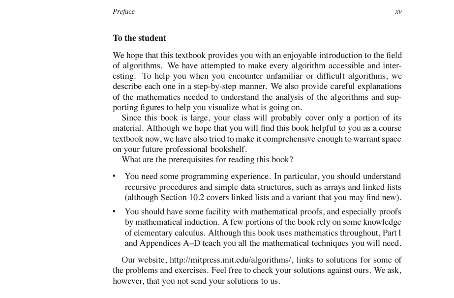
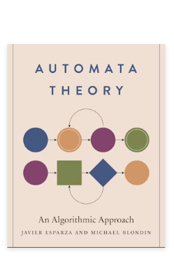

# ALGORITHMS
Notes from the book **Introduction to Algorithms**

#### AnchorPoint -> Some Exercise Solutions
Some Solutions to exercises:

[selected-solutions.pdf](selected-solutions.pdf) OR <a href="selected-solutions.pdf" target="blank"> click-here (if previous link is not working)</a>

#### Prerequisites
- mathematical proofs (esp. proofs by Mathematical Induction)
- elementary calculus


The Books website: https://mitpress.mit.edu/9780262046305/introduction-to-algorithms/


Maybe check later:


## Part IV: Advanced Design and Analysis Techniques
### Dynamic Programming  (aka Dynamic Tabular Method) :Page 362 

This method/algorithm works just like the 'Divide & Conquer' method by combining subproblem solutions in order to solve a problem. 

 

How to know when to use Dynamic Programming instead of Divide-and-Conquer: 

If the problem has overlapping subproblems 
( that is the subproblems share subproblems ) 

When you have an optimization problem 
( a problem that has many possible solutions && each solution has a value && we are looking for the optimal ( maximum or minimum ) value ) 
 

We use this algorithm when a problem has multiple possible solutions. Each solution has a value. From those possible values, we are looking for the maximum value OR the minimum value --- "which is called the Optimal value". So solutions to these type of problems are called 'Optimal Solution' to the problem. 

 

This algorithm involves 3 to 4 steps: 

Characterize the structure of an optimal solution 

Recursively define the value of an optimal solution 

Compute the value of an optimal solution, typically in a bottom-up fashion 

Construct an optimal solution from computed information. 
(That's why I said 3 to 4 steps) 

 

Look at 'Divide-and-Conquer' algorithm steps: 

Partition the problem into disjoint subproblems ( Divide ) 

Solve the subproblems recursively ( Conquer ) 

Combine their solutions to solve the original problem 

 

What I've noticed: 

Dynamic Programming algorithm sort of divides the 'Recursive' step of Divide-and-Conquer into two: 

Recursively define the value of the optimal solution 

Compute the value of an optimal solution, typically in a bottom-up fashion 

 

More information: 

As we saw in Chapters 2 and 4, divide-and-conquer algorithms partition the problem into disjoint subprob- lems, solve the subproblems recursively, and then combine their solutions to solve the original problem. In contrast, dynamic programming applies when the subprob- lems overlap, that is, when subproblems share subsubproblems.  

 

In this context, a divide-and-conquer algorithm does more work than necessary, repeatedly solv- ing the common subsubproblems. A dynamic-programming algorithm solves each subsubproblem just once and then saves its answer in a table, thereby avoiding the work of recomputing the answer every time it solves each subsubproblem.  

 

-----------------------------------
Aproximation Algorithms 
35.5 - The subset-sum problem       : page 1124 

------------------------------


```cpp
EXTENDED_BOTTOM_UP_CUT_ROD(p, n) {
    let r[0: n] and s[1: n] be new arrays;
    r[0] = 0;

    for(int J = 1 to n) {
        q = NEGATIVE_INFINITY;

        for(int i = 1 to J) {
            if(q < p[i] + r[J - i]) {
                q = p[i] + r[J - i];
                s[J] = i;
            }
        }

        r[J] = q;
    }

    return r and s;
}
PRINT_CUT_ROD(p, n) {
    (r, s) = EXTENDED_BOTTOM_UP_CUT_ROD(p, n);

    cout << "Rod Length: " << n << ", Maximum price possible : " << r[n] << '\n';

    while (n > 0) {
        cout << "Rod Length: " << n << ", Cut at : " << s[n] << '\n';
        n -= s[n];
    }
}
```

```cpp
MEMOIZED_CUT_ROD(p, n) {
    let r[0: n] be a new array;

    for(i = 0 to n) {
        r[i] = NEGATIVE_INFINITY;
    }

    return MEMOIZED_CUT_ROD_AUX(p, n, r);
}

MEMOIZED_CUT_ROD_AUX(p, n, r) {
    // initialise q somewhere here
    if(r[n] >= 0) { return r[n] }
    if(n == 0) { q = 0; } // { r[n] = 0; return r[n] } || { r[n] = 0; return 0 }
    else {
        q = NEGATIVE_INFINITY;

        for(i = 1 to n) {
            q = max{ q, p[i] + MEMOIZED_CUT_ROD_AUX(p, n-i, r) };
        }
    }

    r[n] = q;
    return q; // return r[n]
    
}
```

```cpp
BOTTOM_UP_CUT_ROD(p, n) {
    // initialise q here   : I'm starting to think that it doesn't matter
    // where I initialise q from
    let r[0: n] be a new array;
    r[0] = 0;

    for(int J = 1 to n) {
        q = NEGATIVE_INFINITY;

        for(int i = 1 to J) {           
            q = max(q, p[i] + r[J - i] );            
        }

        r[J] = q;
    }

    return r[n];
}

```

```cpp
CUT_ROD(p, n) {
    if(n == 0) {
        return 0;
    }

    q = NEGATIVE_INFINITY;

    for(i = 1 to n) {
        q = max{ q, p[i] + CUT_ROD(p, n-i) };
    }

    return q;
}

```