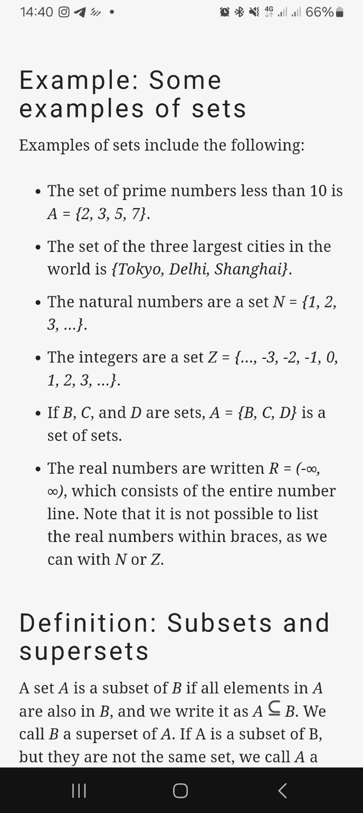

# Discrete Mathematics
## Learning Plan
1. The Basic Concepts of Dis. Math
2. Applying (aka Implementing) Dis. Math in Computer Science (and Data Science)

## Basic Concepts and Definition
Discrete Mathematics is the study of **countable** *mathematical structures*.
Discrete Mathematics is the study of **distinct** *mathematical structures*.
Discrete Mathematics is the study of **separate** *mathematical structures*.

Examples of objects studied in Dis. Math:
- Logical statements
- Graphs
- Networks
- Bits and Bytes

The above listed things can form intricate patterns which we can exploit for various purposes related to Computer (and Data) Science.

- You need to understand the principles of Discrete mathematics in order to understand the underlying ideas of Computer Algorithms.
- You need to understand the principles of Discrete mathematics in order to understand the underlying ideas of Software Development / Programming Languages.

## Set Theory
### **Why can't real numbers be listed within braces?**
**Question:**

Look at the section `Example: some examples of sets.` 



It says it is not possible to list the Real numbers within braces, as we can with N or Z.
My question is why not?
And what are the differences in meaning between braces and parentheses and square brackets in Set Theory?
Do the have other meaning when I make the face different directions? E.g. ] 1, 5]

**Response:**

Real numbers ($\mathbb{R}$) cannot be listed within braces because they form an **uncountable infinite set**. Unlike natural numbers ($\mathbb{N}$) or integers ($\mathbb{Z}$), which are **countable**, real numbers include an infinite number of elements between any two numbers (e.g., all the decimals between $0$ and $1$). Therefore, it's impossible to explicitly write down all the elements of $\mathbb{R}$ within braces.

In contrast:
- $\mathbb{N} = \{1, 2, 3, \dots\}$: Countable.
- $\mathbb{Z} = \{\dots, -3, -2, -1, 0, 1, 2, 3, \dots\}$: Countable.
- $\mathbb{R}$: Includes all rational and irrational numbers, making it uncountable.

### **Differences in meaning between braces, parentheses, and square brackets**

1. **Braces $\{\}$:**
   - Denote a **set** in mathematics.
   - Example: $\{1, 2, 3\}$ represents a set with the elements $1, 2, 3$.

2. **Parentheses $(a, b)$:**
   - Denote an **open interval** in mathematics.
   - Meaning: All real numbers between $a$ and $b$, excluding $a$ and $b$.
   - Example: $(1, 5)$ includes $1.1, 2, \pi, 4.999$, but **not** $1$ or $5$.

3. **Square Brackets $[a, b]$:**
   - Denote a **closed interval**.
   - Meaning: All real numbers between $a$ and $b$, including $a$ and $b$.
   - Example: $[1, 5]$ includes $1, 3, 4.5, 5$.

4. **Mixed Brackets $(a, b]$ or $[a, b)$:**
   - Denote **half-open intervals**.
   - $(a, b]$: Excludes $a$, includes $b$.
   - $[a, b)$: Includes $a$, excludes $b$.
   - Example: $(1, 5]$ includes $1.1, 3, 5$ but excludes $1$.

### **Other meanings for brackets in reverse direction $[a, b[$:**
In some regions (e.g., Europe), the notation $[a, b[$ or $\;]a, b]$ is used instead of the more common mixed brackets:
- $[a, b[$ means $[a, b)$ (closed at $a$, open at $b$).
- $\;]a, b]$ means $(a, b]$ (open at $a$, closed at $b$).

These reversed directions are stylistic preferences and do not change the mathematical meaning.
-----------

So the word *open* from **open interval** just means excluding the 2 numbers which show where the interval starts and ends? 
I doesn't mean the numbers from surrounding intervals can join the interval  in question?
I find the words `open` and `closed` in relation to intervals to be confusing.

You're absolutely right that the terms **"open"** and **"closed"** in the context of intervals can be a bit unintuitive. Let me clarify:

### **Open Interval**
- **Definition**: An open interval $(a, b)$ includes all the numbers **strictly between** $a$ and $b$, but **excludes** $a$ and $b$.
- The word *open* here means that the interval does **not include its endpoints**. Think of it as leaving "gaps" at $a$ and $b$.
- Example: $(1, 5)$ includes $1.1, 2, 3.5, 4.999$, but **not** $1$ or $5$.

### **Closed Interval**
- **Definition**: A closed interval $[a, b]$ includes all the numbers between $a$ and $b$, **including** $a$ and $b$.
- The word *closed* means the interval **contains its endpoints**—there are no gaps.
- Example: $[1, 5]$ includes $1, 2, 3, 5$.

### **Does "open" mean numbers from outside the interval can join?**
No, "open" does **not** mean that numbers outside the interval (from surrounding intervals) can "join" the interval. The term *open* only specifies that the **endpoints are excluded**. The set of numbers in $(a, b)$ is still completely distinct from numbers in, say, $(b, c)$.

### **Why are these terms used?**
The words "open" and "closed" come from a broader concept in mathematics called **topology**, where "open" sets are like intervals without boundaries and "closed" sets include their boundaries. It's just terminology that describes the behavior of endpoints.

### **Visual Analogy**
Think of intervals as doors:
1. **Open Interval ($a, b$)**: The doors at $a$ and $b$ are **open**—you can't step on them, but you can walk inside the room.
2. **Closed Interval ($[a, b]$)**: The doors at $a$ and $b$ are **closed**—you can step on them, and they are part of the room.

### **Half-Open Intervals**
- A mix of open and closed:
  - $[a, b)$: Includes $a$ but excludes $b$.
  - $(a, b]$: Excludes $a$ but includes $b$.
- Think of one door being open and the other closed.

### **To Sum It Up**
- *Open* means **endpoints excluded**.
- *Closed* means **endpoints included**.
- This has no effect on numbers outside the interval—they are never part of the interval in question! 
-------
**Question:**

So braces `{}` are for countable sets while parenthesis `()` and square brackets `[]` are for uncountables sets?

**Response:**

Not exactly! Braces `{}`, parentheses `()`, and square brackets `[]` are used differently in set theory and mathematics. Their usage is **not directly tied to whether a set is countable or uncountable**, but rather to the **type of mathematical object** or **interval** being described. Let’s break it down:

---

### **Braces `{}`**
- **Purpose**: Braces `{}` are used to explicitly define **sets**.
- **Examples**:
  - $\{1, 2, 3\}$: A **finite set** (countable).
  - $\{n \in \mathbb{N} \mid n \text{ is even}\}$: A **description** of a set (even natural numbers, countable).
  - Braces can also define **uncountable sets** indirectly:
    - $\{x \in \mathbb{R} \mid x^2 = 2\}$: This is a **set of solutions** for $x^2 = 2$, which includes $\{-\sqrt{2}, \sqrt{2}\}$, and it’s finite.
  - You can't **explicitly list** uncountable sets (like real numbers), but you can describe them with set notation.

---

### **Parentheses `()`**
- **Purpose**: Used to denote **open intervals** (not sets directly).
- **Examples**:
  - $(a, b)$: Describes an **open interval** of real numbers $\{x \in \mathbb{R} \mid a < x < b\}$. This is typically **uncountable** if $a, b \in \mathbb{R}$.
  - Open intervals exclude the endpoints $a$ and $b$.
  - Parentheses can describe both **countable** and **uncountable** sets:
    - **Countable**: $(n, n+1)$, where $n \in \mathbb{Z}$, could describe an interval for integers.
    - **Uncountable**: $(0, 1)$ contains all real numbers between $0$ and $1$ (uncountable).

---

### **Square Brackets `[]`**
- **Purpose**: Used to denote **closed intervals** (not sets directly).
- **Examples**:
  - $[a, b]$: Describes a **closed interval** of real numbers $\{x \in \mathbb{R} \mid a \leq x \leq b\}$. This is typically **uncountable** if $a, b \in \mathbb{R}$.
  - Closed intervals include the endpoints $a$ and $b$.
  - Similar to parentheses, square brackets can describe **countable** or **uncountable** sets.

---

### **Key Difference Between Braces and Parentheses/Brackets**
- **Braces `{}`**: Used for explicit **sets** or their descriptions.
  - Sets can be **countable** or **uncountable**.
- **Parentheses `()`** and **Brackets `[]`**: Used for **intervals**, typically in the **real numbers** ($\mathbb{R}$).
  - Intervals are usually **uncountable** because they describe ranges of real numbers, but they can also represent **countable** subsets in special cases.

---

### **Does This Mean Countability Depends on the Symbol?**
No. Countability is a property of the set itself, not the symbol:
1. A **countable set** like $\{1, 2, 3\}$ uses braces because we explicitly list its elements.
2. An **uncountable set** like $(0, 1)$ uses parentheses to describe an interval of real numbers, which cannot be explicitly listed.


-------

**Question:**

Why are the set of Natural numbers and the set of Integers said to be countable? 
Let's take the set of Natural numbers for example. We can't list all of it's members because it starts from 1 all the way to positive infinity. It's never ending. There are an infinite number of elements in that set.
So why are those two sets said to be countable?

**Response:**

This is an excellent question! It might seem contradictory to call infinite sets like the set of natural numbers $\mathbb{N}$ or integers $\mathbb{Z}$ "countable," but the term "countable" has a specific **mathematical definition**. Let’s break it down:

---

### **Definition of Countable Sets**
A set is **countable** if:
1. It is **finite**, or
2. It is **infinite** but can be placed in a **one-to-one correspondence** (bijection) with the natural numbers ($\mathbb{N}$).

This means that the elements of the set can be "counted" (even if they are infinite) by systematically listing them one by one without skipping any.

---

### **Why Are the Natural Numbers Countable?**
The natural numbers themselves ($\mathbb{N} = \{1, 2, 3, \dots\}$) are the "baseline" for countability because:
- Each element in $\mathbb{N}$ is assigned a unique position or index: $1$ is first, $2$ is second, $3$ is third, and so on.
- Although there are infinitely many natural numbers, you can still list them in order: $1, 2, 3, 4, 5, \dots$.

This ability to "list" all elements of $\mathbb{N}$, in a sequence where each number corresponds to exactly one "step," is what makes it **countable**.

---

### **Why Are the Integers Countable?**
The integers $\mathbb{Z} = \{\dots, -3, -2, -1, 0, 1, 2, 3, \dots\}$ are also infinite, but we can show they are countable by creating a **bijection** (one-to-one mapping) with $\mathbb{N}$. Here's how:

1. Pair each integer with a unique natural number:
   - Start with $0$, then alternate between positive and negative integers:
     - $0 \to 1$
     - $1 \to 2$, $-1 \to 3$
     - $2 \to 4$, $-2 \to 5$
     - $3 \to 6$, $-3 \to 7$, and so on.
2. The sequence looks like this:
   $$
   0, 1, -1, 2, -2, 3, -3, \dots
   $$
3. Every integer is assigned to exactly one natural number, and every natural number is assigned to exactly one integer.

Thus, the integers are also **countable**.

---

### **Countable vs. Uncountable**
- **Countable** sets include:
  - Finite sets ($\{1, 2, 3\}$).
  - Infinite sets that can be "listed," like $\mathbb{N}$, $\mathbb{Z}$, and $\mathbb{Q}$ (rational numbers).
- **Uncountable** sets include:
  - Sets that **cannot** be placed in one-to-one correspondence with $\mathbb{N}$, such as the real numbers $\mathbb{R}$.
  - For example, the interval $(0, 1)$ is uncountable because it contains infinitely many numbers, and you can’t list them all without missing some (this is proven by Cantor's diagonal argument).

---

### **Infinite but Countable**
The key is that "countable" doesn’t mean "finite." Instead, it means there’s a way to systematically enumerate the elements, even if there are infinitely many.

Does this explanation make sense now? üòä


## Side Quests
### Continuum Math
Many areas of Mathematics, such as algebra or calculus, focus on `Continuums`. These are mathematical objects that take values over continuous ranges, such as the set of numbers *x* between 0 and 1, or mathematical functions plotted as smooth curves.
These objects come with their own class of mathematical methods, but are mostly distinct from the methods for discrete problems.

### Number Theory
The study of counting numbers (Numbers that are used to count stuff)

### Cryptography
The art and science of converting data and information into encoded forms that can be ideally **ONLY** be decoded by authorized entities.

This field makes heavy use of:
- Number theory
- Algorithms on base-n number systems 

### Graph Theory
- used in Logistics
- airlines use it too

### Set Theory
A relational database makes use of the concept of set theory in order to group together relevant information.
- Chapter 8: Storage and Feature Extraction of Trees, Graphs, and Networks.

### Machine Learning
This is the area that seeks to automate statistical and analytical methods so systems can find useful patterns in data, learn, and make decisions with minimal human intervention.

### Analysis of Algorithms
**Algorithm**: *Any set of instructions to accomplish a task*

An effective algorithm must:
1. solve the problem
2. terminate in a useful amount of time (i.e.: not take too much time to terminate)
3. not take up too much space

To ensure the 2nd condition: `terminate in a useful amount of time`, it is often necessary to:
- `count the number of operations` an algorithm must complete in order to terminate

which can be complex, but can be done through `methods of combinatorics`.

The 3rd condition requires a similar counting of memory usage.

To continue learning Algorithm Analysis, check:
- Chapter 4 - Combinatorics using SciPy
- Chapter 6 - Computational Algorithms in Linear Algebra
- Chapter 7 - Computational Requirements for Algorithms

e.g.:
To analyze the running time of the inefficient `CUT-ROD(p, n)` we had to count the number of operations, T(n), that **CUT-ROD** had complete in order to terminate.

```pseudo-code
CUT-ROD(p, n) {
  if (n == 0) { 
    return 0; 
  }

  p = negative_infinity

  for i = 1 to n
  {
    p = max{ p, p[i] + CUT-ROD(p, n-i) }
  }

  return p;
}
```

- Let T(n) denote the total number of calls made to *CUT-ROD(p, n)* for a particular value *n*. 
- This expression equals the number of nodes in a *subtree* whose root is labeled *n* in the *recursion tree*.

The count includes: 
- the initial call at the root, plus
- all the recursive calls made due to *CUT-ROD(p, n-i)*

How to count:
- initial call = 1
- T(0) = 1
- T(n) = 1 + the sum of { T(j) | 0 <= j <= n-1 }

In T(n):
- the 1 is for the initial call at the root.
- then T(j) is for the total number of recursive calls.
It counts the number of calls due to the call *CUT-ROD(p, n-i)*, where *j = n - i*.

---
# Give this to ChatGPT
## I'm learning :

Analysis of Algorithms, Discrete Math and Algorithms from some books. 

P.S.:
I'm not done reading the books. So I'm still in the process of learning. 


## Some of the things I've learnt are:

An **Algorithm** is *Any set of instructions to accomplish a task*.

An effective algorithm must:
1. solve the problem
2. terminate in a useful amount of time (i.e.: not take too much time to terminate)
3. not take up too much space

To ensure the 2nd condition: `terminate in a useful amount of time`, it is often necessary to:
- `count the number of operations` an algorithm must complete in order to terminate.

The counting can be complex, but can be done through `methods of combinatorics`.

## My issue

So at a certain point in the book about Algorithms, the book then comes up with an algorithm to solve a certain problem and then says that the algorithm is inefficient. It doesn't show how it counted the operations to show that the algorithm is inefficient (I want to know how to count). Let me show you the problem and the algorithm (P.S. don't give me an efficient version of the algorithm. I want to learn it from the book. Just show me how the book came up with the Time Analysis part):

### This is the algorithm:
```pseudo-code
CUT-ROD(p, n) {
  if (n == 0) { 
    return 0; 
  }

  p = negative_infinity

  for i = 1 to n
  {
    p = max{ p, p[i] + CUT-ROD(p, n-i) }
  }

  return p;
}
```


### It was made to try and solve this problem: 
Serling Enterprises buys long steel rods and cuts them into shorter rods, which it then sells. Each cut is free. The management of Serling Enterprises wants to know the best way to cut up the rods. Serling Enterprises has a table giving, for $i = 1, 2, ... $, the price $p_i$ in dollars that they charge for a rod of length $i$ inches. The length of each rod in inches is always an integer. Figure 14.1:

| length $i$  | 1 | 2 | 3 | 4 | 5 | 6 | 7 | 8 | 9 | 10 |
|---------------|---|---|---|---|---|---|---|---|---|---|
| price $p_i$ | 1 | 5 | 8 | 9 | 10 | 17 | 17 | 20 | 24 | 30 |

gives a sample price table. The rod-cutting problem is the following. Given a rod of length $n$ inches and a table of prices $p_i$ for $i = 1, 2, ..., n $ , determine the maximum revenue $r_n$ obtainable by cutting up the rod and selling the pieces. If the price $p_n$ for a rod of length $n$ is large enough, an optimal solution might require no cutting at all. 

#### Consider the case when $n = 4$ .
All the ways to cut up a rod of 4 inches in length, including the way with no cuts at all:
  - (a) :
    $p_4  = 9$
  - (b) :
    $p_1 + p_3 = 1 + 8 = 9$
  - (c) :
    $p_2 + p_2 = 5 + 5 = 10$
  - (d) :
    $p_3 + p_1 = 8 + 1 = 9$
  - (e) :
    $p_1 + p_1 + p_2 = 1 + 1 + 5 = 7$
  - (f) :
    $p_1 + p_2 + p_1 = 1 + 5 + 1 = 7$
  - (g) :
    $p_2 + p_1 + p_1 = 5 + 1 + 1 = 7$
  - (h) :
    $p_1 + p_1 + p_1 + p_1 = 1 + 1 + 1 + 1 = 4$

Cutting a 4-inch rod into two 2-inch pieces produces revenue $p_2 + p_2 = 5 + 5 = 10$ , which is optimal. 

#### More info concerning the problem
Serling Enterprises can cut up a rod of length $n$ in $2^{n-1}$ different ways, since they have an independent option of cutting, or not cutting, at distance $i$ inches from the left end, for  $i = 1, 2, ..., n-1 $ . 1 We denote a decomposition into pieces using ordinary additive notation, so that $7 = 2 + 2 + 3$ indicates that a rod of length $7$ is cut into three pieces - two of length $2$ and one of length $3$ . If an optimal solution cuts the rod into $k$ pieces, for some $1 \leq k \leq n$ , then an optimal decomposition $n = i_1 + i_2 + ... + i_k$ of the rod into pieces of lengths $i_1, i_2, ..., i_k$ provides maximum corresponding revenue $r_n = p_{i1} + p_{i2} + ... + p_{ik}$ .

### This is what the book says about the algorithm:
If you code up CUT-ROD in your favorite programming language and run it on your computer, you’ll ûnd that once the input size becomes moderately large, your program takes a long time to run. For $n = 40$ , your program may take several minutes and possibly more than an hour. For large values of $n$ , you’ll also discover that each time you increase $n$ by $1$ , your program’s running time approximately doubles. 

Why is CUT-ROD so inefficient? The problem is that CUT-ROD calls itself re-cursively over and over again with the same parameter values, which means that it solves the same subproblems repeatedly. Figure 14.3 shows a recursion tree demonstrating what happens for $n D 4$ : `CUT-ROD(p, n)` calls `CUT-ROD(p, n-i)` for $i = 1, 2, ..., n $ . Equivalently, `CUT-ROD(p, n)` calls `CUT-ROD(p, j)` for each $j = 0, 1, ..., n-1 $ . When this process unfolds recursively, the amount of work done, as a function of $n$ , grows explosively. 

To analyze the running time of CUT-ROD, let $T(n)$ denote the total number of calls made to `CUT-ROD(p, n)` for a particular value of $n$ . This expression equals the number of nodes in a subtree whose root is labeled $n$ in the recursion tree. The count includes the initial call at its root. Thus, $T.0/ D 1$ and 
$$
T(n) =  1 + \sum_{j=0}^{n-1}  T(j)
$$

The initial $1$ is for the call at the root, and the term $T(j) $ counts the number of calls (including recursive calls) due to the call `CUT-ROD(p, n)` , where $j = 0, 1, ..., n-1 $ . 

Show that 
$$
T(n) = 2^n 
$$

, and so the running time of CUT-ROD is exponential in $n$ . 

#### My other issue (or maybe it's the same issue)
How did the book go from this:
$$
T(n) =  1 + \sum_{j=0}^{n-1}  T(j)
$$ 

to this:
$$
T(n) = 2^n
$$

?

And how can I show that  $T(n) = 2^n$  so that I can conclude that the running time of CUT-ROD is exponential in $n$ ?


--------

Great question! Let’s carefully walk through how the recurrence relation  
$$
T(n) = 1 + \sum_{j=0}^{n-1} T(j)
$$  
leads to the solution  
$$
T(n) = 2^n.
$$  

### Step 1: Understand the Recurrence Relation  

- $T(n)$ represents the number of calls made to `CUT-ROD` when solving a problem of size $n$.  
- The initial `1` accounts for the root call to `CUT-ROD(p, n)`.  
- The summation $\sum_{j=0}^{n-1} T(j)$ accounts for the recursive calls made for all subproblems of sizes $0, 1, \ldots, n-1$.  

This recurrence suggests that the number of calls grows rapidly because every problem size generates smaller subproblems recursively.  

---

### Step 2: Build the Recurrence Intuitively

Let’s try to compute a few small values manually:

- $T(0) = 1$  (base case, only the initial call is made)
- $T(1) = 1 + T(0) = 1 + 1 = 2$
- $T(2) = 1 + T(0) + T(1) = 1 + 1 + 2 = 4$
- $T(3) = 1 + T(0) + T(1) + T(2) = 1 + 1 + 2 + 4 = 8$
- $T(4) = 1 + T(0) + T(1) + T(2) + T(3) = 1 + 1 + 2 + 4 + 8 = 16$

You might notice a pattern:
$$
T(n) = 2^n
$$

This pattern suggests that each increase in $n$ doubles the number of calls.

---

### Step 3: Prove by Induction  

We can prove by mathematical induction that:
$$
T(n) = 2^n
$$

#### **Base Case:** $n = 0$  
From the recurrence:
$$
T(0) = 1 = 2^0
$$  
The base case holds.

#### **Inductive Hypothesis:**  
Assume that the formula holds for all values up to some $k \geq 0$:
$$
T(k) = 2^k
$$

#### **Inductive Step:** Show it holds for $k + 1$  
From the recurrence:
$$
T(k+1) = 1 + \sum_{j=0}^{k} T(j)
$$

Using the inductive hypothesis:
$$
T(j) = 2^j
$$

Substituting into the sum:
$$
T(k+1) = 1 + \sum_{j=0}^{k} 2^j
$$

The summation of powers of 2 is a geometric series:
$$
\sum_{j=0}^{k} 2^j = 2^{k+1} - 1
$$

Substituting this into the equation:
$$
T(k+1) = 1 + (2^{k+1} - 1)
$$

Simplify:
$$
T(k+1) = 2^{k+1}
$$

The induction step holds, so by the principle of mathematical induction:
$$
T(n) = 2^n
$$

---

### Step 4: Conclusion

We’ve shown that:
$$
T(n) = 2^n
$$

This means the `CUT-ROD` algorithm has an **exponential time complexity** in terms of the input size $n$. As $n$ increases, the number of calls grows extremely fast, explaining why the algorithm becomes impractically slow for larger values of $n$.

If you have further questions about any step, let me know—I’d be happy to clarify! 🚀

---

I find it a bit challenging to come up with mathematical equations/formulas from just looking at patterns. For example, in this part :
"
Let’s try to compute a few small values manually:

- $T(0) = 1$  (base case, only the initial call is made)
- $T(1) = 1 + T(0) = 1 + 1 = 2$
- $T(2) = 1 + T(0) + T(1) = 1 + 1 + 2 = 4$
- $T(3) = 1 + T(0) + T(1) + T(2) = 1 + 1 + 2 + 4 = 8$
- $T(4) = 1 + T(0) + T(1) + T(2) + T(3) = 1 + 1 + 2 + 4 + 8 = 16$

You might notice a pattern:
$$
T(n) = 2^n
$$

"
Is there a mathematical way to come up with the equation $2^n$ from this pattern: $1, 2, 4, 8, 16, ...$ ?

---

Yes! Recognizing patterns in sequences and translating them into mathematical formulas can indeed be challenging, but there are systematic approaches to do so. Let’s break down how you can deduce that the sequence $1, 2, 4, 8, 16, \dots$ corresponds to $2^n$.

---

## üìö **Step 1: Observe the Sequence Carefully**

The sequence given is:

$$
1, 2, 4, 8, 16, \dots
$$

- The first term ($T(0)$) is $1$.  
- The second term ($T(1)$) is $2$.  
- The third term ($T(2)$) is $4$.  
- Each term seems to **double** the previous term.

### Key Observation: **Each term is multiplied by 2 compared to the previous term.**

Mathematically, this can be expressed as:  

$$
T(n) = 2 \cdot T(n-1)
$$

---

## üìö **Step 2: Write the Recurrence Relation**

From the pattern above:

- $T(0) = 1$ (base case)  
- $T(1) = 2 \cdot T(0)$  
- $T(2) = 2 \cdot T(1)$  
- $T(3) = 2 \cdot T(2)$  

If you expand the terms step-by-step:

$$
T(1) = 2 \cdot 1 = 2
$$  
$$
T(2) = 2 \cdot 2 = 4
$$  
$$
T(3) = 2 \cdot 4 = 8
$$  
$$
T(4) = 2 \cdot 8 = 16
$$  

It looks like the general formula follows a geometric progression.

---

## üìö **Step 3: Geometric Progression Formula**

The general formula for a geometric progression is:

$$
T(n) = T(0) \cdot r^n
$$

Where:
- $T(0)$ is the initial value ($1$ in this case)  
- $r$ is the common ratio ($2$ in this case)  

Substituting these values:

$$
T(n) = 1 \cdot 2^n
$$

Simplifying:

$$
T(n) = 2^n
$$

---

## üìö **Conclusion**

The mathematical reasoning relies on:
1. Observing the doubling pattern.
2. Recognizing it as a **geometric progression**.
3. Using the general formula for geometric sequences.

So yes, the sequence $1, 2, 4, 8, 16, \dots$ indeed corresponds to:

$$
T(n) = 2^n
$$

This approach can be applied to other sequences as well. Over time, recognizing patterns will become more intuitive! üòä


---
## Math Symbols in LaTeX
Is it possible to write special Math equations and symbols in markdown?

E.g:  like the summation symbol and show equations which have the square root symbol or fractions ( showing them just like how they would look if they were hand written)


Yes, you can write special math equations and symbols in Markdown using **LaTeX** syntax. Many Markdown renderers, including those on platforms like GitHub, Jupyter Notebooks, and MathJax-supported editors, support LaTeX-style math rendering.

Here’s how you can do it:


### 🧮 **Inline Math Notation**
Use single dollar signs (`$`) to write inline math expressions:  
```markdown
The equation for the area of a circle is $A = \pi r^2$.
```
**Renders as:**  
The equation for the area of a circle is $A = \pi r^2$.


### üìê **Block Math Notation**
Use double dollar signs (`$$`) to display equations on separate lines:  
```markdown
$$
\sum_{i=1}^{n} i = \frac{n(n+1)}{2}
$$
```
**Renders as:**  
$$
\sum_{i=1}^{n} i = \frac{n(n+1)}{2}
$$

---

### üîë **Common Math Symbols in LaTeX**
| Symbol       | Code          | Example             | Rendered Output       |
|--------------|---------------|----------------------|-----------------------|
| Summation    | `\sum`        | `$$\sum_{i=1}^n i$$` | $\sum_{i=1}^n i$    |
| Square Root  | `\sqrt`       | `$$\sqrt{x}$$`       | $\sqrt{x}$          |
| Fractions    | `\frac`       | `$$\frac{a}{b}$$`    | $\frac{a}{b}$       |
| Integral     | `\int`        | `$$\int_a^b x dx$$`  | $\int_a^b x dx$     |
| Subscript    | `_`           | `x_i`               | $x_i$              |
| Superscript  | `^`           | `x^2`               | $x^2$              |

---

### 🎯 **Example Equation**
```markdown
$$
f(x) = \int_{a}^{b} \frac{1}{\sqrt{x^2 + 1}} dx
$$
```
**Renders as:**  
$$
f(x) = \int_{a}^{b} \frac{1}{\sqrt{x^2 + 1}} dx
$$


Let me know if you need help with specific equations or formatting! üòä

In **LaTeX math notation**, you can represent comparison operators like **less-than**, **greater-than**, **less-than-or-equal-to**, and **greater-than-or-equal-to** as follows:

| **Symbol**            | **LaTeX Code**   | **Rendered Output** |
|------------------------|------------------|----------------------|
| Less-than             | `<`             | $ < $             |
| Greater-than          | `>`             | $ > $             |
| Less-than-or-equal-to | `\leq`          | $ \leq $          |
| Greater-than-or-equal-to | `\geq`      | $ \geq $          |

---

### üìê **Inline Examples**
```markdown
$x < y$, $x > y$, $x \leq y$, $x \geq y$
```

**Renders as:**  
$x < y$, $x > y$, $x \leq y$, $x \geq y$

---

### üìä **Block Example**
```markdown
$$
x \leq y \quad \text{and} \quad y \geq z
$$
```

**Renders as:**  
$$
x \leq y \quad \text{and} \quad y \geq z
$$

If you need more symbols or advanced formatting, feel free to ask! üòä

---
## Terms
### **Combinatorics**
- **Definition**: A branch of mathematics that studies finite or discrete structures. It deals with counting, arrangement, and combination of elements in sets according to specified rules.
- **Applications**: Widely used in computer science (e.g., algorithms, complexity, cryptography), statistics, and optimization problems.
- **Etymology**: Derived from the **Latin** word *combinare* ("to combine") and the **Greek** suffix *-ics*, meaning "study of."
  
### **Combinatronics**
- **Definition**: Not a recognized mathematical field. It may be a typo or a playful/invented term. Occasionally, it is used informally in some contexts to refer to computational applications of combinatorics, though this usage is rare.
- **Etymology**: Likely a blend or misunderstanding of "combinatorics" and "electronics" or "mechanics."

If you encountered "combinatronics" in a specific context, it might have a niche meaning—feel free to share more details for clarification!