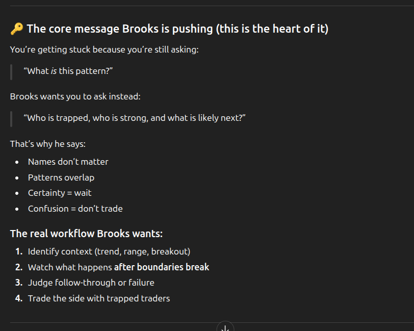

# TRADING PRICE ACTION: TRENDS

<details>
 <summary> Al Brooks ideas </summary>

- One of the most important things for a trader to do is decide whether the market is trending or not
- What happens after a breakout is one of the most important things
- Important idea: smaller patterns evolve into larger ones that can be traded


</details>


# Start: Introduction

<details>
 <summary> Introduction </summary>

 - In this series of books, Brooks is presenting how he trades the markets (and also how he views them).
 - Everything I need to make a living out of trading is provided in this series of books
 - It's up to me to spend time learning how to do it
 - His previous book focused on how to read price action.
 - This series of books centers on how to use price action to trade the markets.
 - Brooks' goals is to describe his understanding on why carefully selected trades offer great risk/reward ratios, and ways to profit from the setups
 - Everybody looks at price charts but usually just briefly
 - Price charts contain a lot of information that can be used to make profitable trades
 - Most of it can only be used effectively/effeciently if I spend time trying to understand what each bar is telling me about what institutional money is doing.
 - Institutions are the market coz 90% of all trading is done by institutions
 - No trade can take place unless one institution is willing to take one side and another is willing to take the other side
 - So every trade that I take has a profitable trader on the other side of the trade (this profitable trader is part of the collection of profitable institutions)

 - My trade takes place if an institution also wants to make the same trade
 - The market can only go to a price where there are institutions willing to buy and other institutions willing to sell.
 - As an individual trader, I can't make the market move. Only institutions can do that.
 - I should always trade in the direction of the majority of institutional money

</details>

# End: Introduction


# Start: I've Learnt that

<details>
 <summary> I've Learnt that: </summary>
- Two-legged corrections are reliable setups for trades in the direction of the trend.
- In general, any trade over 100 contracts should be considered institutional in today's Emini market
- Institutions can sometimes buy the high to prevent a potential 5 tick failure (and they think the market will go higher and they will likely buy more as it goes up)
- Four-tick scalps work so often
- In 5 minute bar charts: It is very common in strong trends for a reversal bar to reverse it's appearance in the final few seconds before the bar closes.
- Therefore, when buying countertrend against a strong trend, it is imperative to wait for the signal bar to close before placing my order, and then only enter on a stop at one tick beyond the bar in the direction of your trade (if I'm buying, buy at one tick above the high of the prior bar on a stop).
- Don't rely on Fibonacci and Elliott Wave stuff. They are useless. 
- Rely on proven chart patterns (clear and reliable price action pattern)
</details>

# End: I've Learnt that


# Start: Alternative way of describing ABC pullBacks/corrections

<details>
<summary> Alternative way of describing ABC pullBacks/corrections: </summary>
- When there is a pullback in a bull leg, the first bar whose high surpases the prior/previous bar's high is a high 1 long entry
- If the pullback continues down for a second leg, then the first bar (in the second leg) that goes above the high of the previous bar's high would be the high 2 entry
- In a sideways ABC pullback, it is common for the C leg to not pass the A leg level
</details>

# End: Alternative way of describing ABC pullBacks/corrections


# Start: Ask ChatGPT to explain

<details>
<summary> Ask ChatGPT to explain </summary>
> [!IMPORTANT]
> Ask ChatGPT to explain this part: "The big legs are unstoppable but the small price action is fine-tuned by some institutional traders who are watching every tick or have programs designed to take trades based on small price movement. For example, some Emini traders will try to scalp-out with a one-point profit, or four ticks... "
</details>

# End: Ask ChatGPT to explain


# Start: 10-Year U.S. Treasury Note Futures contract

<details>
 <summary> Appearance reversal before candle/bar close </summary>
> What about this part: 
```text
Traders pay close attention to the seconds before key time frames close, especially 3, 5, 15, and 60 minute bars. This is also true on key volumes for volume bar charts. For example, if many traders follow the 10,000 shares per bar chart for the 10-Year U.S. Treasury Note Futures contract, then when the bar is about to close (it closes on the first trade of any size that results in at least 10,000 shares traded since the start of the bar, so the bar is rarely exactly 10,000 shares), there may be a flurry of activity to influence the final appearance of the bar. One side might want to demonstrate a willingness to make the bar appear more bullish or bearish. In simplest terms, a strong bull trend bar means that the bulls owned the bar. It is very common in strong trends for a reversal bar to totally reverse its appearance in the final few seconds before a 5 minute bar closes.
```
> I don't understand whose appearance is being reversed. 
> And what does it mean to reverse the appearance? What will the whole chart look like after an appearance-reversal?
> And what is the '10-Year U.S. Treasury Note Futures contract' ? Are the betting on what the US-Dollar will be in 10 years???

---

Great questions — you’re digging into some advanced but really important concepts in price-action and market behavior. Let’s break each one down in simple terms:

---

### 🧠 **1. "Reversal of appearance" — whose appearance is being reversed?**

This refers to the **price bar's appearance on the chart**, not a person or trader. Specifically, the **candle/bar that’s forming** during a time frame (like a 5-minute chart) can **change its shape dramatically in the final seconds before it closes**.

---

### 🟩🟥 **2. What does "reverse the appearance" mean?**

Let’s use candlestick bars to illustrate. A candlestick has:

- **Open**: where price started for that time period  
- **Close**: where price ended for that time period  
- **High/Low**: the extremes reached during that time

Here’s what reversal of appearance might look like:

#### Say it’s a 5-minute candle/bar:
- Price **opened at $100**
- It **rose to $104**
- Now it’s **sitting at $103** right before the 5 minutes ends → Looks like a **strong bullish bar** 📈

BUT in the **final seconds**, a flood of selling happens:
- Price **drops quickly to $99**
- The candle now **closes at $99**

Now it **looks bearish**, maybe even like a bearish reversal candle 📉.

So the **"reversal of appearance"** just means that the **bar was looking one way (bullish or bearish)** but **suddenly changed** in its final moments before closing.

---

### 📊 **3. What will the whole chart look like after this reversal?**

The chart will show that **particular bar as a bearish bar**, not bullish.  
Even if it **looked bullish the entire 5 minutes**, what matters to traders is **how it ends** — just like in sports, **the final score** is what counts.

So if many bars suddenly flip from bullish to bearish near the close:
- The chart might start to **signal a weakening trend**
- Traders might interpret it as **loss of momentum** or a potential **reversal coming**

---

### 💰 **4. What is the '10-Year U.S. Treasury Note Futures contract'?**

This isn’t about the value of the **US Dollar** in 10 years.

It’s about the **interest rates** (or yield) on **10-Year U.S. Treasury Notes**, which are **debt securities** issued by the U.S. government. Here's the breakdown:

- The **U.S. Treasury** borrows money by issuing these notes.
- Investors **lend money** to the government by **buying the notes**.
- The **"10-Year"** part means the government will **pay back the full amount in 10 years**, with **interest along the way**.

#### 🏦 What’s a *futures contract* on it?

A **futures contract** is a **bet/contract to buy or sell** that note **at a specific price on a future date**.

So when people trade the **10-Year Treasury Note Futures**, they are:

- Speculating on **future interest rate movements**
- Trying to profit from changes in **bond prices**, which move **inversely** to interest rates

📈 If interest rates are expected to go **down**, the bond's price **goes up**, and vice versa.

---

So no, they’re not betting on the **USD's value directly** — they’re trading on **expectations about interest rates**, inflation, and monetary policy, all of which affect the broader economy and financial markets.

---

Let me know if you want a visual or simplified diagram of this — it really helps bring all of it together.

Ash: 
Yes, I want a visual diagram.

And concerning the Treasure Note Futures:
How come the price goes up if interest rates are expected to go down, and vice versa.
That doesn't make sense to me coz:
- if the rates are expected to go up; Doesn't that mean that the issuing government will have to pay the one who bought the bond more money?; So won't that make the bond more valuable hence making it's price go up??; And vice versa.

GPT:

Great questions again! Let's tackle both parts — first with a **visual diagram**, and then we’ll **explain the interest rate and bond price relationship** step by step.

---

## 🔍 PART 1: **Visual of "Bar Reversal Before Close"**

Here's a simple sketch of what happens when the **appearance of a candlestick/bar reverses** in the final seconds:

```
⏰ Minute 1 to 4:58 — Bullish Bar Forming

    Price
    ↑
104 |         
103 |         ████
102 |         ████
101 |         ████
100 | ▓▓▓▓▓▓  ████
    +----------------→ Time

Bar looks bullish! Opened at 100, currently at 103.

⏱️ Final Seconds (4:59 to 5:00) — Sudden Sell-Off

    Price
    ↑
104 |
103 |         ████
102 |         ████
101 |         ████
100 | ▓▓▓▓▓▓  ████
 99 | ████████████ ← Final close
    +----------------→ Time

💥 Now the bar **closes at 99**, below where it opened at 100.

➡️ This **reverses its appearance** from a bullish candle to a **bearish one**, just before the 5-minute bar closes.
```

---

## 🧮 PART 2: **Why Do Bond Prices Fall When Interest Rates Rise?**

It **does feel backwards at first**, but it makes sense once you understand how bonds work.

---

### 💡 Let's take a simple example:

Let’s say you buy a **10-year Treasury bond** for **$1,000** that pays a **fixed 3% interest rate** per year (called the **coupon rate**).  
That means you earn **$30 per year** for the next 10 years.

---

### 🚨 Now imagine interest rates rise to **5%**

New bonds being issued now pay **$50/year** on the same $1,000 investment.

Your bond still only pays **$30/year**, which now looks **less attractive**.

👉 So if someone wanted to sell that old 3% bond, they’d have to **sell it for less than $1,000** to make it competitive.

🔁 That’s why when **interest rates go up**, **bond prices go down**.

---

### 📉 The Reverse is Also True:

If interest rates **fall** to, say, **2%**, then your 3% bond is suddenly a **great deal**, and people are willing to **pay more than $1,000** to get it.

So:
- 📈 **Rates go down → Prices go up**
- 📉 **Rates go up → Prices go down**

---

### ⚖️ Why This Matters for Treasury Futures:

When traders buy or sell Treasury futures, they’re **speculating** on future interest rate moves:

- If they **expect rates to fall**, they might **go long (buy)** the futures to profit from rising bond prices.
- If they **expect rates to rise**, they might **short (sell)** the futures, since bond prices will drop.

---

Would you like a **visual diagram of this bond-price/interest-rate relationship** too? I can sketch that for you next!

</details>

# End: 10-Year U.S. Treasury Note Futures contract


# Start: Probabilistic Trading like Al Brooks

<details>
<summary>Probabilistic Trading like Al Brooks</summary>
Yes — I understand *exactly* what you’re asking, and this is a **very high-level question** — the kind that separates someone who’s *memorizing Brooks’ terminology* from someone who’s *learning to think probabilistically like him*.

Let’s build this properly.

---

## 🎯 What You’re Really Asking

> “What are the **core objective elements** I should read from price action — the ones that tell me which side has the higher probability — so I can trade based on probability and not emotion or bias?”

Perfect question.
Because when Brooks says *“think in probabilities”*, he doesn’t mean “guess better.”
He means:

> “Anchor your read in recurring structures that statistically repeat every day — across all markets, all timeframes.”

---

## 🧩 The 5 Core Probability Factors (Brooks’ Way)

Everything Brooks reads falls into one of these 5 categories:

| #     | Category                               | What it tells you                         | Core questions to ask in real-time                                                                                                               |
| ----- | -------------------------------------- | ----------------------------------------- | ------------------------------------------------------------------------------------------------------------------------------------------------ |
| **1** | **Trend Context**                      | Who’s in control *overall*                | Is the market currently in a trend, a pullback, or a trading range? Has there been a break of structure (trendline break or two legs sideways)?  |
| **2** | **Strength & Follow-through**          | Whether control is increasing or fading   | Were the last 1–2 bars strong? Was there follow-through? Are there overlapping bars or large consecutive trend bars?                             |
| **3** | **EMA Relationship (Dynamic Control)** | Which side the market respects            | Is price *using* the EMA as support/resistance or ignoring it? Is it testing it for the first time or after multiple attempts?                   |
| **4** | **Signal Bar Quality**                 | Whether a setup is strong or weak         | Is the signal bar in the direction of the trade? Does it have a close near its extreme? Does it make sense given the recent swings?              |
| **5** | **Location (Structure)**               | Where it’s happening — support/resistance | Is this at the top/bottom of a range, after a measured move, or at an overshoot? Is it a test of something visible (swing, EMA, prior low/high)? |

These 5 combine into a **probability map** for every trade you take.

---

## 📘 How Al Brooks Weighs Probabilities in Real Time

| Factor               | What Increases Probability            | What Decreases Probability                 |
| -------------------- | ------------------------------------- | ------------------------------------------ |
| **Trend Context**    | Always-in one direction; clear spikes | Tight trading ranges; unclear control      |
| **Follow-through**   | 2+ strong bars in same direction      | Reversals with no follow-through           |
| **EMA Relationship** | Price respecting EMA as S/R           | EMA flattening or getting crossed often    |
| **Signal Bar**       | With-trend, closes near extreme       | Counter-trend dojis or opposite-color bars |
| **Location**         | At a clear test (EMA, wedge, swing)   | Middle of nowhere; no obvious structure    |

---

## 🧠 Think Like This in Real Time

Here’s how Brooks’ thought process works moment-to-moment:

> “We’ve been in a bear spike for 10 bars. EMA sloping down. Price just poked above EMA for the first time — no follow-through yet.
> Probability still favors short continuation.
> I’ll only flip if we get multiple closes above the EMA *and* strong bull bodies.”

See how it’s *not about guessing*, it’s about **stacking odds**:

* Trend context = bear
* EMA = resistance
* Signal = weak bull
* Follow-through = unknown
  → Bias = short continuation

---

## 🪜 Bonus: 3 Secondary Factors You’ll Learn to Layer Later

These are *advanced refinements* that Brooks uses on top of the 5 basics:

| Category               | Description                                             | Why It Matters                                           |
| ---------------------- | ------------------------------------------------------- | -------------------------------------------------------- |
| **Microstructure**     | Consecutive closes near extremes, shrinking bars, tails | Adds clues about pressure buildup (energy in market)     |
| **Tests & Traps**      | Failed breakouts, double tops/bottoms, ii/oi patterns   | Show emotional exhaustion — good reversal clues          |
| **Leg Count / Rhythm** | “Two-legged pullback” logic                             | Helps time entries & exits better (don’t fade first leg) |

---

## ⚖️ Practical Checklist Before Entering a Trade

Here’s what you should literally ask yourself in 10 seconds:

1️⃣ What’s the **always-in direction** right now?
2️⃣ Where are we relative to the **EMA**?
3️⃣ Are there **strong bars** or just noise?
4️⃣ Is there a **clear signal bar** (in my direction)?
5️⃣ Are we at a **logical place** (swing, test, range edge)?
6️⃣ Do I have **room to scalp** before major support/resistance?
7️⃣ If wrong, **where does the opposite side win?**

If you can’t answer these clearly, you have no edge.

---

## ✅ Summary: The Core 5 You Must Always Watch

| #     | Probability Factor     | Why It Matters Most                                |
| ----- | ---------------------- | -------------------------------------------------- |
| **1** | Trend Context          | Defines direction bias (don’t fight the always-in) |
| **2** | Follow-through         | Distinguishes momentum from noise                  |
| **3** | EMA Relationship       | Shows dynamic support/resistance control           |
| **4** | Signal Bar Strength    | Determines whether your entry has confirmation     |
| **5** | Location (Structure)** | Prevents trading in the middle of nowhere          |

---

Would you like me to make this into a **one-page “Probabilistic Trading Framework” reference sheet** — something you can glance at while studying or sim trading (like a mental checklist of what to ask before every entry)?

</details>

<details>
 <summary> ProbabilisticT::Reference_Sheet </summary>
Perfect — this is exactly the kind of thing Al Brooks traders build for themselves after reading a few chapters, because otherwise all his “micro clues” feel disconnected.

Here’s your **📄 One-Page Probabilistic Trading Framework (Brooks-Style)** — structured for fast, in-the-moment reference.

---

## 🧭 1. Trend Context → Who’s in control?

| What to check          | Bearish Clues                           | Bullish Clues                           |
| ---------------------- | --------------------------------------- | --------------------------------------- |
| **Spike structure**    | Sharp drop from open, big bear bodies   | Sharp rally from open, big bull bodies  |
| **EMA slope**          | EMA pointing down, price below          | EMA pointing up, price above            |
| **Closes vs. EMA**     | Consecutive closes below EMA            | Consecutive closes above EMA            |
| **Break of structure** | Broke prior bull trendline, lower highs | Broke prior bear trendline, higher lows |

> 🧠 *Default assumption:* Trend resists change. Expect continuation until clear opposite follow-through.

---

## ⚡ 2. Momentum & Follow-Through → Is the pressure real?

| Strong                       | Weak                                       |
| ---------------------------- | ------------------------------------------ |
| Consecutive large trend bars | Alternating bull/bear bars                 |
| Closes near bar extremes     | Big tails, overlapping bars                |
| Second entry continuation    | Single reversal bar with no follow-through |

> 🔍 Ask: “If I were trapped on the wrong side, would I be worried right now?”
> If yes → the move has real pressure.

---

## 📉 3. EMA Relationship → Dynamic support/resistance

| EMA as Resistance                        | EMA as Support                         |
| ---------------------------------------- | -------------------------------------- |
| Pullbacks stall at EMA then reverse down | Pullbacks stall at EMA then reverse up |
| Multiple failed attempts to cross        | Multiple failed attempts to drop below |
| 1st clean test of EMA after a spike      | 1st clean test of EMA after spike up   |

> 💡 If EMA is flat and price keeps crossing → trading range, lower probability for with-trend setups.

---

## 🕯️ 4. Signal Bar Quality → Entry confidence

| Good Signal                                                 | Poor Signal                                             |
| ----------------------------------------------------------- | ------------------------------------------------------- |
| With-trend color, close near extreme                        | Counter-trend doji or opposite color                    |
| Small tails against direction                               | Big tail against your side                              |
| Context supports it (after pullback, test, or micro double) | In the middle of noise, after several bars with overlap |

> 📌 Only act on a signal bar when it *fits the story* — e.g. bull signal after two-legged pullback in a bull trend.

---

## 📍 5. Location & Structure → Where it’s happening

| High-probability zones                 | Low-probability zones     |
| -------------------------------------- | ------------------------- |
| Test of EMA or trendline               | Middle of trading range   |
| Prior swing high/low                   | Random mid-bar location   |
| Wedge top/bottom, measured-move target | No visible structure      |
| Trendline or channel overshoot         | Flat, low-volatility area |

> 🧩 “Where” matters as much as “what.”
> A perfect signal bar in a bad location is still a low-probability trade.

---

## 🧮 Bonus Filters (Secondary Layers)

| Filter                 | Meaning                               | Effect                                 |
| ---------------------- | ------------------------------------- | -------------------------------------- |
| **Leg count**          | Two-leg pullbacks > one-leg pullbacks | Wait for 2nd leg to fade counter-trend |
| **Micro gaps / tails** | Unfilled gaps, tails away from EMA    | Continuation energy                    |
| **Traps**              | Failed breakouts, opposite failures   | Fuel for reversals                     |

---

## 🧠 Quick-Check Workflow (Before Any Entry)

1️⃣ Identify the **always-in direction** (trend context).
2️⃣ Note **EMA slope & position**.
3️⃣ Evaluate **bar strength** (momentum).
4️⃣ Ask: “Is this **signal bar** strong & aligned?”
5️⃣ Confirm **location** (range edge, EMA test, measured move).
6️⃣ Define risk: “Where is the opposite side proven right?”
7️⃣ Only enter if ≥ 3 factors favor your side.

> 💬 *If it’s confusing → skip it. Confusion = no edge.*

---

## ⚖️ Example Summary (applied logic)

| Context                      | Price Action            | Interpretation               |
| ---------------------------- | ----------------------- | ---------------------------- |
| Strong bear spike, EMA down  | Bull bar touches EMA    | Probable MA-gap short setup  |
| Two-leg pullback to EMA      | Bear reversal bar forms | High-prob continuation short |
| 3 overlapping bars mid-range | Doji signal             | Low-prob, avoid              |
| Wedge bottom in range        | Small bull reversal bar | Potential fade long          |

---

Would you like me to turn this into a **printable PDF cheat sheet** (clean layout, color-coded sections, designed like a trader’s desk reference)?
That way you could keep it open beside your chart when reviewing price action examples like Figure 2.3.

</details>

# End: Probabilistic Trading like Al Brooks


# Start: Base my trades on Probability

<details>

<summary>How to base my trades on Probability and not my emotions / bias</summary>

> If I want to base my trades on Probability and not my emotions / bias, there are **5 core objective elements** that I should read from price action. These elements tell me which side has a higher probability of winning.

The 5 elements are about 3 things:
- The Trend
- The EMA
- The Signal
2 elements focus on the Trend; 1 elements focuses on the EMA; 2 elements focus on the Signal.


</details>

# End: Base my trades on Probability