# Java SE Fundamentals
```console
NOTE:
These notes are the notes that were taken by Ashbie B. Mweemba while he was learning/Re-learning Java from Pluralsight courses.
Part of these notes came from AI responses to Ashbie's questions/prompts about certain things (concepts/topics etc).
```
## Understanding Methods

The return value of a method:
  - can use a variable
  - can use a [literal](#literals) or 
  - can use a calculation.
  

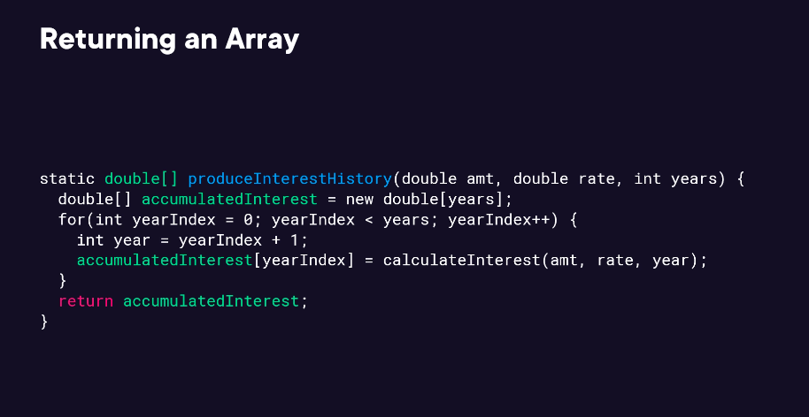
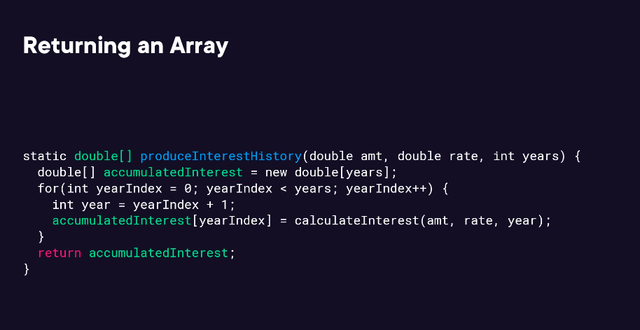

- Command-line arguments are provided as part of launching the program
  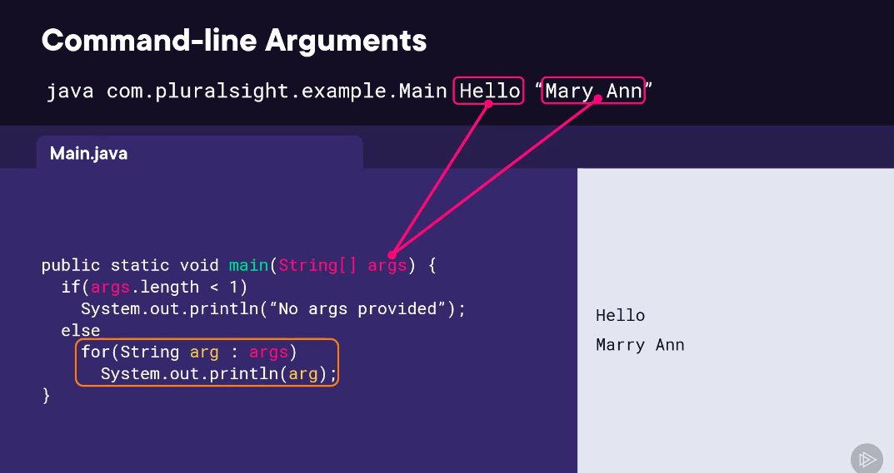

## Strings


- The StringBuilder actually constructs strings piece by piece much more efficiently than the String class itself.
- So why do we have the better building functionnality in the StringBuilder class and not the String class??

### String Class
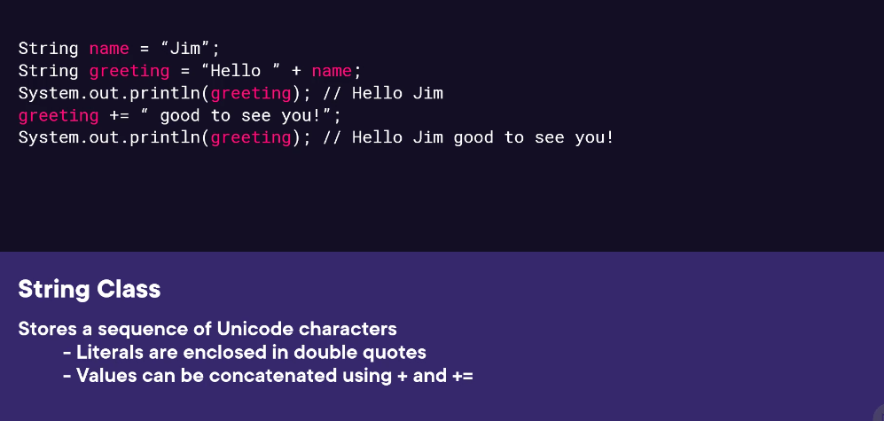
- Technically they're stored in what's known as UTF-16 format (meaning: They can store any charater in any language you're likely to work with)
### Characteristics
### **Immutability**
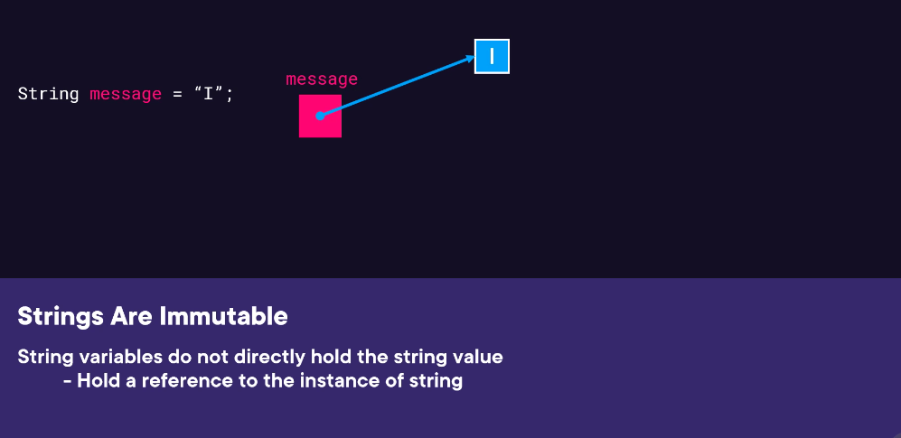
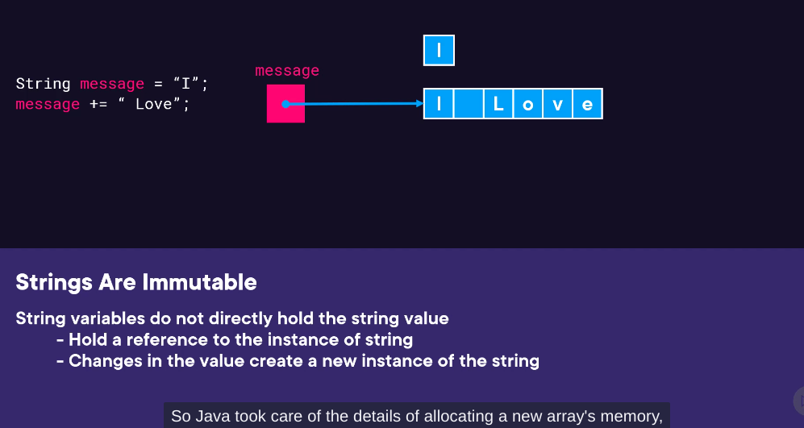
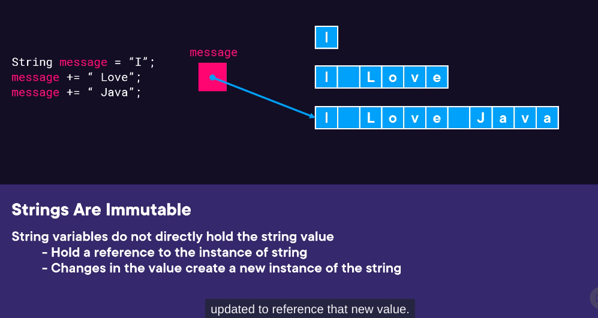

###  **Equality**
There is something important we need to understand about the equality operator when applying it to strings.
The equality operator does not check the value of the string instance itself. 
The equality operator simply checks to see if both string variables reference the same string instance.
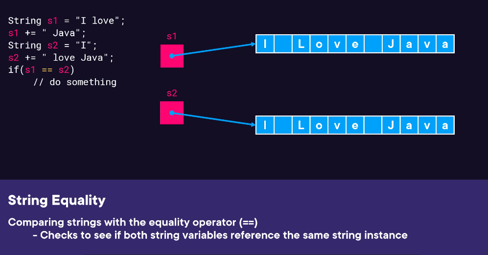
So in this case, (s1 == s2) resolves/results to false.
- Q. What if I had initialized s2 like this:
```java
String s2 = s1;
```
Then say:
```java
if(s1 == s2)
```
What will this equality result to?
- R. According to chatGPT, it would return true. 
I have to test this!!!
### **When we want to know if the values are the same:**
We use the .equals() method
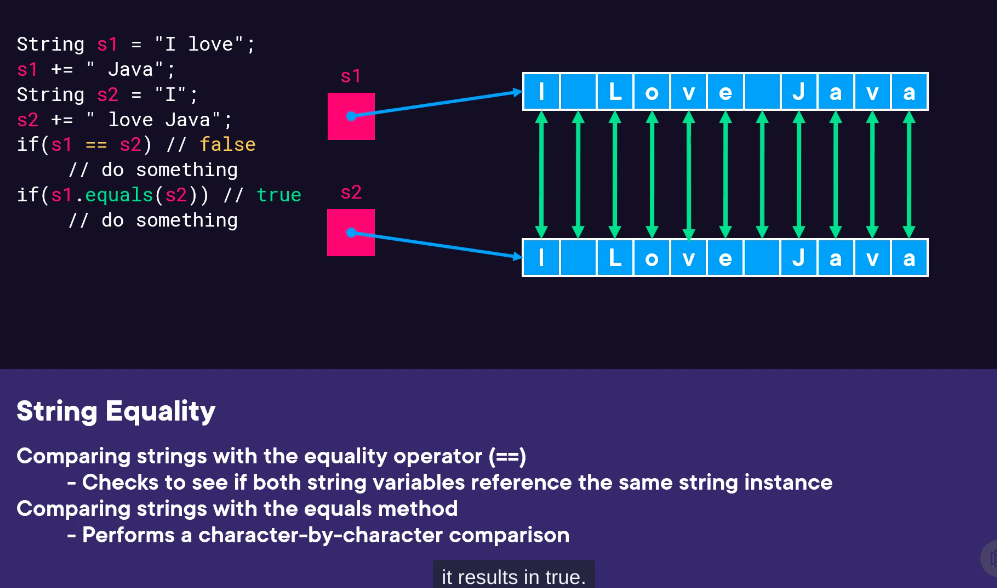
s1.equals(s2) results to true
### Intern-ing strings: Cases where we frequently need to check strings for equality
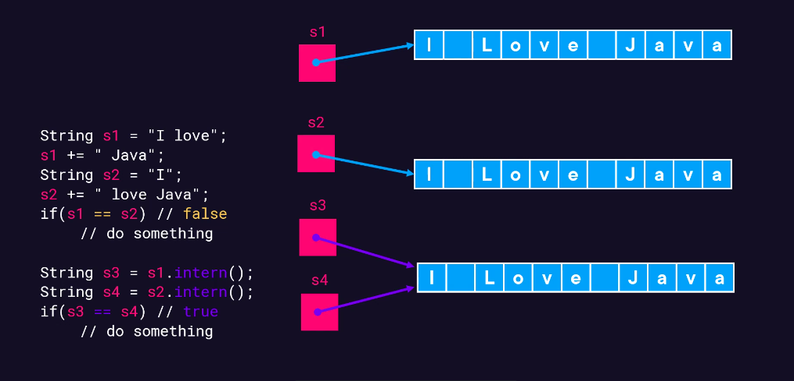
**Code Explanation**
When we say `s3 = s1.intern();`
What the intern method does is:
- `1 ` it looks at the value of the string 
- `2 ` it looks around to see if there is already an intern version of that string
- `3 ` if it can't find one, it provides that intern version:
So then s3 is set to reference the intern version of the string.


So now if I say `s4 = s2.intern();`
- `1 ` the intern method will look at the value of the string that s2 references
- `2 ` then it will look around for an intern version of that string:
And in this case, it would find one. It's the same version that s3 references.
So s4 will now reference that same instance that s3 references.

So with that, if we say `s3 == s4`, in this case, that will now return `true`

**Why does `string intern-ing` exist?**
Because doing character-by-character comparisons of a string (using the .equals() method) is certainly more expensive than checking to see if two references point to the same string instance; Particularly if the strings you're checking are very long strings.
So in cases where we need to frequently check strings for equality, we have this concept known as `interning a string`.

What `string interning` does is provide what's known as a `canonicalized` value.
And that's simply a fancy way of saying that when you intern a string, a string of any given value will always `return back a reference to the same string instance`.
What that makes possible is that we can actually do the comparison using the `==` operator, which would then improve our performance in cases where we frequently need to compare string values.
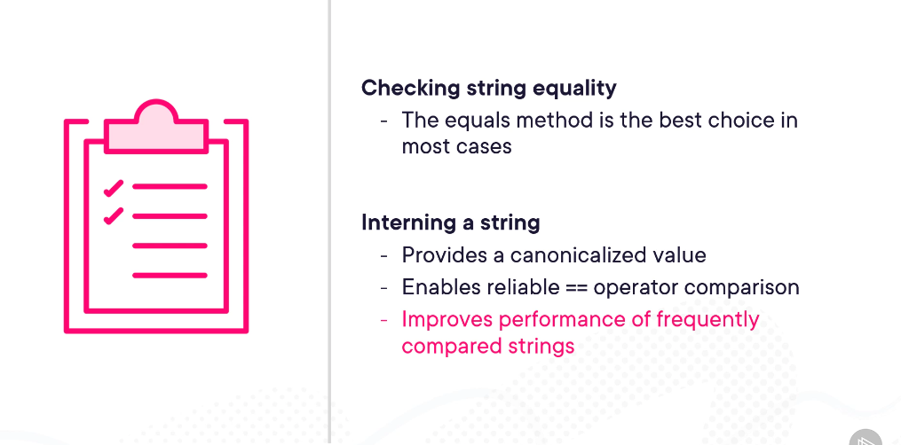

##
**A question then arises**
Q. Can two none-interned / none-canonical string variables reference the same string instance?
 
`NOTE: When I asked this question:`
- I didn't know that String literals are automatically stored in the String Pool by Java. 
- And I forgot that all Strings in Java are objects and so, they are **not** stored on the stack. They are either stored on the heap or the pool(String Pool).
The response to the question in the [(yes-they-are-actually-objects)](#yes-they-are-actually-objects) section, reminds me that Strings are objects.

R. Yes, two non-interned (or non-canonical) string variables can reference the same string instance in memory, but only under certain conditions. This happens when both variables are explicitly set to reference the same instance, either through assignment or because the instance was created in a way that makes it shared.

#### How Two Non-Interned Strings Can Reference the Same Instance
1. **Assignment**:
   - If you assign one non-interned string to another variable, both variables will reference the same string instance.
   - Example in Java:
     ```java
     String str1 = new String("hello");
     String str2 = str1;  // Both str1 and str2 now reference the same instance
     ```

2. **Factory Methods**:
   - Sometimes, a factory or utility method returns a reference to an existing instance rather than creating a new one, allowing two references to point to the same instance.
   
3. **Manual Interning**:
   - If you explicitly call a method like `intern()` in Java, you can place the string in the pool, allowing multiple variables to reference the same canonical instance, even if they were created with `new`.

###### Why You Might Ask This Question
You might be asking about this to understand how strings work in memory, particularly the behavior of the **String pool** and **string interning**. This is especially relevant for performance, memory management, and reference equality checks (`==`) versus content equality checks (`equals`). 

In Java, for instance, string literals are automatically interned, meaning they refer to the same memory instance in the pool. But non-interned strings created with `new` do not automatically enter the pool, so each `new String("value")` normally creates a distinct object. However, if you explicitly intern these strings or assign one to another, they can share the same instance.

This question is often asked to test knowledge about **string pooling**, **memory optimization**, and **how strings are managed differently from other objects** in languages like Java and C#. It helps confirm a strong understanding of references and memory management in object-oriented languages.

## String Literals are automatically interned by Java OR String Literals are automatically placed in the Spring Pool memory area
##### But Wait:
Q. So are you telling me I can't instantiate a second string from a first string that was instantiated using a string literal (meaning: the first string wasn't instantiated using the key word **new**)?
like this: 
```java
String s1 = "A string instance";
String s2 = s1;
```
Are you telling me this won't work?

R. No, actually, that *will* work! In the code snippet you provided:

```java
String s1 = "A string instance";
String s2 = s1;
```

both `s1` and `s2` will indeed reference the same string instance. Here’s why:

1. **String Literals and the String Pool**: 
   - When you assign a literal like `"A string instance"` to `s1`, Java places this literal in a special memory area known as the **string pool**. Since `s1` is referencing this literal directly, it is automatically interned and shared.

2. **Reference Assignment**:
   - When you assign `s2 = s1`, `s2` becomes a reference to the exact same string instance in memory, so both `s1` and `s2` point to the same object.

3. **String Interning**:
   - Because string literals are automatically interned by Java, `"A string instance"` is only created once in the string pool, and `s1` and `s2` both reference this same instance.

###### To Summarize
Yes, you *can* instantiate `s2` from `s1` without the `new` keyword because `s1` points to a string literal in the pool, and assigning `s1` to `s2` makes `s2` refer to the same interned instance.

If you explicitly used `new String("A string instance")` to create a new, distinct instance (like `String s3 = new String("A string instance");`), then `s3` would refer to a different object in memory, even though it contains the same content.

##### Another Question:
Q. What if I assign the same literal to different variables. Will the variables reference/point to one/the same instance (meaning: only one instance of the literal was created) the same **OR** will they reference/point to different instances? 
e.g.
```java
String string1 = "polony";
String string2 = "polony";
String string3 = "polony";
```
R. If you assign the same literal to multiple `String` variables in Java, as in your example:

```java
String string1 = "polony";
String string2 = "polony";
String string3 = "polony";
```

then **all three variables (`string1`, `string2`, and `string3`) will reference the same instance of the string `"polony"`**. Java optimizes memory usage by placing string literals in a special area called the **string pool**. Here’s what happens step-by-step:

1. **String Pooling**: When the literal `"polony"` is encountered for the first time, Java creates a single instance of this string and places it in the string pool.

2. **Reusing the Instance**: For each subsequent occurrence of the literal `"polony"` in the code, Java recognizes that the string already exists in the pool and simply makes the variable (like `string2` or `string3`) reference this same pooled instance instead of creating a new one.

3. **Memory Efficiency**: Because all variables reference the same instance in the pool, this approach saves memory and allows comparisons like `string1 == string2` to return `true`, as they point to the same object in memory.

###### Verifying with Code
In Java, you can check this behavior with a simple test:

```java
System.out.println(string1 == string2); // true
System.out.println(string2 == string3); // true
System.out.println(string1 == string3); // true
```

Each of these comparisons will return `true` because `string1`, `string2`, and `string3` all point to the same instance of the literal `"polony"` in the string pool. 

###### Important Note
This only applies to string literals. If you create strings with `new String("polony")`, Java will create a new instance each time, and the variables will point to different objects in memory, even if their content is the same.

##### Then why is it that:
Q. When I write this:
```java
String s1 = "I love";
s1 += " Java";
String s2 = "I";
s2 += " love Java";
System.out.println(s1 == s2); // false

String s3 = s1.intern();
String s4 = s2.intern();
System.out.println(s3 == s4); // true
```
`s1 == s2` results to false. Why is that s1 and s2 are not equal (but s3 and s4 are equal)? Didn't you say that string literals are automatically interned? 
The main question is why are s1 and s2 not equal? 
On the concatenation operation of s2, why didn't Java look for an interned string "I love Java", then discover that that interned string exists, then make s2 refer to that already existing interned string?

R. Great question! The reason `s1 == s2` results in `false` is because of how Java handles **string concatenation** at runtime and the creation of **new instances** when concatenation is used with variables. Let's break it down step-by-step.

### Step-by-Step Analysis

1. **String Literals**: 
   - When you write `String s1 = "I love";` and `String s2 = "I";`, Java stores `"I love"` and `"I"` as string literals in the **string pool**. So `s1` initially points to the interned `"I love"` and `s2` initially points to the interned `"I"`.

2. **Concatenation with `+=`**:
   - When you do `s1 += " Java";`, this is shorthand for `s1 = s1 + " Java";`.
   - Java creates a **new `String` object** as a result of this concatenation operation because strings are immutable in Java. This new object is *not* automatically added to the string pool. Instead, it’s a new instance in the heap memory, which `s1` now points to.
   - Similarly, for `s2 += " love Java";`, Java creates another new `String` object that combines `"I"` and `" love Java"` into `"I love Java"`, but again, this is a new instance in the heap memory rather than the string pool.

3. **Result of `s1 == s2`**:
   - After concatenation, `s1` and `s2` are both pointing to separate new instances in the heap, not the original interned strings in the pool.
   - As a result, `s1 == s2` is `false` because `==` checks for reference equality (whether they point to the same object), and they don’t in this case.

4. **Manual Interning with `intern()`**:
   - When you call `s1.intern()` and assign it to `s3`, Java looks for `"I love Java"` in the string pool. Since this string value hasn’t been placed in the pool yet, it will add `"I love Java"` to the pool and `s3` will reference the interned version.
   - For `s2.intern()` assigned to `s4`, Java finds the interned `"I love Java"` that was just created when `s3` was interned. Therefore, `s3` and `s4` both reference the same interned `"I love Java"` instance in the pool.

5. **Result of `s3 == s4`**:
   - Since both `s3` and `s4` reference the same interned instance in the pool, `s3 == s4` returns `true`.

### Key Point: Why Java Doesn’t Intern Automatically on Concatenation

Java does not automatically intern strings created through concatenation at [runtime](#runtime-and-compile-time). This is partly for **performance reasons**, as interning every concatenated string could lead to significant [overhead](#overhead), especially in large applications with frequent concatenation operations. Instead, Java leaves it up to the developer to call `intern()` if interning is needed.

### Summary
- `s1 == s2` is `false` because concatenating strings with `+=` creates new, non-interned instances in heap memory.
- `s3 == s4` is `true` because calling `intern()` explicitly places or finds the concatenated string in the string pool, allowing both `s3` and `s4` to point to the same interned instance.

So, even though literals are automatically interned, *strings created through concatenation are not*, which is why `s1` and `s2` end up referencing different objects.

### Concatenating with Literals instead of Variables
Q. If I wrote this: 
  ```java
  String literalString = "A literal";
  String concatenatedStringWL = "A" + " literal";
  System.out.println("Which instance will be stored in the 'String Pool' and which one will be stored in the 'Heap/Free Store'?");
  ```
Answer the question in the `println` and break it down for me step-by-step.

#### Response
In the example you provided, let's go step-by-step to see where each string instance is stored: either in the **String Pool** or in the **Heap**.

```java
String literalString = "A literal";
String concatenatedStringWL = "A" + " literal";
System.out.println("Which instance will be stored in the 'String Pool' and which one will be stored in the 'Heap/Free Store'?");
```

### Step-by-Step Breakdown

1. **`String literalString = "A literal";`**:
   - When you write `String literalString = "A literal";`, Java checks if `"A literal"` already exists in the **String Pool**.
   - Since this is a **string literal**, it is automatically interned. If `"A literal"` doesn’t exist in the pool, Java will add it there. If it already exists, `literalString` will reference the existing instance in the pool.
   - **Result**: `"A literal"` is stored in the **String Pool**.

2. **`String concatenatedStringWL = "A" + " literal";`**:
   - In this case, `"A"` and `" literal"` are both string literals.
   - Since both parts are literals and the concatenation (`"A" + " literal"`) is done with literals only, **Java optimizes this at compile-time** by directly combining them into a single literal, `"A literal"`.
   - This is an optimization called [constant folding](#constant-folding), where the compiler recognizes the concatenation of literals and combines them into a single constant value at compile-time.
   - After constant folding, this line effectively becomes `String concatenatedStringWL = "A literal";`.
   - As a result, `concatenatedStringWL` will reference the **same interned string** instance in the **String Pool** as `literalString`.

3. **Conclusion of the `println` question**:
   - Both `literalString` and `concatenatedStringWL` reference the **same instance** of `"A literal"` in the **String Pool**.
   - No additional instance is created in the **Heap** because the concatenation was done entirely with literals, allowing the compiler to optimize it to a single string in the pool.

### Summary Answer

In this case:
- **Both `literalString` and `concatenatedStringWL` reference the same instance in the String Pool**.
- There is no new instance created in the **Heap/Free Store** because the concatenation involves only literals, enabling compile-time optimization. 

If you print `literalString == concatenatedStringWL`, it would return `true` because both variables point to the same interned string instance.

### From heap to string pool
Can string objects be placed in the string pool?
Or the string pool is only for string literals?

Yes, **string objects can be placed in the string pool**, not just string literals. However, this only happens when a string object is explicitly **interned** by calling the `intern()` method.

### How String Pool Works

1. **String Literals**:
   - Any string literal (e.g., `"hello"` in `String s = "hello";`) is automatically placed in the **string pool** by the Java compiler. This allows Java to reuse the same instance for identical literals, optimizing memory usage.

2. **String Objects Created with `new`**:
   - When you create a string with `new`, such as `String s = new String("hello");`, Java allocates memory for this string object on the **heap** instead of directly in the string pool.
   - This means `new String("hello")` creates a separate instance in memory, even if `"hello"` already exists in the string pool.
   - However, if you want this heap-allocated string object to refer to an instance in the pool, you can explicitly call `s.intern()`. This method checks if an identical string already exists in the pool:
     - If it does, `intern()` returns a reference to the pooled instance.
     - If it doesn’t, `intern()` adds the string to the pool and then returns a reference to the pooled instance.

### Example of Using `intern()` with String Objects

```java
String s1 = new String("example"); // Allocated on the heap
String s2 = s1.intern();           // s2 now refers to the instance in the string pool

String s3 = "example";             // Uses the string pool directly

System.out.println(s2 == s3);      // true, because both s2 and s3 refer to the pooled instance
System.out.println(s1 == s3);      // false, because s1 refers to the heap instance
```

### Why Use `intern()`?

- **Memory Efficiency**: Interning helps save memory by reusing identical strings.
- **String Comparison**: Since interned strings reference the same instance, you can compare them with `==` for quick reference equality rather than `.equals()`.

### Summary

- **String literals** are automatically placed in the **string pool**.
- **String objects** (e.g., those created with `new`) are placed in the **heap** but can be **moved to the string pool** by calling `intern()`.
  
So, both literals and explicitly interned string objects can be stored in the string pool, allowing efficient memory use and reference equality where desired.

## Yes! They are actually objects!
So calling the intern() method on a string object will no move the object to the string pool BUT it will create a new object in the string pool; so there will be 2 objects with the same value but one will be in the heap while the other will be in the string pool, right?

*Yes, that's correct!*

Calling `intern()` on a string object does **not** move the object itself from the heap to the string pool. Instead, it **creates a new instance in the string pool** if an identical string isn't already there.

Here's what happens in detail:

1. **If an identical string is already in the string pool**:
   - `intern()` returns a reference to the existing pooled instance.
   - The original heap instance is unaffected and remains in the heap.

2. **If an identical string is not in the string pool**:
   - `intern()` adds a new copy of the string (with the same value) to the string pool and returns a reference to this pooled instance.
   - This creates two distinct string objects with the same value: one in the heap and one in the string pool.

### Example to Illustrate This

```java
String heapString = new String("hello"); // Created on the heap
String pooledString = heapString.intern(); // Refers to the pooled instance (in the string pool)

// Check if they are the same instance
System.out.println(heapString == pooledString); // false, different instances
System.out.println(heapString.equals(pooledString)); // true, same value

// Another string literal with the same value
String literalString = "hello"; // Points to the pooled instance

// Check if literalString and pooledString are the same
System.out.println(pooledString == literalString); // true, both point to the pool instance
```

In this example:
- `heapString` points to a unique instance on the heap.
- `pooledString` points to the interned version in the string pool.
- `literalString` also points to the same interned instance as `pooledString`.

So after calling `intern()`, you have:
- **Two instances** with the same value: one on the **heap** (`heapString`) and one in the **string pool** (`pooledString` and `literalString`).
  
This design helps Java manage memory efficiently, as only explicitly interned strings and literals are added to the pool, while other string objects can still exist independently in the heap.

## String Literals are case sensitive
Is this literal "Java problems" the same as this one "JAva Problems" ?

*No* 

The literals `"Java problems"` and `"JAva Problems"` are **not the same**. 

### Explanation
In Java (and most programming languages), string literals are **case-sensitive**, which means that `"Java problems"` and `"JAva Problems"` are treated as completely different strings because of the differences in capitalization. Specifically:
- `"Java problems"` has a lowercase "a" in "Java" and lowercase "p" in "problems."
- `"JAva Problems"` has an uppercase "A" in "JAva" and an uppercase "P" in "Problems."

### Storage in the String Pool
Because they are different by case, each literal will have its own unique entry in the **string pool**. Java will not reuse one for the other, as it treats them as distinct.

### Summary
To Java, `"Java problems"` and `"JAva Problems"` are two different string literals.

## (String) References and/or Pointers
So when we have been using the term `Reference/Referencing/References/etc`, do we mean an alias (a second name) for the variable and not a pointer; 
just like how in C++, we have references and pointers, but references are like a second name for a variable WHILE pointers are distinct variables that point to the address of the variable being pointed to.
I ask this question because we keep saying strings reference String objects that are either in the heap or the String pool; but when I look at the syntax of how we create/initialize the strings, we don't place asterisks after the data type like how we do for pointers in C/C++.
So are these Java references the same as C++ references (just another name for the variable) ? Or maybe they are like C++ pointers?
Do you see where I'm coming from?

**The response to the question**
Yes, I see exactly where you’re coming from, and your comparison to C++ references and pointers is insightful!

In Java, the term **reference** does indeed have a different meaning than in C++. Java **references** are more like **C++ pointers** in behavior (but without explicit syntax like `*` for dereferencing). Here’s a breakdown of the key points:

### 1. **Java References vs. C++ References**
   - In Java, when we say a variable "references" an object, it means the variable **holds the memory address of that object**. However, this is abstracted away — we don’t see or work with the actual address.
   - Java references are not exactly like C++ references, which are more of an **alias**. In C++, a reference provides an alternate name for an existing variable, binding directly to that variable so there’s no “referencing” in terms of memory location.
   - In Java, each reference variable **refers to a distinct memory address in the heap** where an object resides, much like a pointer in C++. 

### 2. **Java References Are Not C++ Pointers, but They Behave Similarly**
   - Unlike pointers, Java references don’t allow you to directly manipulate memory addresses or arithmetic (like pointer arithmetic in C++).
   - However, Java references have similar functionality to pointers because they **indirectly allow access to objects**. When you assign one Java reference to another, they both refer to the same object (like pointers referring to the same memory location).

### 3. **String Pool and Reference Reuse**
   - When we say that two string variables “reference the same object in the string pool,” we mean that **both variables point to the same location in memory** where that interned string resides. 
   - Java’s handling of references and objects in memory aligns more with the behavior of pointers in C++, but Java manages memory for you (e.g., with garbage collection) so that you never have direct control over addresses.

### Example to Illustrate Java References

In Java:
```java
String s1 = "hello";  // s1 references the string object "hello" in the string pool
String s2 = s1;       // s2 now references the same string object as s1

System.out.println(s1 == s2); // true, because both s1 and s2 point to the same object
```

In C++:
```cpp
std::string s1 = "hello";
std::string& s2 = s1; // s2 is an alias (reference) to s1, not a separate variable

// s1 and s2 are truly the same entity
```

In this example:
- In **Java**, `s1` and `s2` are like pointers that happen to point to the same object in memory. Changing `s1` to reference something else would not affect `s2`.
- In **C++**, `s2` is a true alias for `s1`. Changing `s1` directly affects `s2` because they are essentially the same variable.

### Summary

- **Java references** act like C++ pointers because they hold references to objects in memory, although without direct memory access or pointer syntax.
- **Java references are not like C++ references** (aliases), as they do not bind directly to an existing variable but instead point to objects in memory, which aligns more closely with the behavior of pointers.

So, you’re right to observe that **Java references are more similar to C++ pointers than to C++ references**!


# Some Terms and Definitions
### Literals

- In programming, literals are fixed values that are directly written into code and represent specific values for fundamental data types. Unlike variables, which store data that can change, literals are constant values written exactly as they should be used in the program.
- Examples:

```java
int age = 30;              // 30 is an integer literal
double pi = 3.14159;       // 3.14159 is a floating-point literal
char initial = 'A';        // 'A' is a character literal
String greeting = "Hello"; // "Hello" is a string literal
boolean isReady = true;    // true is a boolean literal
Object obj = null;         // null is a null literal
```

### Immutability
In programming, **immutable** refers to an object or data structure whose state cannot be modified after it is created. Once an immutable object is initialized with a specific value, it remains constant throughout its lifetime. This concept is particularly important in languages and environments where data integrity, thread safety, or functional programming paradigms are emphasized.

### Characteristics of Immutability
1. **Fixed State**: The object's state (its data or values) is locked in when the object is created. Any "modification" results in creating a new object rather than changing the existing one.
2. **Thread Safety**: Because immutable objects can't be changed, they are inherently thread-safe. Multiple threads can access them without risk of one thread altering the object in a way that affects others.
3. **Predictability and Reliability**: Immutable objects lead to fewer unintended side effects, making code more predictable and easier to understand, test, and maintain.

### Examples of Immutability in Common Languages

1. **Strings**:
   - In languages like Java, Python, and JavaScript, strings are immutable.
   - For example, in Java:
     ```java
     String greeting = "Hello";
     greeting = greeting + " World";
     ```
     Here, `greeting + " World"` creates a new string rather than modifying the original `"Hello"` string.

2. **Immutable Data Structures**:
   - Some languages have specific libraries or data types for immutable structures. For example, **tuples** in Python are immutable, as opposed to lists.
   - In JavaScript, libraries like **Immutable.js** offer data structures (like `Map`, `Set`, `List`) that prevent modification.

3. **Primitive Data Types**:
   - Many languages treat primitive data types (like integers and booleans) as immutable, meaning that assigning a new value to a variable with a primitive type results in creating a new instance rather than modifying the existing one.

### Why Use Immutability?
1. **Functional Programming**: Immutability is a cornerstone of functional programming because it eliminates side effects.
2. **Avoiding Bugs**: When an object can’t be modified, it reduces the chances of accidental changes, which can help prevent certain types of bugs.
3. **Concurrency and Thread Safety**: Immutability enables safe sharing of data between threads without needing locks, which can simplify concurrent programming.

In summary, **immutability** ensures that once an object is created with a value, that value cannot be altered, making the object predictable, reliable, and often safer to use in concurrent or complex code.

### Concurrent programming
**Concurrent programming** is a programming approach that allows multiple tasks (or units of work) to be executed simultaneously or interleaved within the same time period. In concurrent programming, different parts of a program can execute independently, often making use of **multithreading**, **parallelism**, and **asynchronous execution** to achieve this.

### Key Concepts in Concurrent Programming

1. **Concurrency vs. Parallelism**:
   - **Concurrency** means that multiple tasks make progress over time but may not necessarily execute at the exact same instant.
   - **Parallelism** refers to tasks running simultaneously on multiple processors or cores. Concurrency does not always imply parallelism, though they often go hand-in-hand.

2. **Threads and Processes**:
   - A **process** is a self-contained execution environment, while a **thread** is the smallest unit of execution within a process.
   - Concurrent programming often involves multiple threads (multithreading) within the same process to allow different parts of a program to run independently.

3. **Asynchronous Programming**:
   - In asynchronous programming, tasks are executed independently of the main program flow, often in response to events or with callbacks. This is common in I/O-bound tasks where a program can continue executing other code while waiting for a task to complete.

4. **Task Scheduling and Interleaving**:
   - In concurrent systems, tasks are scheduled so that each task runs for a short time, then yields to allow others to progress. This interleaving makes it appear as if tasks are running simultaneously, even if they’re not truly parallel.

### Advantages of Concurrent Programming
- **Efficiency**: Concurrency can improve efficiency, especially in I/O-bound or waiting tasks, by allowing the system to perform other work while waiting.
- **Better Resource Utilization**: Systems with multiple cores or processors can execute multiple tasks in parallel, improving performance.
- **Responsiveness**: Concurrent programming can make applications more responsive by running background tasks without blocking the main thread (e.g., UI interactions).

### Common Challenges in Concurrent Programming

1. **Race Conditions**:
   - Occur when two or more threads try to access shared resources simultaneously, leading to unpredictable results.

2. **Deadlocks**:
   - Arise when two or more tasks are waiting on each other to release resources, causing all of them to stall indefinitely.

3. **Synchronization and Locks**:
   - To avoid race conditions, tasks must sometimes be synchronized. Synchronization mechanisms like **locks**, **mutexes**, and **semaphores** help manage access to shared resources.

4. **Debugging Complexity**:
   - Concurrent code can be challenging to test and debug because issues like race conditions or deadlocks may not happen every time the code runs.

### Examples of Concurrent Programming
- **Web Servers**: Handling multiple client requests at once by creating a new thread or process for each request.
- **UI Applications**: Performing background work (e.g., loading data, animations) without freezing the interface.
- **Data Processing**: Breaking down large datasets into chunks processed in parallel, such as in machine learning or data analysis tasks.

### Concurrent Programming Languages and Frameworks
- **Java**: Provides multithreading with the `java.lang.Thread` class and `java.util.concurrent` package.
- **Python**: Supports concurrency with threads (using `threading`), asynchronous programming with `asyncio`, and parallelism with the `multiprocessing` module.
- **JavaScript**: Single-threaded but supports asynchronous programming with `async/await` and `Promise` constructs.

In summary, **concurrent programming** allows multiple tasks to progress within the same period, improving efficiency and responsiveness, especially in systems that need to handle many tasks or requests at once.

## Runtime and Compile time
Q. What is runtime? What is compile-time? 
And in the previous example's case, why didn't the concatenation and everything else happen at compile time? Why at runtime?
 ### What is Runtime?

**Runtime** refers to the period during which a program is **running** or **executing** on a machine, after it has been successfully compiled. It is when the program actually performs its operations and executes the code.

At runtime, variables are initialized, methods are invoked, and computations are performed based on the data available. For example, string concatenation using `+=` happens at runtime because it's determined dynamically based on the values at that moment in the program's execution.

### What is Compile-Time?

**Compile-time** is the phase in the program development cycle when the source code is **compiled** into machine-readable bytecode (or a machine-level executable for languages like C/C++). This process is performed by a compiler before the program actually starts running.

At compile-time, the compiler checks the syntax, type-checks variables, and performs optimizations that are deterministic based on the code structure. However, not all things can be determined at compile-time, especially when data values depend on user input, external data, or runtime conditions.

### Why Did the Concatenation Happen at Runtime in Your Example?

In your previous example:

```java
String s1 = "I love";
s1 += " Java";  // String concatenation happens here at runtime

String s2 = "I";
s2 += " love Java";  // String concatenation happens here at runtime

System.out.println(s1 == s2); // false
```

The reason the concatenation happens at **runtime** and not **compile-time** is because of the following factors:

1. **String Immutability**: 
   - Strings in Java are immutable, meaning once a string is created, it cannot be changed. So when you do `s1 += " Java";`, it creates a **new string instance** rather than modifying the existing one.
   - Since the concatenation creates a new object, it cannot happen at compile-time because the concatenated string is a new instance, which is created at runtime based on the values of `s1` and `"Java"`.

2. **String Variables Involved**:
   - The concatenation involves string variables (`s1`, `s2`) that might not be known to the compiler at compile-time, depending on the flow of the program. In your case, `s1` and `s2` are variables that hold string values, and the final result depends on their values when the program is executed, not when it is compiled.
   - Compile-time constants (like string literals that are not concatenated with variables) can be resolved at compile-time, but concatenating variables or expressions requires evaluation during program execution.

3. **The `+=` Operator**:
   - The `+=` operator is syntactic sugar for concatenation, but the result of the operation is still computed **at runtime**, meaning the concatenation process (creating a new string and updating the reference) occurs while the program is running, not during compilation.

4. **The Compiler's Knowledge**:
   - During compile-time, the compiler can only evaluate static expressions or constants. Since `s1` and `" Java"` are not constants at compile-time, the compiler cannot predict the exact value of the concatenated string, so it defers the concatenation to runtime.

### Could It Have Happened at Compile-Time?

- If the concatenation involved only **compile-time constants**, such as:

  ```java
  String s1 = "I love";
  String s2 = "I love" + " Java";  // Both parts are literals
  ```

  Then the concatenation could happen at compile-time because both strings are literals and the result (`"I love Java"`) is determinable ahead of time by the compiler. The compiler would compute the concatenated value at compile-time and optimize it, making it a constant.

However, in the example you provided, the second part of the concatenation (`s1 += " Java"`) involves a **variable** (`s1`), which makes it impossible for the compiler to determine the result at compile-time.

### Summary

- **Runtime**: When the program is executing and when dynamic operations (like string concatenation with variables) are carried out.
- **Compile-time**: When the program is being compiled, and static operations (like concatenating string literals) are handled by the compiler.
- **Why Concatenation Happens at Runtime**: Since the `+=` operator involves variables (not constants), and strings are immutable in Java, the concatenation operation creates new instances dynamically during runtime. The final string values are determined based on the runtime state of the variables, so the concatenation can't be done at compile-time.

## Overhead
You mentionned overhead in one of your responses. e.g.:
"This is partly for performance reasons, as interning every concatenated string could lead to significant overhead,...".

### What is overhead?

**Overhead** in the context of programming and computer science refers to the additional resources (time, memory, or computation) required by a system or operation beyond the basic functionality of the task being performed. Essentially, it is the extra "cost" that comes with certain actions, which can reduce efficiency or performance.

### Types of Overhead

1. **Memory Overhead**:
   - This refers to the extra memory required to perform a task. For example, when you store additional data structures, use complex algorithms, or keep references to objects that aren't strictly needed, you consume more memory than necessary. In the case of **string interning**, if every concatenated string were to be interned (stored in a string pool), it would require more memory because many strings that are only needed temporarily would be kept alive in the pool, increasing memory usage unnecessarily.

2. **Time Overhead**:
   - This refers to the additional time it takes to complete an operation. For example, if an algorithm or function performs extra work (like checking if a string should be interned every time it's concatenated), it can take more time to complete than a simpler, direct approach. The overhead in this case comes from additional checks or operations that don't contribute directly to the result but still consume time.

3. **Computational Overhead**:
   - This refers to the additional computations required beyond what is necessary for the main task. For example, if every time a string is concatenated, Java were to check whether it should be added to the string pool, that would introduce computational overhead because the system would need to perform these checks and operations even when not needed.

### Why Overhead Matters

In performance-critical applications (such as games, real-time systems, or large-scale applications), **minimizing overhead** is crucial because it can lead to slower execution or excessive memory consumption. This can affect the user experience and lead to scalability issues.

### Example: String Interning and Overhead

In the case of string interning:
- **Interning Every String**: If Java automatically interned every string, every time a new string was created (even if it was a temporary value), it would check if the string already exists in the string pool and, if not, add it to the pool. This check and the additional memory storage would introduce both **memory overhead** and **time overhead**.
  
- **Avoiding Overhead with Lazy Interning**: Java opts to intern only string literals and allows developers to use the `intern()` method when they specifically want to place a string in the pool. This avoids unnecessary overhead from intern operations that could have been avoided.

### Summary
**Overhead** is the extra cost, whether in time or memory, that a system incurs while performing a task. In the context of your question about string interning, it refers to the additional processing and memory usage that would arise if Java interned all strings automatically, which could slow down the program and waste memory.

## Constant Folding
**Constant folding** is a compiler optimization technique where the compiler evaluates constant expressions at **compile-time** rather than **runtime**. This allows the compiler to replace constant expressions in the code with their computed values, leading to more efficient code because fewer computations are required at runtime.

### How Constant Folding Works

When the compiler encounters expressions made up of **constants** (literal values that are known at compile-time), it can evaluate these expressions immediately and store the result, rather than waiting to compute it during the program's execution. This applies to both **numeric literals** and **string literals**.

For example:

```java
int result = 10 * 5 + 2;
```

Instead of compiling this expression as-is and having it evaluated each time the program runs, the compiler performs **constant folding** by calculating the result of `10 * 5 + 2` at compile-time. This results in:

```java
int result = 52;
```

Similarly, with strings:

```java
String message = "Hello, " + "world!";
```

Since both parts of the concatenation are string literals, the compiler evaluates this expression at compile-time, resulting in:

```java
String message = "Hello, world!";
```

### Benefits of Constant Folding

1. **Improves Performance**: By evaluating expressions at compile-time, constant folding reduces the need for computations at runtime, making the code run faster.
2. **Reduces Code Size**: Fewer operations are needed in the compiled code, which can reduce the overall size of the compiled program.
3. **Simplifies Code Execution**: It eliminates unnecessary operations, making the execution more efficient.

### Limitations of Constant Folding

- **Only Works with Constants**: Constant folding only applies when all parts of an expression are constants known at compile-time. If any part of the expression depends on runtime data (such as a variable input), the compiler cannot perform constant folding.
  
- **Doesn't Apply to All Data Types or Complex Expressions**: For some types of complex expressions, even if the values are constant, constant folding may not be applied due to limitations in the compiler's optimization algorithms.

### Examples of Constant Folding

1. **Numeric Constants**:

   ```java
   int value = 100 + 200 * 3; // Compiler replaces this with 700 at compile-time.
   ```

2. **String Literals**:

   ```java
   String greeting = "Good " + "Morning"; // Compiler replaces this with "Good Morning" at compile-time.
   ```

In short, **constant folding** is a powerful optimization that reduces the work done at runtime by performing constant calculations and concatenations at compile-time, wherever possible.
